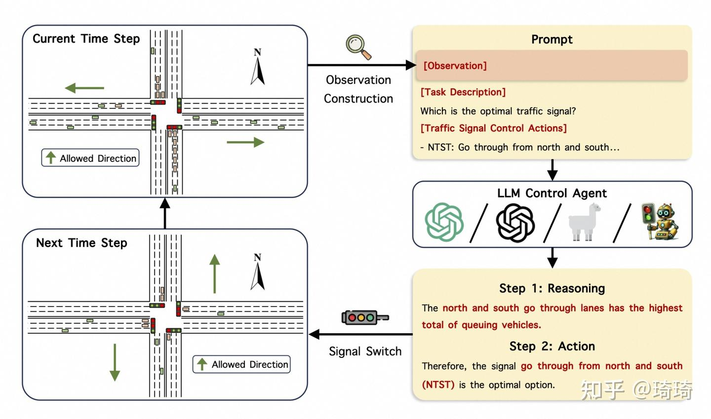

大型语言模型具有强大的信息编码和解码能力，这在文本生成、翻译、摘要等领域已得到证实。然而，**在控制领域，LLM的应用相对较新**。最近的研究将LLM应用于控制系统设计，其中**智能体可以解释自然语言指令，转化为控制策略，或利用自然语言改善控制系统的解释性（Interpretability）和可交互性（Interactivity）**。 例如，研究者可以训练LLM解析系统规范文档，生成控制算法的草案，甚至提供控制策略的优化建议，同样也可以帮助解释控制系统的决策逻辑和潜在故障。这种控制系统与LLM的结合，旨在使控制系统更易于人类理解和监管，有望大大降低控制系统的设计和验证时间。

**智能体（Agent）是具有自主性、能够在环境中执行任务的实体**。在控制领域中，智能体采用的方法多种多样，包括**基于模型的控制、自适应控制和强化学习**。自适应控制是一种无模型的方法，通过在线学习系统的动态，实现对未知或变化环境的适应。机器学习算法，特别是强化学习，已经显示出巨大潜力，这也是控制系统与AI技术完美结合的一个例子。

### 使用LLM作为机器人大脑

在论文[LLM as A Robotic Brain: Unifying Egocentric Memory and Control](https://link.zhihu.com/?target=https%3A//arxiv.org/abs/2304.09349)中，作者提出了一个名为**[LLM-Brain](https://zhida.zhihu.com/search?content_id=241591469&content_type=Article&match_order=1&q=LLM-Brain&zhida_source=entity)的新颖且具有普适性的框架**：**使用大规模语言模型作为机器人大脑，以统一自我中心记忆和控制**。

实体化人工智能（Embodied AI）专注于**研究和开发具有物理或虚拟实体（即机器人）的智能系统**，这些系统能够与其环境动态交互。**记忆和控制是实体化系统的两个基本部分**，通常需要单独的框架来分别建模它们。**LLM-Brain框架整合了多个多模态语言模型（**multimodal language models**）**，采用零样本学习方法，用于机器人任务。LLM-Brain中的所有组件使用**自然语言进行闭环多轮对话**，这些对话包含了感知、规划、控制和记忆。该系统的核心是一个具体化的LLM，维护自我中心记忆并控制机器人。作者通过检验两个下游任务来展示LLM-Brain的功能：**主动探索和实体化问题解答**。主动探索任务要求机器人在有限的动作次数内广泛探索未知环境。同时，实体化问题回答任务要求机器人基于在先前探索过程中获得的观察回答问题。

### LLMLight: 将LLM应用于交通信号控制Agent

在论文[LLMLight: Large Language Models as Traffic Signal Control Agents](https://link.zhihu.com/?target=https%3A//arxiv.org/pdf/2312.16044.pdf)中，提出了一个名为LLMLight的新颖框架，**将大型语言模型（LLMs）作为交通信号控制的决策代理（decision-making agents）。**

交通信号控制（TSC）是城市交通管理中的关键组成部分，旨在优化道路网络效率和减少拥堵。传统的TSC方法，主要基于交通工程和强化学习（RL），往往在不同交通场景的泛化能力上表现有限，并且缺乏可解释性。这篇论文提出的框架首先**指导LLM，使用知识丰富的提示（knowledgeable prompt）详细描述实时交通状况**。借助LLMs先进的泛化能力，LLMLight参与类似于人类直觉的推理和决策过程，以实现有效的交通控制。此外，作者还构建了LightGPT，一个为TSC任务量身定制的专业LLM核心。通过学习微妙的交通模式和控制策略，LightGPT增强了LLMLight框架，且性价比高。实验是基于九个现实世界和合成数据集进行的，实验展示了LLMLight相对于九个基于交通和基于RL的基线系统的显著效果、泛化能力和可解释性。

TSC的Agent框架如下图所示。

具体而言，将交通信号控制（TSC）视为一个**部分可观测的马尔可夫游戏**，游戏中的每个agent都装备了一个LLM，管理一个交叉路口的交通灯。在每个信号切换的时间步骤中，**agent会收集目标交叉路口的交通状况，并将它们转换成人类可读的文本，作为实时观测**。此外，文章还纳入了丰富的常识性知识的任务描述，以帮助LLM理解交通管理任务。结合了实时观测、任务描述和控制行动空间的知识性提示引导LLM进行决策制定。接着，**agent利用思维链（Chain-of-Thought，CoT）推理来确定下一个time step的最佳交通信号配置**。