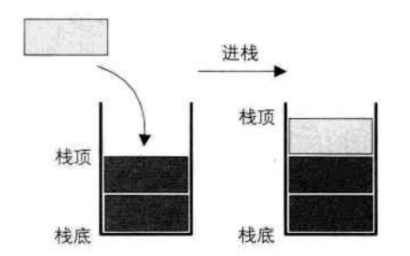
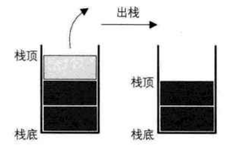

# 栈

## 栈的定义

> 栈（stack）是限定仅在表尾进行插入和删除操作的线性表

把允许插入和删除的一端称为栈顶（top），另一端称为栈底（bottom），不含有任何数据元素的栈称为空栈。栈又称为后进先出（Last In First Out）的线性表，简称 LIFO 结构。

栈的插入操作，叫做进栈，也称压栈、入栈。

栈的删除操作，叫做出栈，也有叫做弹栈。

**栈的应用**

- 递归
  - 斐波那契数列
- 四则运算表达式求值
  - 后缀（逆波兰）表达式法定义