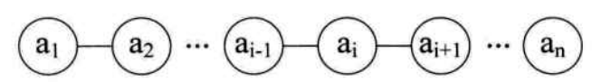
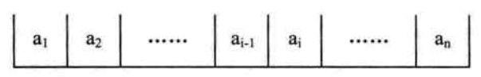
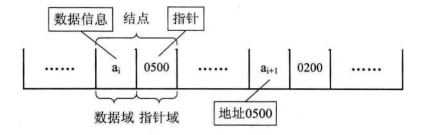

# 线性表

## 线性表的定义

> 线性表（List）：零个或多个数据元素的有限序列

如果用数学语言来进行定义。可如下：

> 若将线性表记为 $(a_{1},a_{2},\cdots,a_{i-1},a_{i},a_{i+1},\cdots,a_{n-1},a_{n})$ ,则表中 $a_{i-1}$ 领先于 $a_{i}$ ,$a_{i}$ 领先于 $a_{i+1}$ ，称 $a_{i-1}$ 是 $a_{i}$ 的直接前驱元素，$a_{i+1}$ 是 $a_{i}$ 的直接后续元素。当 $i=1,2,\cdots,n-1$ 时，$a_{i}$ 有且仅有一个直接后续，当 $i=2,3,\cdots,n$ 时，$a_{i}$ 有且仅有一个直接前驱。如下图所示：
>
> 
>
> 所以线性表元素的个数 $n(n \geqslant 0)$ 定义为线性表的长度，当 $n=0$ 时，称为空表。

## 线性表的顺序存储结构

### 顺序存储定义

> 线性表的顺序存储结构，指的是用一段地址连续的存储单元依次存储线性表的数据元素

线性表 $(a_{1},a_{2},\cdots,a_{n})$ 的顺序存储示意图如下：

### 顺序存储方式

**可以用 Java 语言的一维数组来实现顺序存储结构**

### 线性表顺序存储结构的优缺点

**优点**

- 无须为表示表中元素之间的逻辑关系而增加额外的存储空间
- 可以快速地存取表中任意位置地元素

**缺点**

- 插入和删除操作需要移动大量地元素
- 当线性表长度变化较大时，难以确定存储空间的容量
- 造成存储空间的“碎片”

## 线性表的链式存储结构

### 线性表链式存储结构定义

> 为了表示每个数据元素 $a_{i}$ 与其直接后续数据元素 $a_{i+1}$ 之间的逻辑关系，对数据元素 $a_{i}$ 来说，除了存储其本身的信息之外，还需存储一个指示其直接后续的信息（即直接后续的存储位置）。把存储数据元素信息的域称为数据域，把存储直接后续位置的域称为指针域。指针域中存储的信息称做指针或链。这两部分信息组成数据元素 $a_{i}$ 存储映像，称为节点（Node）。
>
> n 个节点（$a_{i}$ 的存储映像）链结成一个链表，即为线性表（$a_{1},a_{2},\cdots,a_{n}$）的链式存储结构，因为此链表的每个节点中只包含一个指针域，所以叫做单链表。

## 单链表结构与顺序存储结构优缺点

| 对比项           | 顺序存储结构                                       | 单链表                                                   |
| ---------------- | -------------------------------------------------- | -------------------------------------------------------- |
| **存储方式分配** | 用一段连续的存储单元依次存储线性表的数据元素       | 采用链式存储结构，用一组任意的存储单元存放线性表的元素   |
| **时间性能**     |                                                    |                                                          |
| 查找             | $O(1)$                                             | $O(n)$                                                   |
| 插入和删除       | 需要平均移动表长一半的元素，时间为  $O(n)$         | 找出某位置的指针后，插入和删除时间仅为  $O(1)$           |
| **空间性能**     | 需要预分配存储空间，分大了，浪费，分小了易发生上溢 | 不需要分配存储空间，只要有就可以分配，元素个数也不受限制 |

