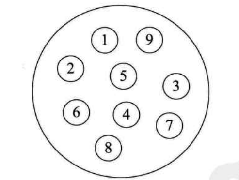
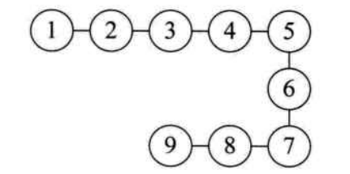
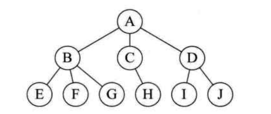
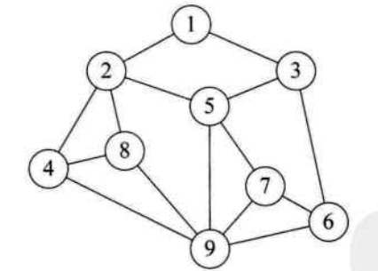
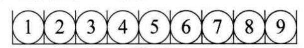
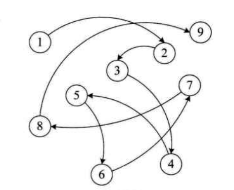

按照视点的不同，把数据结构分成逻辑结构和物理结构

## 逻辑结构

> 逻辑结构：是指数据对象中数据元素之间的相互关系。

### 集合结构

> 集合结构：集合结构中的数据元素除了同属于一个集合外，它们之间没有其他关系。

各个数据元素是“平等”的，它们的共同属性是“同属于一个集合”

### 线性结构

> 线性结构：线性结构中的数据元素之间是一对一的关系

### 树形结构

> 树形结构：树形结构中的数据元素之间存在一种一对多的层次关系

### 图形结构

> 图形结构：图形结构的数据元素是多对多的关系

在用示意图表示数据的逻辑结构时，要注意两点：

- 将每一个数据元素看作一个结点，用圆圈表示
- 元素之间的逻辑关系用结点之间的连线表示，如果这个关系是有方向的，那么用带箭头的连线表示。

> 综上，逻辑结构是针对具体的问题的，是为了解决某个问题，在对问题理解的基础上，选择一个合适的数据结构表示数据元素之间的逻辑关系。

## 物理结构

> 物理结构：是指数据的逻辑结构在计算机中的存储形式。

数据是数据元素的集合，那么根据物理结构的定义，实际上就是如何把数据元素存储到计算机的存储器中。

数据元素的存储结构形式有两种：顺序存储和链式存储。

### 顺序存储结构

> 顺序存储结构：是把数据元素存放在地址连续的存储单元里，其数据间的逻辑关系和物理关系是一致的，如下图所示：

### 链式存储结构

> 链式存储结构：是把数据元素存放在任意的存储单元里，这组存储单元可以是连续的，也可以是不连续的。

数据元素的存储关系并不能反映其逻辑关系，因此需要用一个指针存放数据元素的地址，这样通过地址就可以找到相关联数据元素的位置，如下图所示：

> 逻辑结构是面向问题的，而物理结构就是面向计算机的，其基本的目标就是将数据及其逻辑关系存储到计算机的内存中。