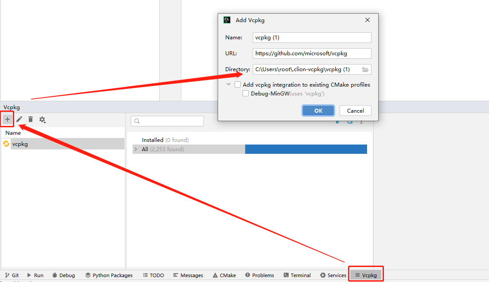

# Vcpkg

> Vcpkg是一个命令行包管理工具，它可以极大地简化三方库的获取、安装、使用和部署流程。

## 安装

```sh
#获取
git clone https://github.com/microsoft/vcpkg

cd vcpkg

# 编译好后会在同级目录下生成vcpkg.exe文件。编译期间，脚本会自动下载vswhere组件
bootstrap-vcpkg.bat

# 可选：将 vcpkg.exe 设置到环境变量中，即可直接使用 vcpkg 命令
```

## 使用

**搜索可用库**

```sh
# 语法
# vcpkg search [search term]

# 这条命令会列举 vcpkg/ports 子文件夹中的控制文件。
vcpkg search

# 添加过滤条件
vcpkg search sql
```

**安装第三方库**

> 第三方库的下载和编译命令是 `vcpkg install`

```sh
vcpkg install sqlite3:x64-windows
vcpkg install sqlite3 --triplet x64-windows
```

> 默认情况下，Vcpkg 使用的编译环境是 `x86-windows`，`x64-windows`，`x64-windows-static` 等

**查看已安装的第三方库**

> 命令 `vcpkg list` 可以查询已有的三方库

**卸载第三方库**

```sh
vcpkg remove sqlite3
```

## CLion 配置上述安装的 vcpkg

