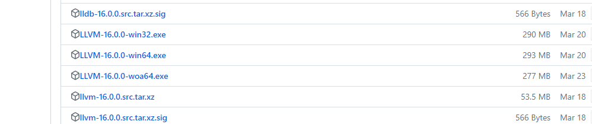

# LLVM CLang

## 安装

**下载**

> 下载地址：<https://releases.llvm.org/download.html>
>
> Github 仓库地址：<https://github.com/llvm/llvm-project>



### 环境变量

> EXE 文件安装时可选择是否将 LLVM 添加到环境变量中。

**手动设置**


**验证**

```sh
clang -v
```

## 编译

> **注意**：由于Clang主要是⼀个编译器前端，因此它需要依赖其他编译器的连接器以及某些运⾏时库。

```sh
clang demo.c --target=x86_64-w64-windows-gnu
```