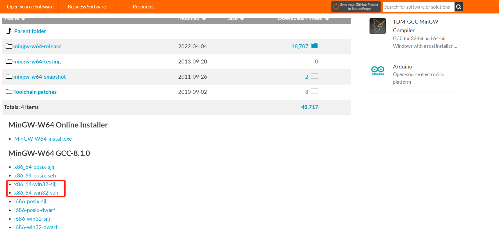

# MinGW

MinGW 的全称是：Minimalist GNU on Windows 。是将经典的开源 C语言 编译器 GCC 移植到了 Windows 平台下，并且包含了 Win32API ，因此可以将源代码编译为可在 Windows 中运行的可执行程序。

**MinGW-w64 与 MinGW 的区别**

MinGW-w64 与 MinGW 的区别在于 MinGW 只能编译生成32位可执行程序，而 MinGW-w64 则可以编译生成 64位 或 32位 可执行程序。

正因为如此，MinGW 现已被 MinGW-w64 所取代，且 MinGW 也早已停止了更新。

## 下载安装

> 下载地址：
> 
> 1. [MinGW-64](https://www.mingw-w64.org/downloads/#mingw-builds)\(https://www.mingw-w64.org/downloads/#mingw-builds\)
> 2. [MinGW-64 SourceForge](https://sourceforge.net/projects/mingw-w64/files/mingw-w64/mingw-w64-release/)\(https://sourceforge.net/projects/mingw-w64/files/mingw-w64/mingw-w64-release/\)
> 3. [MinGW-64 Github](https://github.com/niXman/mingw-builds-binaries/releases)\(https://github.com/niXman/mingw-builds-binaries/releases\)

```md
安装信息：

- Architechture:电脑系统是 64位的，选择 x86_64；如果是 32位 系统，则选择 i686
- Threads:如果是 Windows ，选择 win32 ，如果是 Linux、Unix、Mac OS 等其他操作系统要选择 posix
- exception: 异常处理类型，32位系统有2种：dwarf和sjlj；64位系统同样2种：seh 和 sjlj。3种类型的区别为：
    - sjlj：可用于32位和64位 – 不是“零成本”：即使不抛出exception，也会造成较小的性能损失（在exception大的代码中约为15％） – 允许exception遍历例如窗口callback
    - seh：结构化异常处理，利用FS段寄存器，将原点压入栈，遇到异常弹出，seh 是新发明的，而 sjlj 则是古老的，seh 性能比较好，但不支持 32位。 sjlj 稳定性好，支持 32位
    - dwarf：只有32位可用 – 没有永久的运行时间开销 – 需要整个调用堆栈被启用，这意味着exception不能被抛出，例如Windows系统DLL。
```

下面使用 SourceForge 下载界面进行下载安装：



如上下载 MinGW 压缩包。

### 环境变量配置【可选】


若配置了环境变量可进行如下命令来验证：

```shell
gcc -v
```