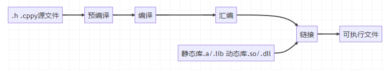

# 编译过程

## 预处理（Prepressing）

预处理过程主要处理那些源文件中的以 `#` 开始的预编译指令。比如 `#include`、`#define` 等，主要处理规则如下：

- 将所有的 `#define` 删除，并且展开所有的宏定义；
- 处理所有条件预编译指令，比如 `#if`、`#ifdef`、`#elif`、`#else`、`#endif`；
- 处理 `#include` 预编译指令，将被包括的文件插入到该预编译指令的位置。注意，这个过程是递归进行的，也就是说被包含的文件可能还包含其他文件；
- 删除所有注释 `//` 和 `/* */`；
- 添加行号和文件名标识，比如 `#2 "hello.c" 2`，以便于编译时编译器产生调试用的行号信息及用于编译时产生编译错误或警告时能够显示行号；
- 保留所有 `#pragma` 编译器指令，因为编译器需要使用它们。

> 当开发人员无法判断宏定义是否正确或头文件包含是否正确时，可以查看预编译后的文件来确定问题。

## 编译（Compilation）

编译过程就是把预处理完的文件进行一系列词法分析、语法分析、语义分析及优化后生产相应的汇编代码。

## 汇编（Assembly）

汇编器将汇编代码转变成机器可以执行的指令，每一个汇编语句几乎都对应一条机器指令。

## 链接（Linking）

