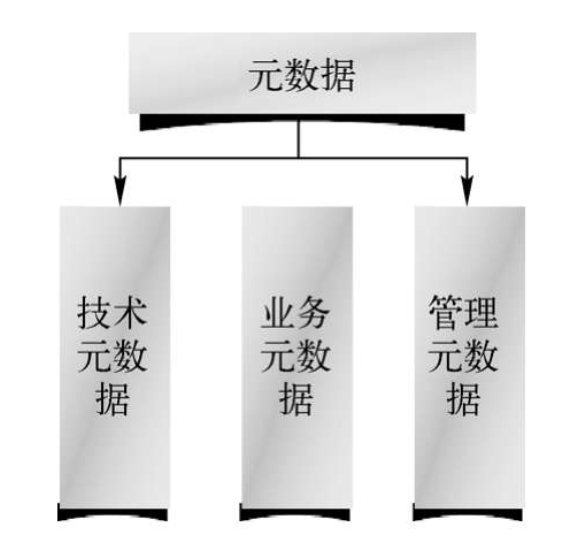
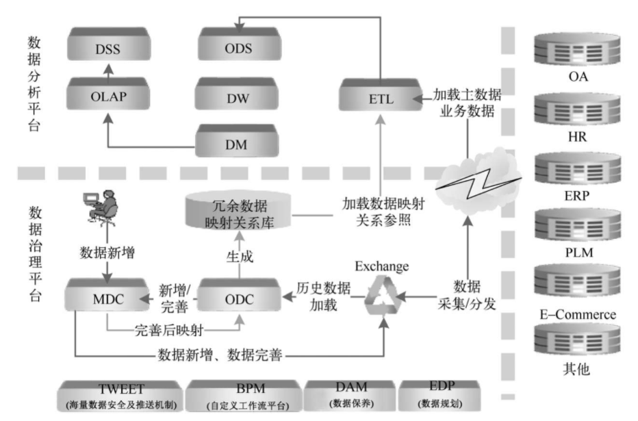
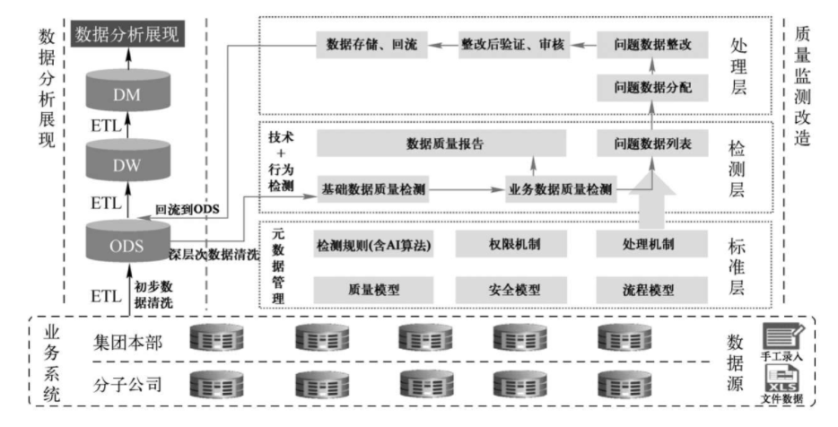

<!--
 * @Github       : https://github.com/superzhc/BigData-A-Question
 * @Author       : SUPERZHC
 * @CreateDate   : 2020-11-26 16:34:52
 * @LastEditTime : 2020-11-27 00:50:14
 * @Copyright 2020 SUPERZHC
-->
# 数据治理

## 概念

**元数据**

元数据（Metadata），又称中介数据、中继数据，是描述数据的数据（Dataabout Data），是描述数据属性（Property）的信息，用来支持如指示存储位置、保存历史数据、资源查找、文件记录等功能。元数据组成如下图所示。

- 技术元数据是描述数据系统中技术领域相关概念、关系和规则的数据，主要包括对数据结构、数据处理方面的特征描述，覆盖数据源接口、数据仓库、数据集市、ETL、OLAP、数据封装和前端展现等全部数据处理环节。
- 业务元数据是描述数据系统中业务领域相关概念、关系和规则的数据，主要包括业务术语、信息分类、指标定义和业务规则等信息。
- 管理元数据是描述数据系统中管理领域相关概念、关系和规则的数据，主要包括人员角色、岗位职责和管理流程等信息。

元数据最为重要的特征和功能是为数字化信息资源建立一种机器可理解框架。

没有合适的元数据，主数据管理就会失语。没有元数据，数据治理就没有语料。

**主数据（Master Data）**

指描述某一业务实体对象时，基础数据（属性）中被两个及两个以上的业务系统共同使用的部分（属性），通常指相对业务系统（或业务场景）的共有属性及属性的取值、格式、验证、关系等。主数据不是一种数据，只是数据存在的一种状态，类似大数据需要同时满足几个维度的标准时才可以称之为大数据。

**静态数据（Static Data）**

指描述某一业务实体对象时，基础数据（属性）中静态或相对静态的数据的统称（含主数据+业务场景或组织视角的私有数据）。通常也可以指除交易数据以外的数据的统称。

**静态数据中心（Static Data Center）**

指包括清洗后的历史数据和新的标准、规范的新增数据，以及描述了这些数据的私有（组织或业务场景信息）和公有（特征、基本信息等）属性、规则、类别、文档、关系、配置信息等全方位的信息集合。

## 定义

数据治理，是指从使用零散数据变为使用统一规范数据，从具有很少或没有组织和流程治理到综合数据治理，从尝试处理数据混乱状况到数据井井有条的一个过程。

## 数据治理的价值

实施数据治理项目具备以下 8 个方面的价值：

1. **确立数据管理体系规范和标准，并实现其系统化落地**
   
   通过实施数据治理项目，在考虑现有数据管理的基础上，可以制定出全面符合未来 5～10 年信息化发展的数据模型、数据管理制度、数据管理流程。可以全面实现数据管理体系的系统化落地，解决长期以来生产过程中数据描述不准确、不规范、不统一的问题，进而提高了计划执行、仓库盘点、材料采购等的准确率，减少了资金的浪费，为快速发展奠定基础。

2. **全面梳理并清洗存量数据，根治多年积累的数据质量问题**
   
   通过实施数据治理项目，可以由数据清洗平台依照以下策略对存量数据进行清洗，解决当前数据存在大量的不一致、不完整、数据冗余等问题：
   1. 针对不同业务系统中的历史数据进行自动或人工的一次性清洗，并形成最终的冗余数据映射关系
   2. 把冗余数据映射关系保存到数据治理平台核心数据库中，为业务系统的数据停用以及后期 BI（商业智能）的使用提供坚实的数据基础。

3. **全面实现数据管理的系统化、集中化，节省业务系统用户数**
   
   通过实施数据治理项目，引入数据治理平台，可以实现数据管理过程的全面电子化，可全部脱离原有的手工操作，摆脱原有手工查重和编码的繁重工作，大大改善和加快信息的传递和反馈，增强信息的准确性、及时性。
   
   数据治理平台的数据模型的视图化、全面化、自定义化，完全可以模拟现有业务系统的数据档案并及时分发到对应业务系统中去，真正实现业务系统数据档案的外部新增，为数据中心的建立奠定坚实的基础。

4. **搭建全面科学的数据验证体系，杜绝数据冗余的再次发生**
   
   数据治理平台的组合式编码、立体式查重机制改善了原有数据编码的模式和弊端，数据治理平台内置的多方位的数据验证机制（如文本、文本框、数字、是否选择、树状数据限定、平面数据限定、组合数据限定等）从数据录入的源头杜绝可能发生的错误。

5. **实现数据管理过程的流程化、制度化、准确化**
   
   通过实现数据管理制度和流程的系统落地，实现数据管理过程的有效监督和执行、流程化的信息推送，使数据管理工作由被动转为主动，使管理过程责任透明化，提高执行效率。并且系统化的数据管理监控机制，扫清了传统手工状态下的各种管理障碍，使管理更加清晰、责任更加明确、数据更加准确。

   系统权限划分可以针对不同人员分配不同的数据编制和审核权限，解决了目前多方信息传递的失真、缓慢等问题，提升了信息的准确率，缩短了整个数据新增的时间，提升了数据新增的效率。

6. **实现详尽的静态数据服务**
   
   数据治理平台的引入提供了全方位、多角度、权限化、立体智能查询机制，完全满足所有人员的数据查询需求，可大幅缩短数据查询以及编码和数据业务实体对照时间。

7. **数据交换平台全面实现数据的协同、联动**
   
   通过实施数据治理项目引入的数据交换平台，通过简单的配置即可实现包括数据的分发机制、分发内容、分发时间等的设置，全面满足现有以及未来数据管理的协同和联动要求。

8. **建立了统一的数据标准，为资源共享、快速决策提供保障**
   
   数据治理平台从数据录入的源头开始实现规范、标准，杜绝人为化的错误产生，规范后的数据通过数据交换平台实现静态、动态以及横向、纵向的信息化服务。从根本上保证了 BI 等工具数据分析的准确率，使数据资产价值得到全面体现。

## 数据治理的模式

数据治理解决了数据的冗余、一致性、完整性、规范性等问题，从而使数据分析能够发挥最大的管理价值。通过制定及贯彻执行各类业务和技术标准，就能从技术上、管理上把各方面有机地联系起来，形成一个统一的系统整体，保证数据治理过程进行得有条不紊。

目前企业存在三种数据治理模式，具体如下：

- 源端数据治理，是指通过解决业务系统源头数据质量的问题，实现提高数据分析的准确率。
- 末端数据治理，是指针对解决数据全生命周期的末端（数据仓库层）数据质量的问题，实现提高数据分析的准确率。
- 综合数据治理，是指包括源端和末端数据治理的混合模式。

### 源端数据治理模式

针对源端的数据治理是主流的数据治理模式，目前行业内 80% 以上的方案都采用此模式。如静态数据治理、主数据管理、编码管理等，都是属于针对业务系统的直接影响实现数据质量的改造，最终达到支撑数据应用分析的目的。

源端数据治理支撑数据分析及业务管理框架，具体如下图所示：

由上图可以看出，数据治理平台直接新增数据或者通过数据交换平台（Exchange）从业务系统采集的新增数据进行规范、改造后，一方面冗余数据自动进入冗余数据映射关系库，另一方面改造后的数据再次回传到对应业务系统，实现对业务系统数据质量的改造（在业务系统运行的前提下）。

当 ETL 从业务系统中抽取数据的时候，同时从冗余数据映射关系库中抽取冗余数据的关系参照，在加载到数据仓库时会注明某些编码（数据）对应的业务实体对象其实是一个，这样未来进行数据分析时可以实现同一业务实体对象不同编码的业务数据的累加，从而实现数据分析的精确度最大化。

### 末端数据治理模式

末端数据治理技术架构如上图所示。从图中可以看出，所谓末端数据治理，是指数据被集成到原业务系统外的某个区域（一般指数据仓库的 ODS 层，即数据仓库的操作数据存储层）后集中进行质量识别、处理的过程。此模式适用于战略管控型或者财务管控型的大型企业集团（央企或者大型国企）的顶层数据分析，大部分数据来源于二、三级单位上报的数据，本部系统比较简单，数据量较少、较单一。

通过末端数据治理对 ODS 层的数据质量干预，可以实现深层次数据质量问题的解决，最大化支撑数据分析的准确率。目前此方案已经比较成熟。