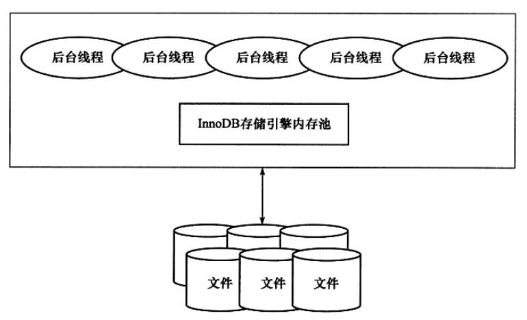
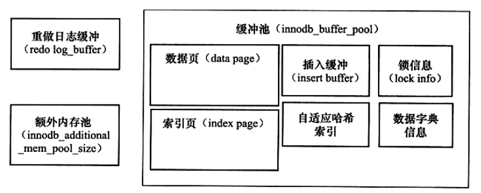

<!--
 * @Github       : https://github.com/superzhc/BigData-A-Question
 * @Author       : SUPERZHC
 * @CreateDate   : 2020-05-08 10:12:30
 * @LastEditTime : 2020-12-17 17:39:54
 * @Copyright 2020 SUPERZHC
-->
# InnoDB 体系架构

上图显示了 InnoDB 的存储引擎的体系架构，从图可见，InnoDB 存储引擎有多个内存块，可以认为这些内存组成了一个大的内存池，负责如下工作：
- 维护所有进程/线程需要访问的多个内部数据结构
- 缓存磁盘上的数据，方便快速地读取，同时在对磁盘文件的数据修改之前在这里缓存
- 重做日志（redo log）缓冲

后台线程的主要作用是负责刷新内存池中的数据，保证缓冲池中的内存缓存的是最近的数据。此外将已修改的数据文件刷新到磁盘文件，同时保证在数据库发生异常的情况下 InnoDB 能恢复到正常运行状态。

## 后台线程

InnoDB 存储引擎是多线程的模型，因此其后台有多个不同的后台线程，负责处理不同的任务。

1. Master Thread
   
   > Master Thread 是一个非常核心的线程，主要负责将缓冲池中的数据异步刷新到磁盘，保证数据的一致性，包括脏页的刷新、合并插入缓冲（INSERT BUFFER）、UNDO 页的回收等。
2. IO Thread
   
   > 在 InnoDB 存储引擎中大量使用了 AIO（Async IO）来处理写 IO 请求，这样可以极大提高数据库的性能。而 IO Thread 的工作主要是负责这些 IO 请求的回调（call back）处理。
3. Purge Thread
   
   > 事务被提交后，其所使用的 undo log 可能不再需要，因此需要 Purge Thread 来回收已经使用并分配的 undo 页。
4. Page Cleaner Thread
   
   > Page Cleaner Thread 是在 InnoDB 1.2.x 版本中引入的。其作用是将之前版本中脏页的刷新操作都放入到单独的线程中完成，而其目的是为了减轻原 Master Thread 的工作及对于用户查询线程的阻塞，进一步提高 InnoDB 存储引擎的性能。

## 内存

### 缓冲池

InnoDB 存储引擎是基于磁盘存储的，并将其中的记录按照页的方式进行管理。因此可将其视为基于磁盘的数据库系统（Disk-base Database）。在数据库系统中，由于 CPU 速度与磁盘速度之间的鸿沟，基于磁盘的数据库系统通常使用缓冲池技术来提高数据库的整体性能。

缓冲池简单来说就是一块内存区域，通过内存的速度来弥补磁盘速度较慢对数据库性能的影响。在数据库中进行读取页的操作，首先将从磁盘读到的页存放在缓冲池中，这个过程称为将页 “FIX” 在缓冲池中。下一次再读相同的页时，首先判断该页是否在缓冲池中。若在缓冲池中，称该页在缓冲池中被命中，直接读取该页。否则，读取磁盘上的页。

对于数据库中页的修改操作，则首先修改在缓冲池中的页，然后再以一定的频率刷新到磁盘上。这里需要注意的是，页从缓冲池刷新回磁盘的操作并不是在每次页发生更新时触发，而是通过一种 Checkpoint 的机制刷新回磁盘。同样，这也是为了提高数据库的整体性能。

综上所述，缓冲池的大小直接影响着数据库的整体性能。

对于 InnoDB 存储引擎而言，其缓冲池的配置通过参数 `innodb_buffer_pool_size` 来设置。

具体来看，缓冲池中缓存的数据页类型有：索引页、数据页、undo 页、插入缓冲（insert buffer）、自适应哈希索引（adaptive hash index）、InnoDB 存储的锁信息（lock info）、数据字典信息（data dictionary）等。不能简单地认为，缓冲池只是存储索引页和数据页，它们只是占缓冲池很大地一部分而已。

下图显示了 InnoDB 存储引擎中内存地结构情况：

从 InnoDB 1.0.x 版本开始，允许有多个缓冲池实例。每个页根据哈希值平均分配到不同缓冲池中。这样做地好处是减少数据库内部的资源竞争，增加数据库的并发处理能力。可以通过参数 `innodb_buffer_pool_instances` 来进行配置，该值默认为 1。

### LRU List、Free List 和 Flush List

通常来说，数据库中的缓冲池是通过 LRU（Latest Recent Used，最近最少使用）算法来进行管理的。即最频繁使用的页在 LRU 列表的前端，而最少使用的页在 LRU 列表的队尾。当缓冲池不能存放新读取的页时，将首先释放 LRU 列表中尾端的页。

在 InnoDB 存储引擎中，缓冲池中的页的大小默认为 16KB，同样使用 LRU 算法对缓冲池进行管理。稍有不同的是 InnoDB 存储引擎对传统的 LRU 算法做了一些优化，在 InnoDB 的存储引擎中，LRU 列表中还加入了 midpoint 位置，新读取到的页，虽然是最新访问的页，但并不是直接放入到 LRU 列表的首部，而是放入到 LRU 列表的 midpoint 位置，这个算法在 InnoDB 存储引擎下称为 midpoint insertion strategy。在默认配置下，该位置在 LRU 列表长度的 `5/8` 处，midpoint 位置可由参数 `innodb_old_blocks_pct` 控制。

在 LRU 列表中的页被修改后，称该页为脏页（dirty page），即缓冲池中的页和磁盘上的数据产生了不一致，这时数据库会通过 Checkpoint 机制将脏页刷新回磁盘，而 Flush 列表中的页即为脏页列表。需要注意的是，脏页即存在于 LRU 列表中，也存在于 Flush 列表中。LRU 列表用来管理缓冲池中页的可用性，Flush 列表用来管理将页刷新回磁盘，二者互不影响。

### 重做日志缓冲（redo log buffer）

InnoDB 存储引擎首先将重做日志信息先放入到这个缓冲区，然后按照一定频率将其刷新到重做日志文件。重做日志缓冲一般不需要设置的很大，因为一般情况下每一秒钟会将重做日志缓冲刷新到日志文件，因此用户只需要保证每秒产生的事务量在这个缓冲大小之内即可。

### 额外的内存池

TODO