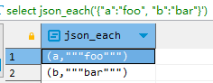
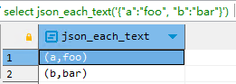
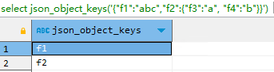
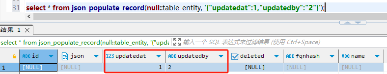
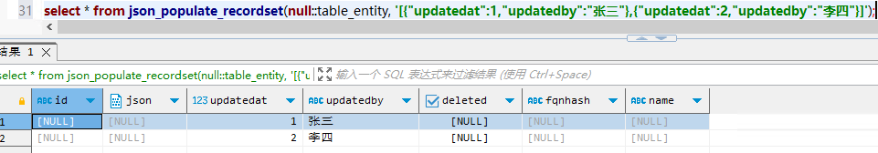
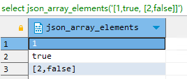
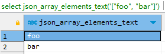
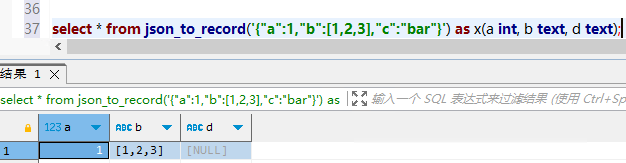
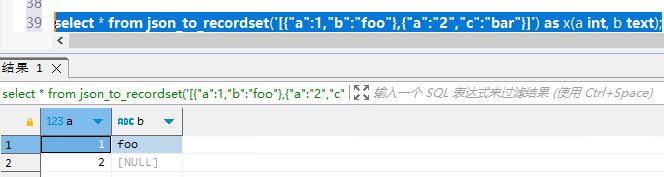
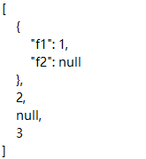

# JSON 数据类型

> Postgres 支持两种 JSON 数据类型：`json` 和 `jsonb`，而两者唯一的区别在于效率，`json` 是对输入的完整拷贝，使用时再去解析，所以它会保留输入的空格，重复键以及顺序等。而 `jsonb` 是解析输入后保存的二进制，它在解析时会删除不必要的空格和重复的键，顺序和输入可能也不相同。使用时不用再次解析。
> 
> 两者对重复键的处理都是保留最后一个键值对。

**注意事项**

1. 键值对的键必须使用双引号

## 操作符

**`json` 和 `jsonb` 的操作符**

| 操作符 | 右操作数类型 | 描述                            | 示例                                                       | 结果           |
| :----: | :----------: | ------------------------------- | ---------------------------------------------------------- | -------------- |
|  `->`  |     int      | 获取JSON数组元素（索引从0开始） | `select '[{"a":"foo"},{"b":"bar"},{"c":"baz"}]'::json->2;` | `{"c":"baz"}`  |
|  `->`  |     text     | 通过键获取值                    | `select '{"a": {"b":"foo"}}'::json->'a';`                  | `{"b":"foo"}`  |
| `->>`  |     int      | 获取JSON数组元素为 text         | `select '[1,2,3]'::json->>2;`                              | `3`            |
| `->>`  |     text     | 通过键获取值为text              | `select '{"a":1,"b":2}'::json->>'b';`                      | `2`            |
|  `#>`  |   `text[]`   | 在指定的路径获取JSON对象        | `select '{"a": {"b":{"c": "foo"}}}'::json#>'{a,b}';`       | `{"c": "foo"}` |
| `#>>`  |   `text[]`   | 在指定的路径获取JSON对象为 text | `select '{"a":[1,2,3],"b":[4,5,6]}'::json#>>'{a,2}';`      | `3`            |

**`jsonb` 扩展操作符**

| 操作符  | 右操作数类型 | 描述                                                                                                   | 示例                                                                                                             | 结果                   |
| :-----: | ------------ | ------------------------------------------------------------------------------------------------------ | ---------------------------------------------------------------------------------------------------------------- | ---------------------- |
|  `@>`   | jsonb        | 左侧json最上层的值是否包含右边json对象                                                                 | `select '{"a":{"b":2}}'::jsonb @> '{"b":2}'::jsonb;`   `select '{"a":1, "b":2}'::jsonb @> '{"b":2}'::jsonb;` | `false`   `true`   |
|  `<@`   | jsonb        | 左侧json对象是否包含于右侧json最上层的值内                                                             | `select '{"b":2}'::jsonb <@ '{"a":1, "b":2}'::jsonb;`                                                            | `true`                 |
|   `?`   | text         | text是否作为左侧Json对象最上层的键                                                                     | `select '{"a":1, "b":2}'::jsonb ? 'b';`                                                                          | `true`                 |
| `?\| `  | `text[]`     | `text[]` 中的任一元素是否作为左侧Json对象最上层的键                                                    | `select '{"a":1, "b":2, "c":3}'::jsonb ?\| array['b', 'c'];`                                                     | `true`                 |
|  `?&`   | `text[]`     | `text[]` 中的所有元素是否作为左侧Json对象最上层的键                                                    | `select '["a", "b"]'::jsonb ?& array['a', 'b'];`                                                                 | `true`                 |
| `\|\| ` | jsonb        | 连接两个json对象，组成一个新的json对象                                                                 | `select '["a", "b"]'::jsonb \|\| '["c", "d"]'::jsonb;`                                                           | `["a", "b", "c", "d"]` |
|   `-`   | text         | 删除左侧json对象中键为text的键值对                                                                     | `select '{"a": "b"}'::jsonb - 'a';`                                                                              | `{}`                   |
|   `-`   | integer      | 删除数组指定索引处的元素，如果索引值为负数，则从右边计算索引值。如果最上层容器内不是数组，则抛出错误。 | `select '["a", "b"]'::jsonb - 1;`                                                                                | `["a"]`                |
|  `#-`   | text[]       | 删除指定路径下的域或元素（如果是json数组，且整数值是负的，则索引值从右边算起）                         | `select '["a", {"b":1}]'::jsonb #- '{1,b}';`                                                                     | `["a", {}]`            |

## 函数

**创建函数**

| 函数                                                                                       | 描述                                                                                                                                                  | 示例                                                                                                          | 结果                                    |
| ------------------------------------------------------------------------------------------ | ----------------------------------------------------------------------------------------------------------------------------------------------------- | ------------------------------------------------------------------------------------------------------------- | --------------------------------------- |
| `to_json(anyelement)`   `to_jsonb(anyelement)`                                         | 返回json或jsonb类型的值。数组和复合被转换（递归）成数组和对象。另外除数字、布尔、NULL值（直接使用NULL抛出错误）外，其他标量必须有类型转换。           | `select to_json('3'::int);`                                                                                   | 3                                       |
| `array_to_json(anyarray[, pretty_bool])`                                                   | 以JSON数组返回该数组。PostgreSQL多维数组变成JSON数组中的数组。如果pretty_bool 为真，则在维度1元素之间添加换行。                                       | `select array_to_json('{{1,5},{99,100}}'::int[],true);`                                                       | `[[1,5],[99,100]]`                      |
| `row_to_json(record [, pretty_bool])`                                                      | 以JSON对象返回行。如果pretty_bool 为真，则在级别1元素之间添加换行。                                                                                   | `select row_to_json(row(1,'foo'),true);`                                                                      | `{"f1":1, "f2":"foo"}`                  |
| `json_build_array(VARIADIC "any")`   `jsonb_build_array(VARIADIC "any")`               | 建立一个由可变参数列表组成的不同类型的JSON数组                                                                                                        | `select json_build_array(1,2,'3',4,5);`                                                                       | `[1, 2, "3", 4, 5]`                     |
| `json_build_object(VARIADIC "any")`   `jsonb_build_object(VARIADIC "any")`             | 建立一个由可变参数列表组成的JSON对象。参数列表参数交替转换为键和值。                                                                                  | `select json_build_object('foo',1,'bar',2);`                                                                  | `{"foo" : 1, "bar" : 2}`                |
| `json_object(text[])`   `jsonb_object(text[])`                                         | 根据 `text[]` 数组建立一个json对象，如果是一维数组，则必须有偶数个元素，元素交替组成键和值。如果是二维数组，则每个元素必须有2个元素，可以组成键值对。 | `select json_object('{a, 1, b, "def", c, 3.5}');`   `select json_object('{{a, 1},{b, "def"},{c, 3.5}}');` | `{"a" : "1", "b" : "def", "c" : "3.5"}` |
| `json_object(keys text[], values text[])`   `jsonb_object(keys text[], values text[])` | 分别从两组 `text[]` 中获取键和值，与一维数组类似。                                                                                                    | `select json_object('{a, b}', '{1,2}');`                                                                      | `{"a" : "1", "b" : "2"}`                |

**处理函数**

| 函数                                                                                                                                            | 返回类型         | 描述                                                                                                                                              | 示例                                                                                                                                                    | 结果                                                                                              |
| ----------------------------------------------------------------------------------------------------------------------------------------------- | ---------------- | ------------------------------------------------------------------------------------------------------------------------------------------------- | ------------------------------------------------------------------------------------------------------------------------------------------------------- | ------------------------------------------------------------------------------------------------- |
| `json_array_length(json)`   `jsonb_array_length(jsonb)`                                                                                     | int              | 返回Json数组最外层元素个数                                                                                                                        | `select json_array_length('[1,2,3,{"f1":1,"f2":[5,6]},4]');`                                                                                            | 5                                                                                                 |
| `json_each(json)`   `jsonb_each(jsonb)`                                                                                                     | 一组键值对集合   | 将最外层Json对象转换为键值对集合                                                                                                                  | `select json_each('{"a":"foo", "b":"bar"}');`                                                                                                           |                                                                 |
| `json_each_text(json)`   `jsonb_each_text(jsonb)`                                                                                           | 一组键值对集合   | 将最外层Json对象转换为键值对集合，且value为text类型                                                                                               | `select json_each_text('{"a":"foo", "b":"bar"}');`                                                                                                      |                                                                 |
| `json_extract_path(from_json json,VARIADIC path_elems text[])`   `jsonb_extract_path(from_json jsonb,VARIADIC path_elems text[])`           | json   jsonb | 返回 path_elems 指向的value，同操作符 `#>`                                                                                                        | `select json_extract_path('{"f2":{"f3":1},"f4":{"f5":99,"f6":"foo"}}','f4');`                                                                           | `{"f5":99,"f6":"foo"}`                                                                            |
| `json_extract_path_text(from_json json,VARIADIC path_elems text[])`   `jsonb_extract_path_text(from_json jsonb,VARIADIC path_elems text[])` | text             | 返回 path_elems 指向的 value，并转为text类型，同操作符 `#>>`                                                                                      | `select json_extract_path_text('{"f2":{"f3":1},"f4":{"f5":99,"f6":"foo"}}','f4', 'f6');`                                                                | `foo`                                                                                             |
| `json_object_keys(json)`   `jsonb_object_keys(jsonb)`                                                                                       | 一组字符串集合   | 返回 json 对象最外层的 key                                                                                                                        | `select json_object_keys('{"f1":"abc","f2":{"f3":"a", "f4":"b"}}');`                                                                                    |                                                                 |
| `json_populate_record(base anyelement,from_json json)`   `jsonb_populate_record(base anyelement,from_json jsonb)`                           | 任意元素         | 将 json 对象的 value 以 base 定义的行类型返回，如果行类型字段比json对象键值少，则多出的键值将被抛弃；如果行类型字段多，则多出的字段自动填充NULL。 | `select * from json_populate_record(null::table_entity, '{"updatedat":1,"updatedby":"2"}');`                                                            |                                                                 |
| `json_populate_recordset(base anyelement,from_json json)`   `jsonb_populate_recordset(base anyelement,from_json jsonb)`                     | 任意元素         | 将json对象最外层数组以base定义的行类型返回                                                                                                        | `select * from json_populate_recordset(null::table_entity, '[{"updatedat":1,"updatedby":"张三"},{"updatedat":2,"updatedby":"李四"}]');`                 |                                                                 |
| `json_array_elements(json)`   `jsonb_array_elements(jsonb)`                                                                                 |                  | 将json数组转换成json对象value的集合                                                                                                               | `select json_array_elements('[1,true, [2,false]]');`                                                                                                    |                                                                 |
| `json_array_elements_text(json)`   `jsonb_array_elements_text(jsonb)`                                                                       | setof text       | 将json数组转换成text的value集合                                                                                                                   | `select json_array_elements_text('["foo", "bar"]');`                                                                                                    |                                                                 |
| `json_typeof(json)`   `jsonb_typeof(jsonb)`                                                                                                 | text             | 返回json最外层value的数据类型，可能的类型有 object, array, string, number, boolean, 和null                                                        | `select json_typeof('-123.4');`                                                                                                                         | number                                                                                            |
| `json_to_record(json)`   `jsonb_to_record(jsonb)`                                                                                           | record           | 根据 json 对象创建一个 record 类型记录，所有的函数都返回 record 类型，所以必须使用 as 明确定义 record 的结构。                                    | `select * from json_to_record('{"a":1,"b":[1,2,3],"c":"bar"}') as x(a int, b text, d text);`                                                            |                                                                 |
| `json_to_recordset(json)`   `jsonb_to_recordset(jsonb)`                                                                                     | 一组record集合   | 根据json数组创建一个record类型记录，所有的函数都返回record类型，所以必须使用as明确定义record的结构。                                              | `select * from json_to_recordset('[{"a":1,"b":"foo"},{"a":"2","c":"bar"}]') as x(a int, b text);`                                                       |                                                                 |
| `json_strip_nulls(from_json json)`   `jsonb_strip_nulls(from_json jsonb)`                                                                   |                  | 返回json对象中所有非null的数据，其他的null保留。                                                                                                  | `select json_strip_nulls('[{"f1":1,"f2":null},2,null,3]');`                                                                                             | `[{"f1":1},2,null,3]`                                                                             |
| `jsonb_set(target jsonb, path text[],new_value jsonb[,create_missing boolean])`                                                                 | jsonb            | 如果 create_missing 为 true，则将在 target 的 path 处追加新的 jsonb；如果为 false，则替换 path 处的 value。                                       | `select jsonb_set('[{"f1":1,"f2":null},2,null,3]', '{0,f1}','[2,3,4]', false);`   `select jsonb_set('[{"f1":1,"f2":null},2]', '{0,f3}','[2,3,4]');` | `[{"f1": [2, 3, 4], "f2": null}, 2, null, 3]`   `[{"f1": 1, "f2": null, "f3": [2, 3, 4]}, 2]` |
| `jsonb_insert(target jsonb, path text[],new_value jsonb, [insert_after boolean])`                                                               | jsonb            | 如果 insert_after 是 true，则在 target 的 path 后面插入新的 value，否则在 path 之前插入。                                                         | `select jsonb_insert('{"a": [0,1,2]}', '{a, 1}', '"new_value"');`   `select jsonb_insert('{"a": [0,1,2]}', '{a, 1}', '"new_value"', true);`         | `{"a": [0, "new_value", 1, 2]}`   `{"a": [0, 1, "new_value", 2]}`                             |
| `jsonb_pretty(from_json jsonb)`                                                                                                                 | text             | 以缩进的格式更容易阅读的方式返回json对象                                                                                                          | `select jsonb_pretty('[{"f1":1,"f2":null},2,null,3]');`                                                                                                 |                                                                 |