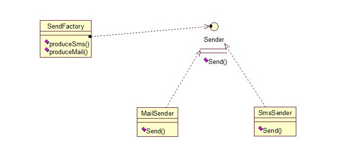
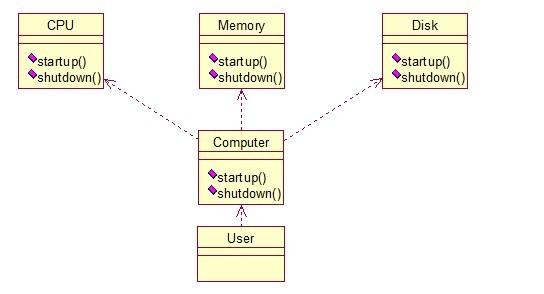
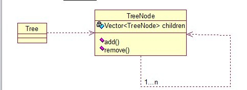

# 设计模式

**设计模式（Design Patterns）**：可复用面向对象软件的基础

设计模式（Design pattern）是一套被反复使用、多数人知晓的、经过分类编目的、代码设计经验的总结。使用设计模式是为了可重用代码、让代码更容易被他人理解、保证代码可靠性。

## 设计模式分类

总体来说设计模式分为三大类：

- 创建型模式，共五种：工厂方法模式、抽象工厂模式、单例模式、建造者模式、原型模式。
- 结构型模式，共七种：适配器模式、装饰器模式、代理模式、外观模式、桥接模式、组合模式、享元模式。
- 行为型模式，共十一种：策略模式、模板方法模式、观察者模式、迭代子模式、责任链模式、命令模式、备忘录模式、状态模式、访问者模式、中介者模式、解释器模式。

其实还有两类：并发型模式和线程池模式。用一个图片来整体描述一下：

## 设计模式的六大原则

- 开闭原则（Open Close Principle）
- 里氏代换原则（Liskov Substitution Principle）
- 依赖倒转原则（Dependence Inversion Principle）
- 接口隔离原则（Interface Segregation Principle）
- 迪米特法则（最少知道原则）（Demeter Principle）
- 合成复用原则（Composite Reuse Principle）

## Java的23种设计模式

### 创建型模式

#### 工厂方法模式（Factory Method）

工厂方法模式分为三种：普通工厂模式、多个工厂方法模式和静态工厂方法模式

##### 普通工厂模式

实现方式：建立一个工厂类，对实现了同一接口的一些类进行实例的创建。

示例图：

过程步骤：

- 创建接口IA
- 创建实现类（继承IA），一般多个
- 建立工厂【通过参数传递，生成不同的对象实例】

##### 多个工厂方法模式

是对普通工厂方法模式的改进，在普通工厂方法模式中，如果传递的字符串出错，则不能正确创建对象，而多个工厂方法模式是提供多个工厂方法，分别创建对象。

示例图：

##### 静态工厂方法模式

将多个工厂方法模式里面的方法设置为静态的，不需要创建实例，直接调用即可。

##### 总结

工厂模式适合：凡是出现了大量的产品需要创建，并且具有共同的接口时，可以通过工厂方法模式进行创建。在以上的三种模式中，第一种如果传入的字符串有误，不能正确创建对象，第三种相对于第二种，不需要实例化工厂类，所以，大多数情况下，我们会选用第三种——静态工厂方法模式。

工厂模式的问题：类的创建依赖工厂类，也就是说，如果想要拓展程序，必须对工厂类进行修改，这违背了闭包原则。

#### 抽象工厂模式（Abstract Factory）

为了解决工厂方法模式的弊端，使用抽象工厂模式，创建多个工厂类，这样一旦需要增加新的功能，直接添加新的工厂类就行了，不需要修改以前的代码。

#### 单例模式（Singleton）

单例对象（Singleton）是一种常用的设计模式。在Java应用中，单例对象能保证在一个JVM中，该对象只有一个实例存在。

单例模式的好处：

- 某些类创建比较频繁，对于一些大型的对象，这是一笔很大的系统开销。
- 省去了new操作符，降低了系统内存的使用频率，减轻GC压力。
- 有些类如交易所的核心交易引擎，控制着交易流程，如果该类可以创建多个的话，系统完全乱了。（比如一个军队出现了多个司令员同时指挥，肯定会乱成一团），所以只有使用单例模式，才能保证核心交易服务器独立控制整个流程。

#### 建造者模式（Builder）

工厂类模式提供的是创建单个类的模式，而建造者模式则是将各种产品集中起来进行管理，用来创建复合对象，所谓复合对象就是指某个类具有不同的属性。

与工程模式的区别就是：工厂模式关注的是创建单个产品，而建造者模式则关注创建符合对象，多个部分。

#### 原型模式（Prototype）

原型模式虽然是创建型的模式，但是与工程模式没有关系，从名字即可看出，该模式的思想就是将一个对象作为原型，对其进行复制、克隆，产生一个和原对象类似的新对象。

一个原型类，只需要实现Cloneable接口，覆写clone方法，此处clone方法可以改成任意的名称，因为Cloneable接口是个空接口，你可以任意定义实现类的方法名，如cloneA或者cloneB，因为此处的重点是super.clone()这句话，super.clone()调用的是Object的clone()方法。

### 结构模型

7种结构型模式：适配器模式、装饰模式、代理模式、外观模式、桥接模式、组合模式、享元模式。其中对象的适配器模式是各种模式的起源，关系图如下：

#### 适配器模式（Adapter）

适配器模式将某个类的接口转换成客户端期望的另一个接口表示，目的是消除由于接口不匹配所造成的类的兼容性问题。主要分为三类：类的适配器模式、对象的适配器模式、接口的适配器模式。

##### 类的适配器模式

类图：

核心思想就是：有一个Source类，拥有一个方法，待适配，目标接口时Targetable，通过Adapter类，将Source的功能扩展到Targetable里。

##### 对象的适配器模式

基本思路和类的适配器模式相同，只是将Adapter类作修改，这次不继承Source类，而是持有Source类的实例，以达到解决兼容性的问题。类图如下：

##### 接口的适配器模式

接口的适配器是这样的：有时我们写的一个接口中有多个抽象方法，当我们写该接口的实现类时，必须实现该接口的所有方法，这明显有时比较浪费，因为并不是所有的方法都是我们需要的，有时只需要某一些，此处为了解决这个问题，我们引入了接口的适配器模式，借助于一个抽象类，该抽象类实现了该接口，实现了所有的方法，而我们不和原始的接口打交道，只和该抽象类取得联系，所以我们写一个类，继承该抽象类，重写我们需要的方法就行。看一下类图：

##### 总结

三种适配器模式的应用场景：

- 类的适配器模式：当希望将一个类转换成满足另一个新接口的类时，可以使用类的适配器模式，创建一个新类，继承原有的类，实现新的接口即可。
- 对象的适配器模式：当希望将一个对象转换成满足另一个新接口的对象时，可以创建一个Wrapper类，持有原类的一个实例，在Wrapper类的方法中，调用实例的方法就行。
- 接口的适配器模式：当不希望实现一个接口中所有的方法时，可以创建一个抽象类Wrapper，实现所有方法，当写别的类的时候，继承抽象类即可。

#### 装饰模式（Decorator）

装饰模式就是给一个对象增加一些新的功能，而且是动态的，要求装饰对象和被装饰对象实现同一个接口，装饰对象持有被装饰对象的实例，关系图如下：

Source类是被装饰类，Decorator类是一个装饰类，可以为Source类动态的添加一些功能。

装饰器模式的应用场景：

1. 需要扩展一个类的功能。
2. 动态的为一个对象增加功能，而且还能动态撤销。（继承不能做到这一点，继承的功能是静态的，不能动态增删。）

缺点：产生过多相似的对象，不易排错。

#### 代理模式（Proxy）

代理模式就是多一个代理类出来，替原对象进行一些操作。

关系图如下：

代理模式的应用场景：

- 如果已有的方法在使用的时候需要对原有的方法进行改进，此时有两种办法：
    1. 修改原有的方法来适应。这样违反了“对扩展开放，对修改关闭”的原则。
    2. 就是采用一个代理类调用原有的方法，且对产生的结果进行控制。这种方法就是代理模式。
- 使用代理模式，可以将功能划分的更加清晰，有助于后期维护。

#### 外观模式（Facade）

外观模式是为了解决类与类之家的依赖关系的，像spring一样，可以将类和类之间的关系配置到配置文件中，而外观模式就是将他们的关系放在一个Facade类中，降低了类类之间的耦合度，该模式中没有涉及到接口，看下类图：（我们以一个计算机的启动过程为例）

#### 桥接模式（Bridge）

桥接模式就是把事物和其具体实现分开，使他们可以各自独立的变化。桥接的用意是： **将抽象化与实现化解耦，使得二者可以独立变化** 。像常用的JDBC桥DriverManager一样，JDBC进行连接数据库的时候，在各个数据库之间进行切换，基本不需要动太多的代码，甚至丝毫不用动，原因就是JDBC提供统一接口，每个数据库提供各自的实现，用一个叫做数据库驱动的程序来桥接就行了。

关系图如下：

#### 组合模式（Composite）

组合模式有时又叫部分-整体模式在处理类似树形结构的问题时比较方便。

关系图如下：

使用场景：将多个对象组合在一起进行操作，常用于表示树形结构中，例如二叉树，树等。

#### 享元模式（Flyweight）

享元模式的主要目的是实现对象的共享，即共享池，当系统中对象多的时候可以减少内存的开销，通常与工厂模式一起使用。

### 行为型模式

行为型模式，共11种：策略模式、模板方法模式、观察者模式、迭代子模式、责任链模式、命令模式、备忘录模式、状态模式、访问者模式、中介者模式、解释器模式。

这11种模式的关系：第一类：通过父类与子类的关系进行实现。第二类：两个类之间。第三类：类的状态。第四类：通过中间类

#### 策略模式（strategy）

策略模式定义了一系列算法，并将每个算法封装起来，使他们可以相互替换，且算法的变化不会影响到使用算法的客户。需要设计一个接口，为一系列实现类提供统一的方法，多个实现类实现该接口，设计一个抽象类（可有可无，属于辅助类），提供辅助函数，关系图如下：

策略模式的决定权在用户，系统本身提供不同算法的实现，新增或者删除算法，对各种算法做封装。因此，策略模式多用在算法决策系统中，外部用户只需要决定用哪个算法即可。

#### 模板方法模式（Template Method）

一个抽象类中，有一个主方法，再定义1...n个方法，可以是抽象的，也可以是实际的方法，定义一个类，继承该抽象类，重写抽象方法，通过调用抽象类，实现对子类的调用。

关系图如下：

就是在AbstractCalculator类中定义一个主方法calculate，calculate()调用spilt()等，Plus和Minus分别继承AbstractCalculator类，通过对AbstractCalculator的调用实现对子类的调用。

#### 观察者模式（Observer）

当一个对象变化时，其它依赖该对象的对象都会收到通知，并且随着变化！对象之间是一种一对多的关系。

#### 迭代子模式（Iterator）

迭代器模式就是顺序访问聚集中的对象，这句话包含两层意思：一是需要遍历的对象，即聚集对象，二是迭代器对象，用于对聚集对象进行遍历访问。

#### 责任链模式（Chain of Responsibility）

有多个对象，每个对象持有对下一个对象的引用，这样就会形成一条链，请求在这条链上传递，直到某一对象决定处理该请求。但是发出者并不清楚到底最终那个对象会处理该请求，所以，责任链模式可以实现，在隐瞒客户端的情况下，对系统进行动态的调整。

**注：** 链接上的请求可以是一条链，可以是一个树，还可以是一个环，模式本身不约束这个，需要我们自己去实现，同时，在一个时刻，命令只允许由一个对象传给另一个对象，而不允许传给多个对象。

#### 命令模式（Command）

#### 备忘录模式（Memento）

主要目的是保存一个对象的某个状态，以便在适当的时候恢复对象，通俗的讲下：假设有原始类A，A中有各种属性，A可以决定需要备份的属性，备忘录类B是用来存储A的一些内部状态，类C呢，就是一个用来存储备忘录的，且只能存储，不能修改等操作。

#### 状态模式（State）

核心思想就是：当对象的状态改变时，同时改变其行为，很好理解！就拿QQ来说，有几种状态，在线、隐身、忙碌等，每个状态对应不同的操作，而且你的好友也能看到你的状态，所以，状态模式就两点：1、可以通过改变状态来获得不同的行为。2、你的好友能同时看到你的变化。

#### 访问者模式（Visitor）

访问者模式把数据结构和作用于结构上的操作解耦合，使得操作集合可相对自由地演化。访问者模式适用于数据结构相对稳定算法又易变化的系统。因为访问者模式使得算法操作增加变得容易。若系统数据结构对象易于变化，经常有新的数据对象增加进来，则不适合使用访问者模式。访问者模式的优点是增加操作很容易，因为增加操作意味着增加新的访问者。访问者模式将有关行为集中到一个访问者对象中，其改变不影响系统数据结构。其缺点就是增加新的数据结构很困难。

#### 中介者模式（Mediator）

#### 解释器模式（Interpreter）