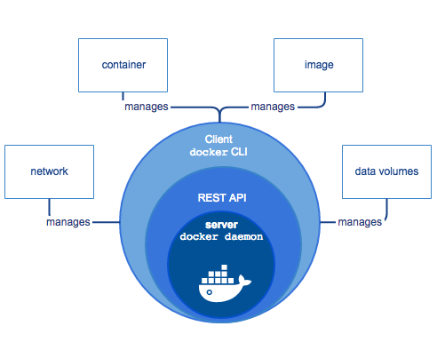
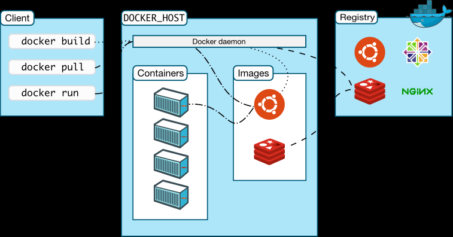

# Docker

## Docker Engine

Docker Engine 是一个 C/S 架构的应用程序，主要包含下面几个组件：

- 常驻后台进程 Dockerd
- 一个用来和 Dockerd 交互的 REST API Server
- 命令行 CLI 接口，通过和 REST API 进行交互（常用的 docker 命令）

## Docker 架构

Docker 使用 C/S （客户端/服务器）体系的架构，Docker 客户端与 Docker 守护进程通信，Docker 守护进程负责构建，运行和分发 Docker 容器。Docker 客户端和守护进程可以在同一个系统上运行，也可以将 Docker 客户端连接到远程 Docker 守护进程。Docker 客户端和守护进程使用 REST API 通过 UNIX 套接字或网络接口进行通信。

- Docker Damon：dockerd，用来监听 Docker API 的请求和管理 Docker 对象，比如镜像、容器、网络和 Volume。
- Docker Client：docker，docker client 是和 Docker 进行交互的最主要的方式方法，比如可以通过 `docker run` 命令来运行一个容器，然后这个 client 会把命令发送给上面的 Dockerd，让它来做真正事情。
- Docker Registry：用来存储 Docker 镜像的仓库，Docker Hub 是 Docker 官方提供的一个公共仓库，而且 Docker 默认也是从 Docker Hub 上查找镜像的，当然也可以很方便的运行一个私有仓库，当使用 `docker pull` 或者 `docker run` 命令时，就会从用户配置的 Docker 镜像仓库中去拉取镜像，使用 `docker push` 命令时，会将构建的镜像推送到对应的镜像仓库中。
- Images：镜像，镜像是一个只读模板，带有创建 Docker 容器的说明，一般来说的，镜像会基于另外的一些基础镜像并加上一些额外的自定义功能。比如，可以构建一个基于 Centos 的镜像，然后在这个基础镜像上面安装一个 Nginx 服务器，这样就可以构成一个属于自定义的镜像了。
- Containers：容器，容器是一个镜像的可运行的实例，可以使用 Docker REST API 或者 CLI 来操作容器，容器的实质是进程，但与直接在宿主执行的进程不同，容器进程运行于属于自己的独立的命名空间。因此容器可以拥有自己的 root 文件系统、自己的网络配置、自己的进程空间，甚至自己的用户 ID 空间。容器内的进程是运行在一个隔离的环境里，使用起来，就好像是在一个独立于宿主的系统下操作一样。这种特性使得容器封装的应用比直接在宿主运行更加安全。
- 底层技术支持：Namespaces（做隔离）、CGroups（做资源限制）、UnionFS（镜像和容器的分层） the-underlying-technology Docker 底层架构分析。