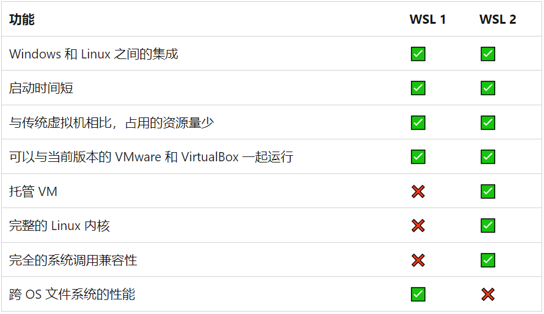

# WSL/WSL 2

> WSL 是适用于 Linux 的 Windows 子系统可让开发人员按原样运行 GNU/Linux 环境 - 包括大多数命令行工具、实用工具和应用程序 - 且不会产生传统虚拟机或双启动设置开销。

> WSL 2 是适用于 Linux 的 Windows 子系统体系结构的一个新版本，它支持适用于 Linux 的 Windows 子系统在 Windows 上运行 ELF64 Linux 二进制文件。 它的主要目标是提高文件系统性能，以及添加完全的系统调用兼容性。

