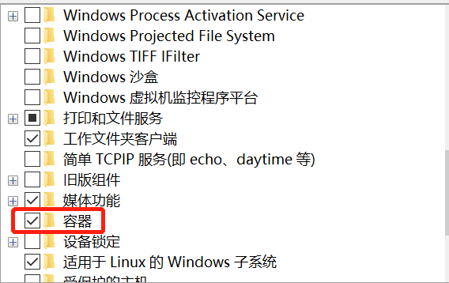
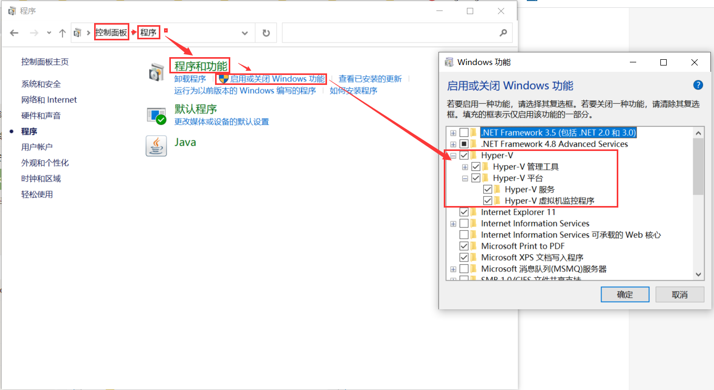
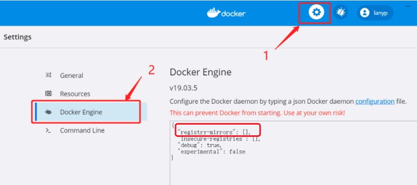
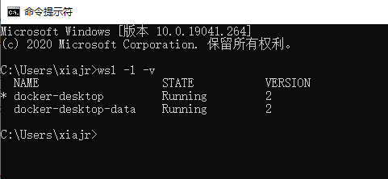

# Windows 版本 Docker 安装

## Win10 系统

Docker Desktop 是 Docker 在 Windows 10 和 macOS 操作系统上的官方安装方式，这个方法依然属于先在虚拟机中安装 Linux 然后再安装 Docker 的方法。

Docker Desktop 官方下载地址： <https://hub.docker.com/editions/community/docker-ce-desktop-windows>

注意：此方法仅适用于 Windows 10 操作系统专业版、企业版、教育版和部分家庭版！

### 开启容器

控制面板 -> 程序 -> 程序和功能 -> 启用或关闭Windows功能



### 开启 Hyper-V

Hyper-V 是微软开发的虚拟机，类似于 VMWare 或 VirtualBox，仅适用于 Windows 10。这是 Docker Desktop for Windows 所使用的虚拟机。

但是，这个虚拟机一旦启用，QEMU、VirtualBox 或 VMWare Workstation 15 及以下版本将无法使用！如果必须在电脑上使用其他虚拟机（例如开发 Android 应用必须使用的模拟器），请不要使用 Hyper-V！

**win10 家庭版安装 Hyper-v**

编写脚本文件以 `.bat` 或 `.cmd` 格式的文件，并以管理员身份运行。

脚本内容如下：

```bat
pushd "%~dp0"

dir /b %SystemRoot%\servicing\Packages\*Hyper-V*.mum >hyper-v.txt

for /f %%i in ('findstr /i . hyper-v.txt 2^>nul') do dism /online /norestart /add-package:"%SystemRoot%\servicing\Packages\%%i"

del hyper-v.txt

Dism /online /enable-feature /featurename:Microsoft-Hyper-V-All /LimitAccess /ALL
```

### 开启 Hyper-V

控制面板 -> 程序 -> 程序和功能 -> 启用或关闭Windows功能



### 安装 Docker Desktop for Windows

双击下载的 Docker for Windows Installer 安装文件，一路 Next，点击 Finish 完成安装。

安装完成后，Docker 会自动启动。通知栏上会出现个小鲸鱼的图标，这表示 Docker 正在运行。

## 镜像加速

国内从 DockerHub 拉取镜像有时会遇到困难，此时可以配置镜像加速器。Docker 官方和国内很多云服务商都提供了国内加速器服务，例如：

- 科大镜像：<https://docker.mirrors.ustc.edu.cn/>
- 网易：<https://hub-mirror.c.163.com/>
- 阿里云：<https://<你的ID>.mirror.aliyuncs.com>
- 七牛云加速器：<https://reg-mirror.qiniu.com>

当配置某一个加速器地址之后，若发现拉取不到镜像，请切换到另一个加速器地址。国内各大云服务商均提供了 Docker 镜像加速服务，建议根据运行 Docker 的云平台选择对应的镜像加速服务。

对于使用 Windows 10 的系统，在系统右下角托盘 Docker 图标内右键菜单选择 Settings，打开配置窗口后左侧导航菜单选择 Daemon。在 registry-mirrors 一栏中填写加速器地址 <https://docker.mirrors.ustc.edu.cn/> ，之后点击 Apply 保存后 Docker 就会重启并应用配置的镜像地址了。



## 设置镜像存储位置（WSL2 子系统）

**前提**

> Windows Docker Desktop 使用 WSL 2 来运行。这种情况下，Docker 运行数据都在 WSL 发行版本中，文件位置都是由 WSL 管理。

安装 Docker 后，Docker 会自动创建 2 个发行版本：

- docker-desktop
- docker-desktop-data



WSL 发行版默认都是安装在 C 盘，在 `%LOCALAPPDATA%/Docker/wsl` 目录。

**WSL 发行版迁移**

1. 关闭 Docker；
2. 关闭所有发行版：`wsl --shutdown`；
3. 将 docker-desktop-data 导出到 `<用户指定文件夹>\wsl\docker-desktop-data\docker-desktop-data.tar`（注意，原有的docker images不会一起导出）
   ```bash
   wsl --export docker-desktop-data D:\docker\wsl\docker-desktop-data\docker-desktop-data.tar
   ```
4. 注销 docker-desktop-data
   ```bash
   wsl --unregister docker-desktop-data
   ```
5. 重新导入 docker-desktop-data 到要存放的文件夹 `<用户指定文件夹>\wsl\docker-desktop-data\docker-desktop-data.tar`
   ```bash
   wsl --import docker-desktop-data D:\docker\wsl\docker-desktop-data\ D:\docker\wsl\docker-desktop-data\docker-desktop-data.tar --version 2
   ```

只需要迁移 docker-desktop-data 一个发行版就行，另外一个不用管，它占用空间很小。

完成以上操作后，原来的 `%LOCALAPPDATA%/Docker/wsl/data/ext4.vhdx` 就迁移到新目录了，重启 Docker。

## FAQ

### 启动 Docker 报错，报错内容： `WSL2 installation is incomplete`

更加报错提示，猜测可能是使用的 WSL2 版本老了，需要手动更新一下，根据提示去微软官网下载最新版的 WSL2 安装后即可正常打开。

[更新包链接](https://wslstorestorage.blob.core.windows.net/wslblob/wsl_update_x64.msi)