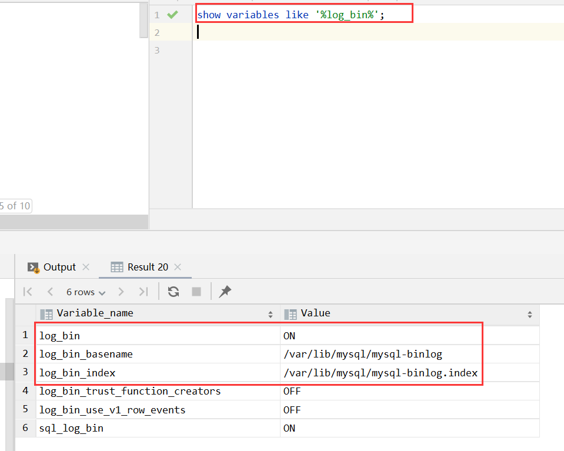

# 镜像：`mysql:5.7`

## 拉取镜像

```bash
docker pull mysql:5.7
```

## 运行

```bash
# -d: 后台运行容器，并返回容器ID
# --name mysql5.7: 为容器指定一个名称
# -p: 指定端口映射，格式为：主机(宿主)端口:容器端口
# -v: 绑定一个卷，主机的目录 D:\docker\volumes\mysql 映射到容器的 /var/lib/mysql
# -e MYSQL_ROOT_PASSWORD=123456: 设置环境变量，密码设置为 123456
# mysql:5.7：使用镜像mysql:5.7

docker run -d --name mysql5.7 -p 3306:3306 -v /d/docker/volumes/mysql/data:/var/lib/mysql -v /d/docker/volumes/mysql/logs:/var/log/mysql -e MYSQL_ROOT_PASSWORD=123456 mysql:5.7
``` 

### 开启 binlog

```bash
# 1. 进入mysql容器
# 2. 新增my.cnf文件
vim /etc/mysql/my.cnf
## 内容如下：
## [mysqld]
## log-bin=/var/lib/mysql/mysql-binlog
## server-id=123456
# 3. 退出容器，重启mysql容器
```



> 注意事项：Windows 用户即使将配置目录映射出去了，也不能直接进行新增/修改文件，会因为权限的问题造成 mysql 容器无法启动，需要在外部删除文件，再重新启动 mysql 的容器。