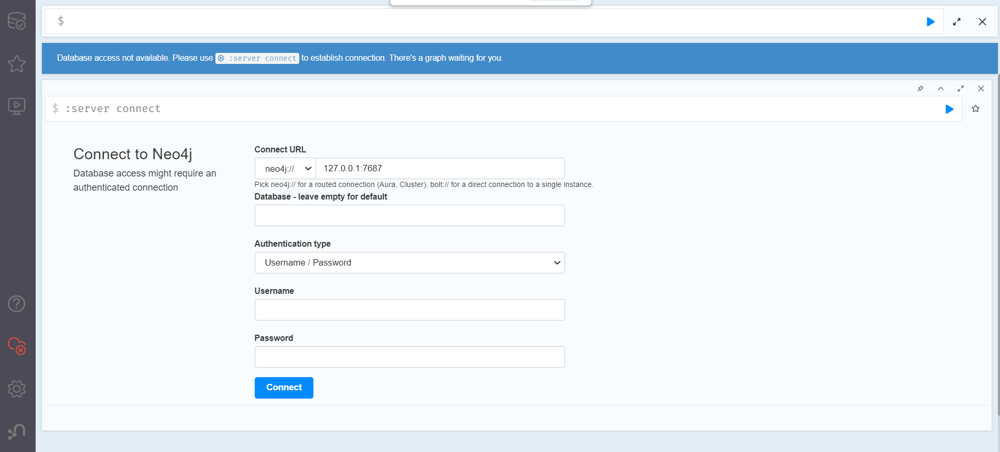

# neo4j

## 拉取镜像

```shell
docker pull neo4j:4.4.16-community
```

## 启动镜像

```shell
# --privileged=true  这个可加可不加，没有影响，使用该参数，container内的root拥有真正的root权限。否则，container内的root只是外部的一个普通用户权限。
# --env NEO4J_AUTH=neo4j/password   配置neo4j数据库的用户名和密码，其中/前面为用户名，后面为密码，此时密码为password，代表使用默认密码，默认密码就是neo4j。

# 文件夹含义
# data：数据存放的文件夹
# logs：运行的日志文件夹
# conf：数据库配置文件夹（在配置文件neo4j.conf中配置包括开放远程连接、设置默认激活的数据库）
# import：为了大批量导入csv来构建数据库，需要导入的节点文件nodes.csv和关系文件rel.csv需要放到这个文件夹下

docker run --privileged=true -d --name neo4j -p 7474:7474 -p 7687:7687 -v /f/docker/volumes/neo4j/data:/data -v /f/docker/volumes/neo4j/logs:/logs -v /f/docker/volumes/neo4j/conf:/conf -v /f/docker/volumes/neo4j/import:/import --env NEO4J_AUTH=neo4j/neo4j neo4j:4.4.16-community
```

**设置配置值**

支持在运行容器时将环境变量传递给容器，可以使用以下命名方案来传递任何配置值（[参数项](https://neo4j.com/docs/operations-manual/current/reference/configuration-settings/#configuration-settings)）

- 带的前缀 `NEO4J_`
- 下划线必须写两次：`_` 写为 `__`
- 句点将转换为下划线：`.` 记为 `_`

例如，`dbms.tx_log.rotation.size` 可以通过为 Docker 指定以下参数来进行设置：

```shell
--env NEO4J_dbms_tx__log_rotation_size=512M
```

可以采用多个选项的变量，例如 `dbms_jvm_additional`，必须仅定义一次，并且包括多个值的串联。例如：

```shell
--env NEO4J_dbms_jvm_additional="-Dcom.sun.management.jmxremote.authenticate=true -Dcom.sun.management.jmxremote.ssl=false -Dcom.sun.management.jmxremote.password.file=$HOME/conf/jmx.password -Dcom.sun.management.jmxremote.access.file=$HOME/conf/jmx.access -Dcom.sun.management.jmxremote.port=3637"
```

## 验证

浏览器访问地址：<http://127.0.0.1:7474>

注意：第一次访问页面可能报 404，稍等片刻即可

