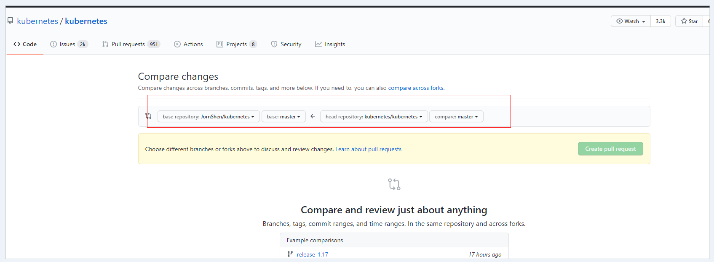
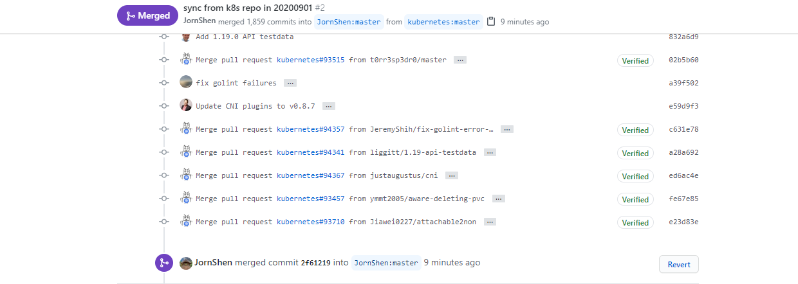

# fork 仓库与原仓库同步

## 通过 PR 方式从原仓库同步到 fork 仓库



> 注意左边是的仓库，然后 create pull request。创建了完了以后，在你的仓库点击 merge。



## 本地设置上游库并拉取最新代码进行 Merge

1. 设置上游库（原仓库地址）
   ```sh
   # 设置上游库
   git remote add upstream https://github.com/fighting41love/funNLP

   # 查看当前本地仓库的远程仓库
   git remote -v
   ```
2. 拉取新设置的上游库的代码
   ```sh
   git fetch upstream
   ```
3. 拉取或合并远程分支到本地分支
   ```sh
   # 使用 Pull拉取分支，将上游仓库的main分支通过rebase的形式拉取到本地main分支
   git pull --rebase upstream main
   # 或者使用Merge，使用Merge会多一条merge commit，而pull --rebase不会有
   git merge upstream main
   ```