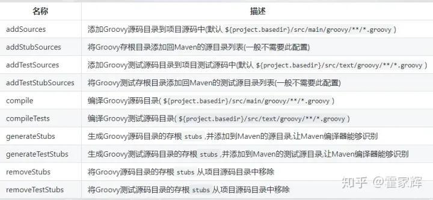

# Maven 项目配置 Groovy

## 添加依赖

```xml
<!-- groovy-all 包含所有groovy GDK 中的包，groovy 只包含基础 Groovy 编译需要的包-->
<dependency>
      <groupId>org.codehaus.groovy</groupId>
      <artifactId>groovy-all</artifactId>
      <version>3.0.17</version>
      <!--指定类型为 pom -->
      <type>pom</type>
    </dependency>
```

## 编译插件

```xml
<plugin> 
    <groupId>org.codehaus.gmavenplus</groupId>  
    <artifactId>gmavenplus-plugin</artifactId>
    <version>2.1.0</version>
    <executions>
        <execution>
            <goals>
                <goal>addSources</goal>
                <goal>addTestSources</goal>
                <goal>generateStubs</goal>
                <goal>compile</goal>
                <goal>generateTestStubs</goal>
                <goal>compileTests</goal>
                <goal>removeStubs</goal>
                <goal>removeTestStubs</goal>
            </goals>
        </execution>
    </executions>
</plugin>
```

