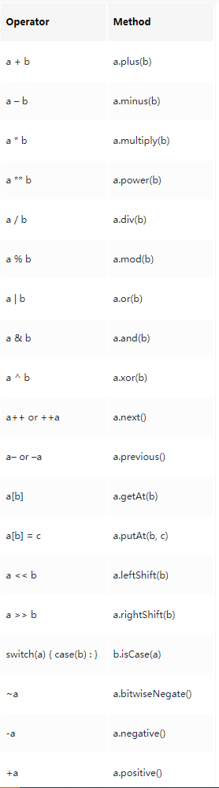

# 运算符

## 算术运算符

## 关系运算符

## 逻辑运算符

## 位运算符

## 赋值运算符

## 范围运算符

> Groovy 支持范围的概念，并在 `..` 符号的帮助下提供范围运算符的符号

```groovy
def range = 0..5
```

## 安全运算符

> 用 `?.` 可以在对象为 null 的时候调用函数不会报空指针的问题，直接返回 null

```groovy
List<String> lst = null
def index_2 = lst?.get(1)
println(index_2)
```

## 展开运算符

> `*.` 运算符应用于实现了 iterator 的对象，对内部的对象进行了遍历操作

```groovy
def lst = ["a", "b", "c"]
def lst2 = lst*.toUpperCase()
println(lst2)
```

## 运算符重载

> Groovy 支持运算符重载，Groovy 将每个运算符映射到一个标准的方法

