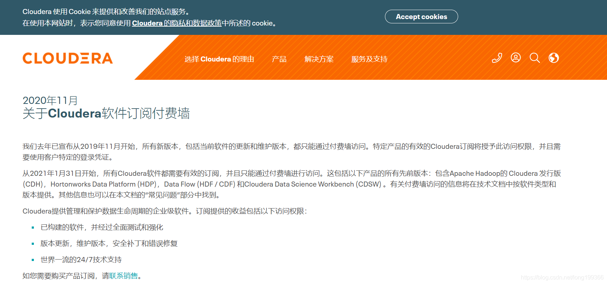

# FAQ

## 2021 年 Cloudera 公司的 CDH 与 HDP 均无法下载

Cloudera公司最近在官网宣布：

> 从 2021 年 1 月 31 日开始，所有 Cloudera 软件都需要有效的订阅，并且只能通过付费墙进行访问。



也就是说CDH各版本都不能免费获取了。很多以前的文章、书籍中提到CDH大数据平台，都是会引用Cloudera官网下载地址，例如：`https://archive.cloudera.com/cm6/6.3.1/redhat7/yum/RPM-GPG-KEY-cloudera`

现在开始要输入账号密码认证了。

解决办法如下：

1. 使用开源的 Hadoop 和 Ambari；
2. 使用试用版 CDP；
3. 在自己或别人机器上是否离线下载过 CDH 的 tar 包，共享使用，官网说的是 CDH6.6 以后收费，以前的还是可以使用。

### 无法下载 `RPM-GPG-KEY-cloudera`

**问题**

```
在服务器中使用命令 rpm --import https://archive.cloudera.com/cm6/6.3.1/redhat7/yum/RPM-GPG-KEY-cloudera 报错，报错为 401 权限问题
```

**解决办法**

从以前安装的 CDH 服务器中将 RPM-GPG-KEY-cloudera 下载下来，拷贝到新服务器上，并执行如下命令：

```bash
# 注意和需要验证命令的区别，下面的命令是执行本地的文件
rpm --import ./RPM-GPG-KEY-cloudera
```