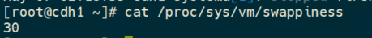
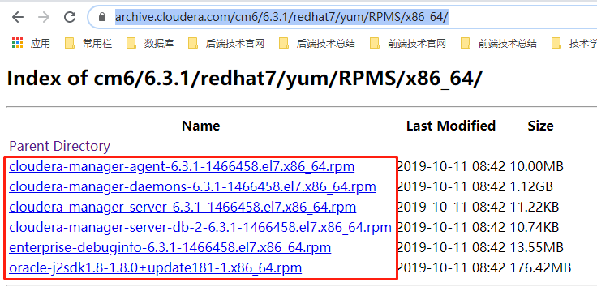
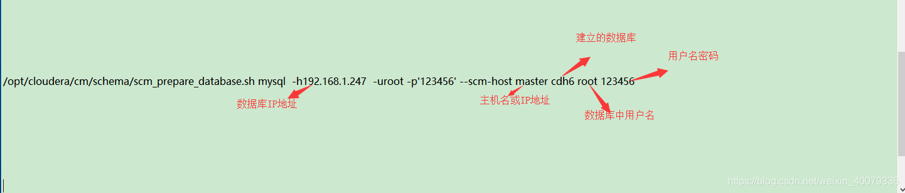
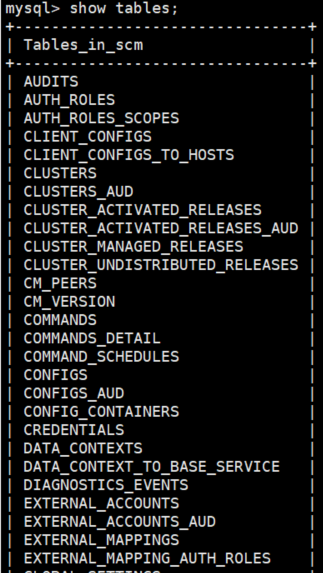
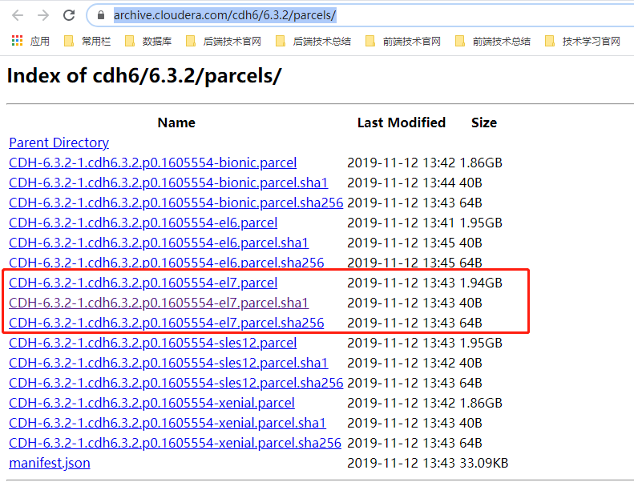

# 安装部署

## 环境准备

### 节点数量

最小规模，建议最少 4 台服务器，一台用作管理节点 Cloudera Manager 和 NameNode 等，另外三台用作工作节点，该规模仅用于开发和测试。如果是生产系统，最少 6 台，3 台管理节点包括 1 个Cloudera Manager，2 个 NameNode 启用高可用，3 个工作节点。常见的较小规模的生产系统一般为10-20台。

### 硬件

以下 Cloudera Manager，NameNode 和 DataNode 相同：

- CPU：最少 4 cores，推荐 2 路 8 核，2 路 10 核，2 路 12 核
- 内存：最小 16GB，推荐 128GB-256GB
- 网络：最小千兆，推荐两张万兆绑定
- 磁盘：建议 raid1 或者 raid10，磁盘大小最少100G，DataNode 数据盘推荐 12 块 1TB-4TB 的 SATA/SAS 盘

[挂载磁盘](Linux/挂载磁盘.md)

### 操作系统

CDH 支持在主流的 64 位 Linux 操作系统上部署运行。

> 该操作都是基于 CentOS7 操作系统的情况下

### 网络

**确保没有启用 IPv6**

```bash
# lsmod | grep ipv6
(todisable add the following to /etc/sysctl.conf)

#disable ipv6
net.ipv6.conf.all.disable_ipv6= 1
net.ipv6.conf.default.disable_ipv6= 1
net.ipv6.conf.lo.disable_ipv6= 1
```

如果是 RHEL/CentOS，可以把以下内容补充到 `/etc/sysconfig/network`:

```bash
NETWORKING_IPV6=no
IPV6INIT=no
```

**静态 IP**

确保所有服务器已配置静态 IP，如下：

```bash
# cat /etc/sysconfig/network-scripts/ifcfg-eth* (RHEL)
```

以上文件需包含以下内容：

- `BOOTPROTO=static`(RHEL/SLES);
- `iface <iface> inet static` (Ubuntu);
- `IPADDR` or `address` should match the output of ifconfig;

### 主机名

> 2021年5月20日：不管是单机部署还是集群部署，这一步骤一定要配置，不然 CDH 初始化数据库无法成功，网上也有 CDH 关于这个相关的 Bug。

确保所有服务器的 hostname 已经配置，比如cdh1, cdh2, cdh3…，示例如下：

```bash
vim /etc/hosts

## 注释掉localhost相关主机名配置，添加如下配置
192.168.123.123 cdh1
192.168.123.124 cdh2
192.168.123.125 cdh3
```

详细见：[修改主机名](Linux/修改hosts.md)

### 用户

可以使用 root 用户安装，或者具有 sudu 权限的其他用户。

### SSH 免密远程登录

详细见：[SSH](Linux/SSH.md)

### JDK

CDH 支持 JDK 包括 JDK7 以及 JDK8。Cloudera 提供相应 JDK 包，并可有 CM 自动在集群中部署安装。CDH 的版本都能提供对 Oracle JDK7 的支持，而 JDK8 的支持则需要 CDH5.3 之后的版本。

> CentOS7 下推荐安装 openjdk，安装命令如下：
> ```bash
> yum install java-1.8.0-openjdk-devel -y
> ```

### 安装 MySQL 数据库

**创建 CDH 所需的数据库**

[CentOS7 上安装部署 MySQL5.7](数据库/安装部署/CentOS7上安装部署.md)

### namenode 安装 httpd 服务

```bash
yum -y install httpd

# 启动服务并设置开机自启
systemctl start httpd.service
systemctl enable httpd.service
```

详细见：[安装httpd服务](Linux/安装HTTP服务器.md)

### 端口

CDH 及相关大数据组件的端口

| Service                     |  Port | Hosts                               |
| --------------------------- | ----: | ----------------------------------- |
| Cloudera Manager            |  7180 | CM所在主机                          |
| Cloudera Navigator Metadata |  7187 | Navigator所在主机                   |
| HDFS                        | 50070 | Namenode所在主机                    |
| HDFS                        |  8020 | Namenode所在主机                    |
| ResourceManager             |  8088 | RM所在主机                          |
| ResourceManager             | 19888 | JobHistory所在主机                  |
| HBase                       | 60010 | HMaster所在主机                     |
| HBase                       | 60030 | 可选:RegionServer所在主机           |
| Hive                        | 10002 | HiveServer2所在主机                 |
| Hue                         |  8888 | Hue所在主机                         |
| Impala                      | 25010 | Impala StateStore所在主机           |
| Impala                      | 25020 | Impala Catalog所在主机              |
| Impala                      | 25000 | 所有ImpalaD所在主机                 |
| http                        |    80 | httpd服务所在机器，一般是CM那台主机 |
| ssh                         |    22 | 可以通过终端ssh到CM所在机器         |
| Spark                       | 18088 | Spark HistoryServer所在机器         |

更多端口参考：<https://www.cloudera.com/documentation/enterprise/latest/topics/cm_ig_ports.html>

## 环境配置

### 禁用 SELinux

1. 在集群所有节点执行如下命令：
   ```bash
   setenforce 0
   ```
2. 修改集群所有节点配置文件 `/etc/selinux/config`
   ```bash
   vim /etc/selinux/config
   
   # This file controls the state ofSELinux on the system.
   # SELINUX= can take one of these three values:
   #     enforcing - SELinux security policyis enforced.
   #     permissive - SELinux printswarnings instead of enforcing.
   #     disabled - No SELinux policy isloaded.
   SELINUX=disabled
   # SELINUXTYPE= can take one of thesetwo values:
   #     targeted - Targeted processes areprotected,
   #     mls - Multi Level Securityprotection.
   SELINUXTYPE=targeted
   ```
3. 验证是否禁用成功
   ```bash
   sestatus -v
   
   # 结果
   SELinux status:                 disabled
   ```

> 注意：配置项需要重启才能生效。

### 关闭防火墙

```bash
systemctl stop firewalld
systemctl disable firewalld
```

详细见：[防火墙](Linux/防火墙.md)

### 设置 SWAP

Cloudera 建议将 `/proc/sys/vm/swappiness` 设置为最大值 10。当前默认设置为 30。使用 sysctl 命令在运行时更改该设置并编辑 `/etc/sysctl.conf`，以在重启后保存该设置。您可以继续进行安装，但 Cloudera Manager 可能会报告您的主机由于交换而运行状况不良

1. 查看当前大小
   ```bash
   cat /proc/sys/vm/swappiness
   ```
   
2. 设置 swappiness 大小
   ```bash
   sysctl vm.swappiness=10
   ```
3. 保障重启生效
   ```bash
   vim /etc/sysctl.conf
   
   # 添加如下内容
   vm.swappiness=10
   ```

### 关闭透明大页面

1. 查看系统是否已启用透明页
   ```bash
   cat /sys/kernel/mm/transparent_hugepage/enabled
   
   [always] madvise never
   # 使用命令查看时，如果输出结果为[always]表示透明大页启用了，[never]表示透明大页禁用
   ```
2. 禁用透明页
   ```bash
   echo never > /sys/kernel/mm/transparent_hugepage/defrag
   echo never > /sys/kernel/mm/transparent_hugepage/enabled
   ```
3. 保障重启生效
   ```bash
   vim /etc/rc.local
   
   # 添加如下内容
   echo never > /sys/kernel/mm/transparent_hugepage/defrag
   echo never > /sys/kernel/mm/transparent_hugepage/enabled
   ```

### 配置时钟同步

部署 CDH 集群必须安装时钟同步服务，保障集群整体的时钟一致性

[配置 NTP 服务](Linux/NTP服务.md)

## 安装

### 在线安装

> 官方文档：<https://docs.cloudera.com/documentation/enterprise/6/latest/topics/install_cm_server.html>

### 离线安装

1. 下载 cloudera-manager 包
   
   

2. 下载 allkeys.asc 文件
3. 配置 cloudera manager 的 yum 库
   1. 在 httpd 服务中创建 cm6 目录
   
   ```bash
   mkdir -p /var/www/html/cloudera-repos/cm6
   ```

   2. 上传下载的文件到 cm 目录下
   3. 创建镜像，生成 RPM 元数据
   
   ```bash
   createrepo ./
   
   #若报错：command not found，执行如下命令
   yum -y install createrepo
   ```

   4. 配置镜像源
   
   ```bash
   vim /etc/yum.repos.d/cloudera-manager.repo
   
   # 配置如下所示：
   [cloudera-manager]
   name=Cloudera Manager 6.3.1
   #baseurl配置为主节点主机名cdh1
   baseurl=http://cdh1/cloudera-repos/cm6/
   gpgcheck=1
   #enabled=1
   #autorefresh=0
   #type=rpm-md
   ```

   5. 更新 yum 库
   
   ```bash
   yum clean all && yum makecache
   ```
4. 导入 GPG key
   ```bash
   rpm --import https://archive.cloudera.com/cm6/6.3.1/redhat7/yum/RPM-GPG-KEY-cloudera
   ```
   上述命令会报错，见：[FAQ](CDH/FAQ.md)
5. 安装 cloudera manager
   ```bash
   yum update
   yum -y install cloudera-manager-daemons cloudera-manager-agent cloudera-manager-server
   ```
6. 数据库初始化
   > 需现在数据库中建立相应的数据库和用户，详细见：[CDH创建库和用户](cdh所依赖的数据库.md)
   - mysql 数据库与 cm-server 是同一台服务器
      ```bash
      /opt/cloudera/cm/schema/scm_prepare_database.sh mysql scm scm
      ```
   - mysql 数据库与 cm-server 不在同一台服务器上
      ```bash
      /opt/cloudera/cm/schema/scm_prepare_database.sh mysql -h <mysql-host-ip> --scm-host <cm-server-ip> scm scm
      ```

   

   > 注意：需要保证 JDK 环境下有数据库的驱动：
   > ```bash
   > wget https://dev.mysql.com/get/Downloads/Connector-J/mysql-connector-java-5.1.21.tar.gz
   > tar zxvf mysql-connector-java-5.1.21.tar.gz
   > sudo mkdir -p /usr/share/java/
   > cd mysql-connector-java-5.1.21
   > sudo cp mysql-connector-java-5.1.21-bin.jar /usr/share/java/mysql-connector-java.jar
   > ```
   > 
   > 经验证，`mysql-connector-5.1.46.jar` 包会出现无法连接数据的问题，测试 `5.1.21` 版本可用
   
   > 注意2：数据库初始化完成后，直接进入数据库查看表是否创建完成，若没有表，需重启后即可查看到表
   

## 配置本地 Parcel 存储包

下载如下所示的文件：



下载完成后，将下载文件拷贝到 `/opt/cloudera/parcel-repo` 目录下

修改sha码【不然cdh无法找到组件包】

```bash
#在/opt/cloudera/parcel-repo执行以下命令，注意版本号
sha1sum CDH-6.3.2-1.cdh6.3.2.p0.1605554-el7.parcel | awk '{ print $1 }' > CDH-6.3.2-1.cdh6.3.2.p0.1605554-el7.parcel.sha
```

> 注意事项：需要重启机器，不然 CDH 找不到 Parcel 存储包

## 启动 cloudera manager

```bash
systemctl start cloudera-scm-server.service
```

**设置开机自启动**

```bash
systemctl enable cloudera-scm-server.service
```

> cm-server 的日志路径是：`/var/log/cloudera-scm-server/cloudera-scm-server.log`

## 访问 cloudera manager WEB 界面

访问地址:`http://<server_host>:7180`，默认账号和密码都是 `admin`

## 注意事项

1. 目前 cloudera manager 使用的版本是 6.3.1，但 parcel 使用的版本是 6.3.2，在安装集群的时候要选择 Express，不然会找不到 parcel。【网上说小版本之间是不会出现高版本问题的，这块注意一下】

showdoc：http://36.153.0.228:4999/web/#/41?page_id=1138

