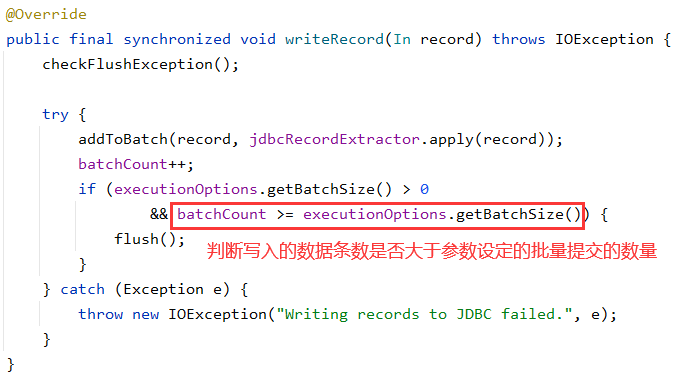

# JdbcSink

## 使用

**引入依赖**

```xml
<dependency>
    <groupId>org.apache.flink</groupId>
    <artifactId>flink-connector-jdbc_2.11</artifactId>
    <version>${flink.version}</version>
</dependency>
<dependency>
    <groupId>mysql</groupId>
    <artifactId>mysql-connector-java</artifactId>
    <version>8.0.15</version>
</dependency>
```

**代码示例**

```java
//存储到mysql数据库
sourceStream.addSink(JdbcSink.sink(
        "insert into flink_kafka_demo(personId,numbers,start,end) values(?,?,?,?)"
        , new JdbcStatementBuilder<Tuple3<String, String, Long>>() {
            @Override
            public void accept(PreparedStatement preparedStatement, Tuple3<String, String, Long> t) throws SQLException {
                String start = null, end = null;
                if (StringUtils.isNotBlank(t.f1)) {
                    String[] ss = t.f1.split(",");
                    start = ss[0];
                    end = ss[1];
                }

                preparedStatement.setString(1, t.f0);
                preparedStatement.setLong(2, t.f2);
                preparedStatement.setString(3, start);
                preparedStatement.setString(4, end);
            }
        }
        , new JdbcConnectionOptions.JdbcConnectionOptionsBuilder().
                withDriverName(driverClass)
                .withUrl(dbUrl)
                .withUsername(userNmae)
                .withPassword(passWord)
                .build()));
```

## FAQ

### Q：数据正常运转到 JdbcSink，但是查询数据库表无数据

> JdbcSink 使用批处理，默认数据量在 5000 条下才会作为一个批次提交上去，这会造成数据量不足 5000 的时候，无法第一时间看到计算的数据。
> 
> 源码见：`org.apache.flink.connector.jdbc.internal.JdbcBatchingOutputFormat#writeRecord`
> 
> 