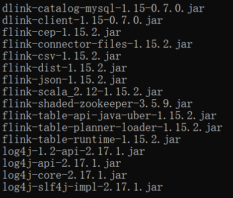

# FAQ

## 【0.7.0_Flink1.15】Dinky 本地的 Flink 环境

> 将 Flink 发布版的 lib 目录下依赖包放到 Dinky 的 `${Dinky_HOME}/plugins/flink1.15/` 目录下

依赖包如下：



## 【0.7.0_Flink1.15】报错：`java.lang.NoClassDefFoundError: org/apache/flink/table/planner/plan/optimize/program/FlinkChainedProgram`

- `flink-table-planner-loader-1.15.1.jar`【删除】
- `flink-table-planner_2.12-1.15.1.jar`【新增】

## 【0.7.0_Flink1.15】Dinky 直接使用 FlinkSql 使用 `flink-connector-jdbc` 报错

`flink-connector-jdbc` 未直接包含在 Flink 二进制发行版本中，需要单独引用。

1. Flink 环境引入 JDBC Connector 及 JDBC Driver 包
2. Dinky plugin 目录下也同样需要引入上面两个包

> Dinky 本地的 Flink 环境要跟实际配置的 Flink 集群要一致，不然无法提交任务

## 【0.7.0_Flink1.15】Yarn Per Job 模式提交报错

**解决方案一：**【暂未验证】

1. 在 auto.sh中加入hadoop_home的环境
例如 export HADOOP_HOME="/opt/cloudera/parcels/CDH/lib/hadoop"
2. 下载common-cli.jar包到 `flink/lib/` 下，同时放到 plugins 下一份，`hdfs/flink/lib/` 下放一份

**解决方案二：**

1. 手动将 Hadoop 相关依赖包放入 plugins 下，注意需排除如下包：

```
javax.servlet.javax.servlet-api
com.google.code.gson.gson
```