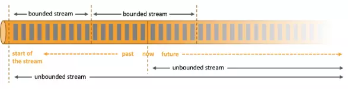
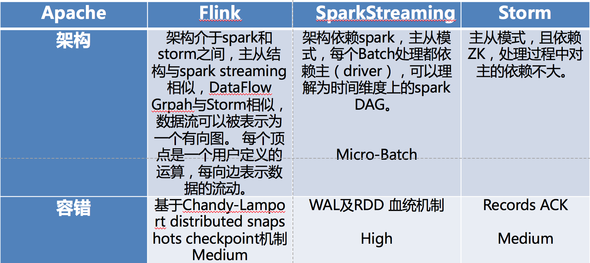
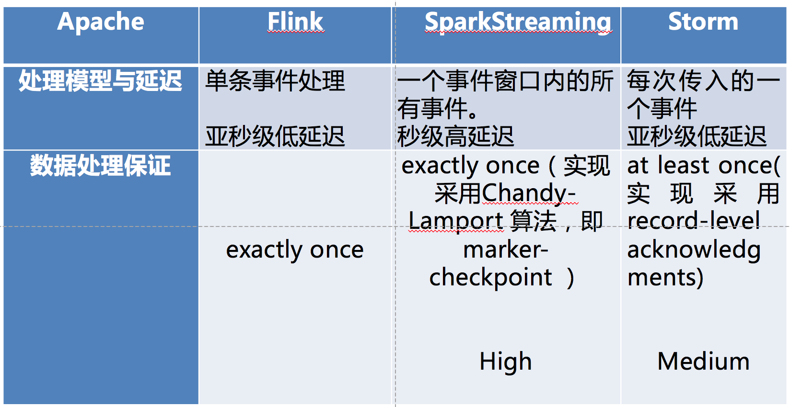
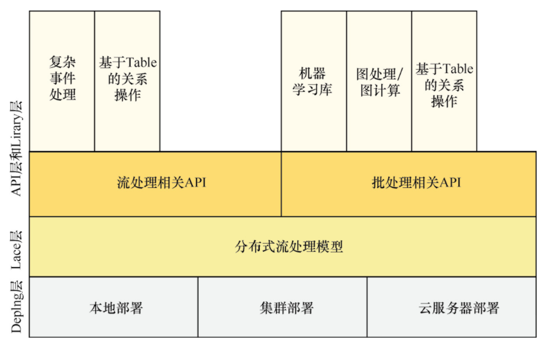
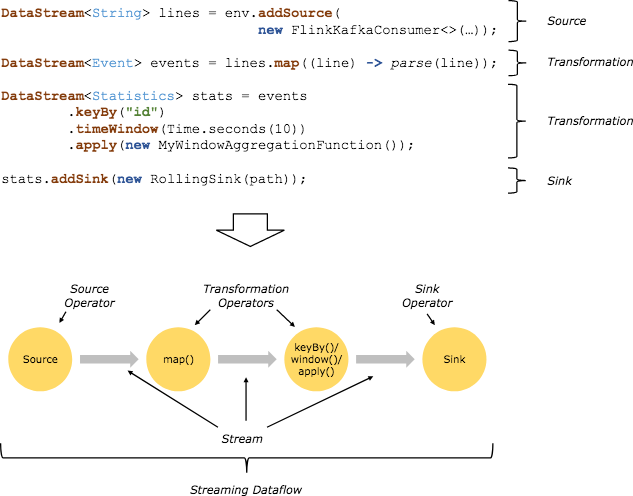
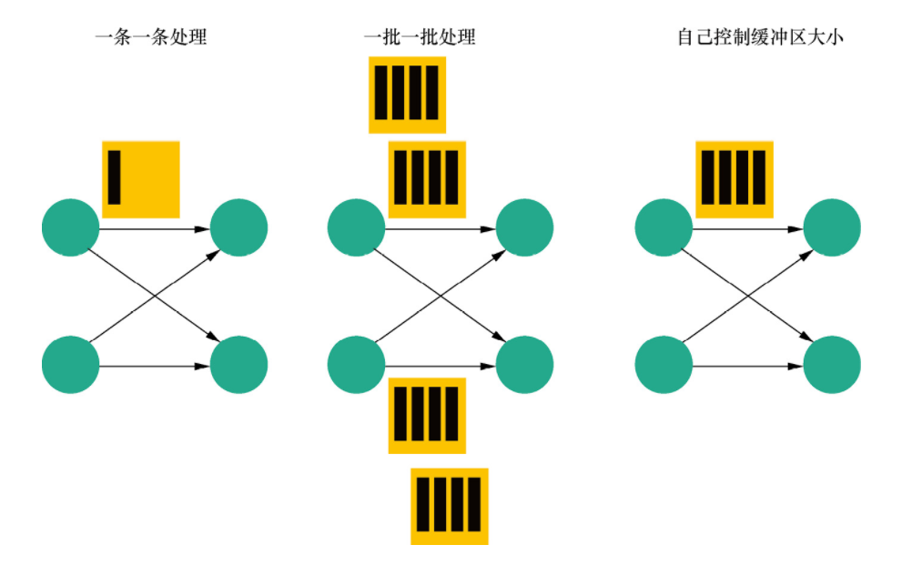

<!--
 * @Github       : https://github.com/superzhc/BigData-A-Question
 * @Author       : SUPERZHC
 * @CreateDate   : 2020-11-18 08:57:20
 * @LastEditTime : 2020-11-26 14:32:10
 * @Copyright 2020 SUPERZHC
-->

# Flink

## 概述

> Flink 官网介绍：
> 
> Apache Flink 是一个框架和分布式处理引擎，用于在无边界和有边界数据流上进行有状态的计算。Flink 能在所有常见集群环境中运行，并能以内存速度和任意规模进行计算。

**有边界和无边界数据**

任何类型的数据都可以形成一种事件流。信用卡交易、传感器测量、机器日志、网站或移动应用程序上的用户交互记录，所有这些数据都形成一种流。

数据可以被作为*无界*或者*有界*流来处理。

1. 无界流：有定义流的开始，但没有定义流的结束。它们会无休止地产生数据。无界流的数据必须持续处理，即数据被摄取后需要立刻处理。我们不能等到所有数据都到达再处理，因为输入是无限的，在任何时候输入都不会完成。处理无界数据通常要求以特定顺序摄取事件，例如事件发生的顺序，以便能够推断结果的完整性。
2. 有界流：有定义流的开始，也有定义流的结束。有界流可以在摄取所有数据后再进行计算。有界流所有数据可以被排序，所以并不需要有序摄取。有界流处理通常被称为批处理



**优势**

- 支持高吞吐、低延迟、高性能的流处理
- 支持高度灵活的窗口（Window）操作
- 支持有状态计算的 Exactly-once 语义
- 提供 DataStream API 和 DataSet API

**与同类产品比较**





## [安装部署](../Flink/安装部署/README.md)

Apache Flink 是一个分布式系统，它需要计算资源来执行应用程序。Flink 集成了所有常见的集群资源管理器，例如 Hadoop YARN、 Apache Mesos 和 Kubernetes，但同时也可以作为独立集群运行。

Flink 被设计为能够很好地工作在上述每个资源管理器中，这是通过资源管理器特定(resource-manager-specific)的部署模式实现的。Flink 可以采用与当前资源管理器相适应的方式进行交互。

部署 Flink 应用程序时，Flink 会根据应用程序配置的并行性自动标识所需的资源，并从资源管理器请求这些资源。在发生故障的情况下，Flink 通过请求新资源来替换发生故障的容器。提交或控制应用程序的所有通信都是通过 REST 调用进行的，这可以简化 Flink 与各种环境中的集成。

## 组件栈

Flink 自底向上在不同的抽象级别提供了多种 API，并且针对常见的使用场景开发了专用的扩展库，如下图所示：



由上图可知，Flink 架构可以分为 4 层，包括 Deploy 层、Core 层、API 层和 Library 层。

- Deploy 层：该层主要涉及 Flink 的部署模式，Flink 支持多种部署模式——本地、集群（Standalone/YARN）和云服务器（GCE/EC2）。
- Core/Runtime 层：该层提供了支持 Flink 计算的全部核心实现，为 API 层提供基础服务，支持分布式 Stream 作业的执行、JobGraph 到 ExecutionGraph 的映射转换、任务调度等。将 DataSteam 和 DataSet 转成统一的可执行的 Task Operator，达到在流式引擎下同时处理批量计算和流式计算的目的。
- API 层：该层主要实现了面向无界 Stream 的流处理和面向 Batch 的批处理 API，其中流处理对应 DataStream API，批处理对应 DataSet API。
- Library 层：该层也被称为 Flink 应用框架层，根据 API 层的划分，在 API 层之上构建的满足特定应用的实现计算框架，也分别对应于面向流处理和面向批处理两类。面向流处理支持 CEP（复杂事件处理）、基于 SQL-like 的操作（基于 Table 的关系操作）；面向批处理支持 FlinkML（机器学习库）、Gelly（图处理）、Table 操作。

## 架构图


Flink 系统架构设计如上图所示，Flink 整个系统主要由两个组件组成，分别为 JobManager 和 TaskManager, Flink 架构也**遵循 Master-Slave 架构** 设计原则， JobManager 为 Master 节点，TaskManager 为 Worker（Slave）节点。所有组件之间的通信都是借助于 Akka Framework，包括任务的状态以及 Checkpoint 触发等信息。

### JobManager

JobManager 负责整个 Flink 集群任务的调度以及资源的管理，从客户端中获取提交的应用，然后根据集群中 TaskManager 上 TaskSlot 的使用情况，为提交的应用分配相应的 TaskSlots 资源并命令 TaskManger 启动从客户端中获取的应用。JobManager 相当于整个集群的 Master 节点，且整个集群中有且仅有一个活跃的 JobManager，负责整个集群的任务管理和资源管理。JobManager 和 TaskManager 之间通过 Actor System 进行通信，获取任务执行的情况并通过 Actor System 将应用的任务执行情况发送给客户端。同时在任务执行过程中，Flink JobManager 会触发 Checkpoints 操作，每个 TaskManager 节点收到 Checkpoint 触发指令后，完成 Checkpoint 操作，所有的 Checkpoint 协调过程都是在 Flink JobManager 中完成。当任务完成后，Flink 会将任务执行的信息反馈给客户端，并且释放掉 TaskManager 中的资源以供下一次提交任务使用。

### TaskManager

TaskManager 相当于整个集群的 Slave 节点，负责具体的任务执行和对应任务在每个节点上的资源申请与管理。客户端通过将编写好的 Flink 应用编译打包，提交到 JobManager，然后 JobManager 会根据已经注册在 JobManager 中 TaskManager 的资源情况，将任务分配给有资源的 TaskManager 节点，然后启动并运行任务。TaskManager 从 JobManager 接收需要部署的任务，然后使用 Slot 资源启动 Task，建立数据接入的网络连接，接收数据并开始数据处理。同时 TaskManager 之间的数据交互都是通过数据流的方式进行的。

### Client 客户端

客户端负责将任务提交到集群，与 JobManager 构建 Akka 连接，然后将任务提交到 JobManager，通过和 JobManager 之间进行交互获取任务执行状态。客户端提交任务可以采用 CLI 方式或者通过使用 Flink WebUI 提交，也可以在应用程序中指定 JobManager 的 RPC 网络端口构建 ExecutionEnvironment 提交 Flink 应用。

## 编程模型



上图是来自 Flink 官网的运行流程图，由上图可知，一个 Flink Job 需要如下 3 个部分组成：

```
Flink Job = Source + Transformation + Sink
```

- Source：表示数据源组件，主要用来接收数据，目前官网提供了 readTextFile、socketTextStream、fromCollection 以及一些第三方的 Source。
- Transformation：表示算子，主要用来对数据进行处理，比如 Map、FlatMap、Filter、Reduce、Aggregation 等。
- Sink：表示输出组件，主要用来把计算的结果输出到其他存储介质中，比如 writeAsText 以及 Kafka、Redis、Elasticsearch 等第三方 Sink 组件。

## 流处理与批处理模型

通过灵活的执行引擎，Flink 能够同时支持批处理任务与流处理任务。在执行引擎层级，流处理系统与批处理系统最大的不同在于节点间的数据传输方式。



如上图所示，对于一个流处理系统，其节点间数据传输的标准模型是，在处理完成一条数据后，将其序列化到缓存中，并立刻通过网络传输到下一个节点，由下一个节点继续处理。而对于一个批处理系统，其节点间数据传输的标准模型是，在处理完成一条数据后，将其序列化到缓存中，当缓存写满时，就持久化到本地硬盘上；在所有数据都被处理完成后，才开始将其通过网络传输到下一个节点。

这两种数据传输模式是两个极端，对应的是流处理系统对低延迟和批处理系统对高吞吐的要求。Flink 的执行引擎采用了一种十分灵活的方式，同时支持了这两种数据传输模型。

Flink 以固定的缓存块为单位进行网络数据传输，用户可以通过设置缓存块超时值指定缓存块的传输时机。如果缓存块的超时值为 0，则 Flink 的数据传输方式类似于前面所提到的流处理系统的标准模型，此时系统可以获得最低的处理延迟；如果缓存块的超时值为无限大，则 Flink 的数据传输方式类似于前面所提到的批处理系统的标准模型，此时系统可以获得最高的吞吐量。

缓存块的超时值也可以设置为 0 到无限大之间的任意值，缓存块的超时阈值越小，Flink 流处理执行引擎的数据处理延迟就越低，但吞吐量也会降低，反之亦然。通过调整缓存块的超时阈值，用户可根据需求灵活地权衡系统延迟和吞吐量。

## [程序开发示例](../Flink/开发程序示例.md)

## [重启策略](../Flink/重启策略.md)

## [分布式缓存](../Flink/分布式缓存.md)

## [时间](../Flink/时间_Time/README.md)

## [窗口](../Flink/窗口_Window/README.md)