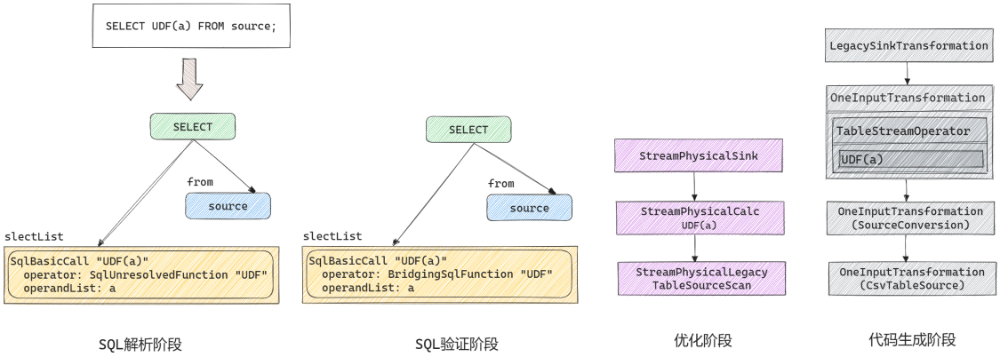
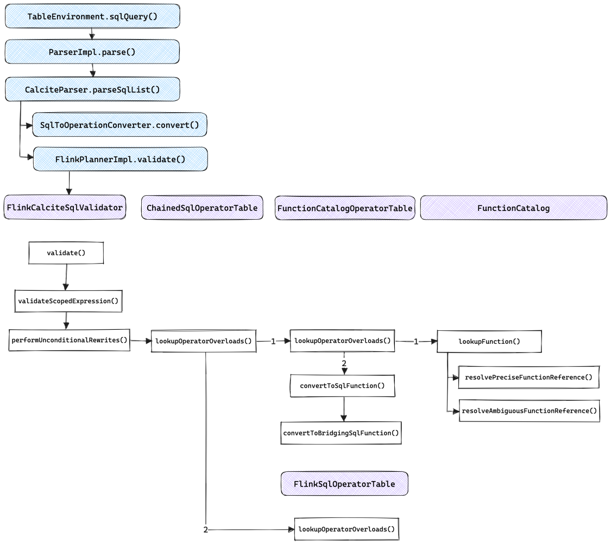
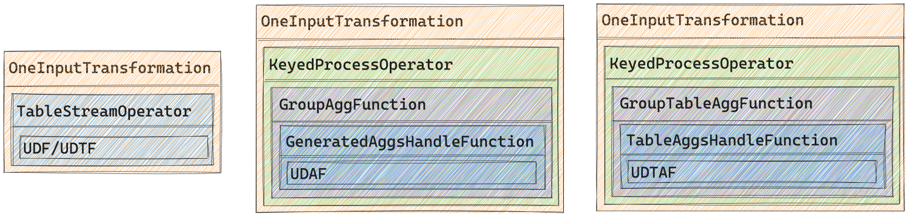

# Flink SQL 自定义函数处理流程

在 Flink SQL 中，函数在 SQL 的解析阶段，验证阶段和代码生成阶段都会进行相应的转换，最终包装在相应的 StreamOperator 实现类中执行。



## 解析阶段

在 SQL 解析阶段，所有类型的函数都会被解析为 `SqlUnresolvedFunction`，这一阶段直接由 Calcite 实现。

## 验证阶段

解析阶段仅做语法上的解析，所有形如 `f(param)` 形式的表达式都会被解析为 `SqlUnresolvedFunction`。验证阶段会验证函数是否已经注册，对于已注册的函数会根据函数类型转换为 `SqlFunction` 的子类型，并验证其输入输出类型是否符合语义。

函数查找及转换的整体调用流程如下图所示，这一流程还是在 Calcite 的验证框架中执行的。



上图中，`FlinkCalciteSqlValidator` 是 `SqlValidatorImpl` 的简单扩展。`SqlValidatorImpl` 通过 `SqlOperatorTable` 获取函数元数据，在 Flink 中其实现类是 `FunctionCatalogOperatorTable` 和 `FlinkSqlOperatorTable`，并组合在 `ChainedSqlOperatorTable` 中。其中:

- `FunctionCatalogOperatorTable` 用来适配 `FunctionCatalog`，包含用户注册的 Catalog Function，以及定义在 `BuiltInFunctionDefinitions` 中的 System Function （通过 CoreModule 加载）
- `FlinkSqlOperatorTable` 则定义了 Flink 特有的一些函数，如 `TUMBLE`、`HOP` 等

如果使用了未注册的函数，验证阶段会直接抛出异常。对于已注册的函数会转换为 `SqlFunction` 的子类型，具体来说：

- UDF
    - Scalar Function 被转换为 `BridgingSqlFunction`
    - Table Function 被转换为 `BridgingSqlFunction.WithTableFunction`
    - Aggregate Function 和 Table Aggregate Function 被转换为 `BridgingSqlAggFunction`
- 内置函数：如果定义了 `runtimeClass` 的函数，同 UDF 一样；否则被转换为 SqlFunction 或其子类，这类函数对应的具体类型都在 `FlinkSqlOperatorTable` 中定义

转换为 SqlFunction 之后会对函数的输入输出类型进行语义验证，验证实现在 `SqlOperator.checkOperandTypes()` 中(SqlFunction 是 SqlOperator 的子类)，会调用 SqlOperandTypeChecker 进行类型检验，在 Flink 中其实现类是 `TypeInferenceOperandChecker`。

## 代码生成阶段

无论是解析阶段产出的 `SqlUnresolvedFunction` 还是验证阶段产出的 `SqlFunction` 都是 Calcite 定义的，无法提交给 Flink 执行引擎运行，代码生成阶段会将 `SqlFunction` 对应的可执行函数嵌入到 `StreamOperator` 中. 具体来说，不同类型函数所生成的 `Transformation` 结构如下图所示，其中蓝色部分均是自动生成的代码，Scalar Function 和 Table Function 均会嵌入到自动生成的 `TableStreamOperator` 子类中，在其中的 `processElement()` 函数中会调用用户提供的 UDF/UDTF 进行处理；Aggregate Function 会嵌入到自动生成的 `GeneratedAggsHandleFunction` 中；Table Aggregate Function 会嵌入到自动生成的 `TableAggsHandleFunction` 中。



函数相关的代码生成的逻辑在 `ExprCodeGenerator.generateCallExpression()` 中，它会根据函数的类型选择对应的生成方法。

### 生成代码参考

> 生成的代码均做了一些简化，如去掉全路径包名，变量名称简化等，以方便阅读。

**生成的与UDF计算相关的代码**

> `SELECT UDF(b) FROM source WHERE UDF(b) IS NOT NULL;`

```java
public class StreamExecCalc$11 
	extends TableStreamOperator implements OneInputStreamOperator {

    private final Object[] references;
    private transient StringDataSerializer typeSerializer$3;
    private transient UDF udf;
    private transient StringStringConverter converter$5;
    BoxedWrapperRowData out = new BoxedWrapperRowData(1);
    private final StreamRecord outElement = new StreamRecord(null);

    public StreamExecCalc$11(
        Object[] references,
        StreamTask task,
        StreamConfig config,
        Output output,
        ProcessingTimeService processingTimeService) throws Exception {
        this.references = references;
        typeSerializer$3 = (((StringDataSerializer) references[0]));
        udf = (((UDF) references[1]));
        converter$5 = (((StringStringConverter) references[2]));
        udf = (((UDF) references[3]));
        this.setup(task，config，output);
        if (this instanceof AbstractStreamOperator) {
            ((AbstractStreamOperator) this).setProcessingTimeService(processingTimeService);
        }
    }

    @Override
    public void open() throws Exception {
        super.open();

        udf.open(new FunctionContext(getRuntimeContext()));

        converter$5.open(getRuntimeContext().getUserCodeClassLoader());
    }

    @Override
    public void processElement(StreamRecord element) throws Exception {
        RowData in1 = (RowData) element.getValue();

        BinaryStringData field$2;
        boolean isNull$2;
        BinaryStringData field$4;
        String externalResult$6;
        BinaryStringData result$7;
        boolean isNull$7;
        String externalResult$9;
        BinaryStringData result$10;
        boolean isNull$10;

        isNull$2 = in1.isNullAt(0);
        field$2 = BinaryStringData.EMPTY_UTF8;
        if (!isNull$2) {
            field$2 = ((BinaryStringData) in1.getString(0));
        }
        field$4 = field$2;
        if (!isNull$2) {
            field$4 = (BinaryStringData) (typeSerializer$3.copy(field$4));
        }

        externalResult$6 = (String) udf
                            .eval(isNull$2 ? null : ((String) converter$5.toExternal((BinaryStringData) field$4)));

        isNull$7 = externalResult$6 == null;
        result$7 = BinaryStringData.EMPTY_UTF8;
        if (!isNull$7) {
            result$7 = (BinaryStringData) converter$5.toInternalOrNull((String) externalResult$6);
        }

        boolean result$8 = !isNull$7;
        if (result$8) {
            out.setRowKind(in1.getRowKind());

            externalResult$9 = (String) udf
                                .eval(isNull$2 ? null : ((String) converter$5.toExternal((BinaryStringData) field$4)));

            isNull$10 = externalResult$9 == null;
            result$10 = BinaryStringData.EMPTY_UTF8;
            if (!isNull$10) {
                result$10 = (BinaryStringData) converter$5.toInternalOrNull((String) externalResult$9);
            }

            if (isNull$10) {
                out.setNullAt(0);
            } else {
                out.setNonPrimitiveValue(0，result$10);
            }      

            output.collect(outElement.replace(out));
        }

    }

    @Override
    public void finish() throws Exception {
        super.finish();
    }

    @Override
    public void close() throws Exception {
        super.close();
        udf.close();
    }
}
```

**生成的与UDTF计算相关的代码**

> `SELECT y，m，d FROM source，LATERAL TABLE(UDTF(b)) AS T(y，m，d);`

```java
public class StreamExecCorrelate$12 
	extends TableStreamOperator implements OneInputStreamOperator {

    private final Object[] references;
    private TableFunctionCollector$4 correlateCollector$2 = null;
    private transient UDTF udtf;
    private transient StringStringConverter converter$7;
    private transient RowRowConverter converter$9;
    private TableFunctionResultConverterCollector$10 resultConverterCollector$11 = null;
    private final StreamRecord outElement = new StreamRecord(null);

    public StreamExecCorrelate$12(
        Object[] references,
        StreamTask task,
        StreamConfig config,
        Output output,
        ProcessingTimeService processingTimeService) throws Exception {
        this.references = references;
        udtf = (((UDTF) references[0]));
        converter$7 = (((StringStringConverter) references[1]));
        converter$9 = (((RowRowConverter) references[2]));
        this.setup(task，config，output);
        if (this instanceof AbstractStreamOperator) {
            ((AbstractStreamOperator) this).setProcessingTimeService(processingTimeService);
        }
    }

    @Override
    public void open() throws Exception {
        super.open();

        correlateCollector$2 = new TableFunctionCollector$4();
        correlateCollector$2.setRuntimeContext(getRuntimeContext());
        correlateCollector$2.open(new Configuration());

        udtf.open(new FunctionContext(getRuntimeContext()));

        converter$7.open(getRuntimeContext().getUserCodeClassLoader());

        converter$9.open(getRuntimeContext().getUserCodeClassLoader());

        resultConverterCollector$11 = new TableFunctionResultConverterCollector$10();
        resultConverterCollector$11.setRuntimeContext(getRuntimeContext());
        resultConverterCollector$11.open(new Configuration());

        udtf.setCollector(resultConverterCollector$11);

        correlateCollector$2.setCollector(new StreamRecordCollector(output));
        resultConverterCollector$11.setCollector(correlateCollector$2);

    }

    @Override
    public void processElement(StreamRecord element) throws Exception {
        RowData in1 = (RowData) element.getValue();

        BinaryStringData field$5;
        boolean isNull$5;
        BinaryStringData result$6;
        boolean isNull$6;

        correlateCollector$2.setInput(in1);
        correlateCollector$2.reset();

        if (false) {
            result$6 = BinaryStringData.EMPTY_UTF8;
            isNull$6 = true;
        } else {
            isNull$5 = in1.isNullAt(1);
            field$5 = BinaryStringData.EMPTY_UTF8;
            if (!isNull$5) {
                field$5 = ((BinaryStringData) in1.getString(1));
            }
            result$6 = field$5;
            isNull$6 = isNull$5;
        }

        udtf.eval(isNull$6 ? null : ((String) converter$7.toExternal((BinaryStringData) result$6)));
    }

    @Override
    public void finish() throws Exception {
        udtf.finish();
        super.finish();
    }

    @Override
    public void close() throws Exception {
        super.close();
        udtf.close();
    }


    public class TableFunctionResultConverterCollector$10 extends WrappingCollector {

        public TableFunctionResultConverterCollector$10() throws Exception { }

        @Override
        public void open(Configuration parameters) throws Exception { }

        @Override
        public void collect(Object record) throws Exception {
            RowData externalResult$8 = (RowData) (RowData) converter$9.toInternalOrNull((Row) record);

            if (externalResult$8 != null) {
                outputResult(externalResult$8);
            }
        }

        @Override
        public void close() {
            try {
            } catch (Exception e) {
                throw new RuntimeException(e);
            }
        }
    }


    public class TableFunctionCollector$4 extends TableFunctionCollector {

        JoinedRowData joinedRow$3 = new JoinedRowData();

        public TableFunctionCollector$4() throws Exception { }

        @Override
        public void open(Configuration parameters) throws Exception { }

        @Override
        public void collect(Object record) throws Exception {
            RowData in1 = (RowData) getInput();
            RowData in2 = (RowData) record;

            joinedRow$3.replace(in1，in2);
            joinedRow$3.setRowKind(in1.getRowKind());
            outputResult(joinedRow$3);  
        }
        
        @Override
        public void close() {
        	try {
            } catch (Exception e) {
                throw new RuntimeException(e);
            }
        }
    }
}
```

**生成的与UDAF相关代码**

> `SELECT UDAF(a) FROM source GROUP BY a;`

```java
public final class GroupAggsHandler$18 implements AggsHandleFunction {

    private transient UDAF udaf;
    private transient StructuredObjectConverter converter$8;
    GenericRowData acc$10 = new GenericRowData(1);
    GenericRowData acc$11 = new GenericRowData(1);
    private RowData agg0_acc_internal;
    private UDAF.Acc agg0_acc_external;
    GenericRowData aggValue$17 = new GenericRowData(1);

    private StateDataViewStore store;

    public GroupAggsHandler$18(Object[] references) throws Exception {
        udaf = (((UDAF) references[0]));
        converter$8 = (((StructuredObjectConverter) references[1]));
    }

    private RuntimeContext getRuntimeContext() {
        return store.getRuntimeContext();
    }

    @Override
    public void open(StateDataViewStore store) throws Exception {
        this.store = store;

        udaf.open(new FunctionContext(store.getRuntimeContext()));

        converter$8.open(getRuntimeContext().getUserCodeClassLoader());    
    }

    @Override
    public void setWindowSize(int windowSize) {}

    @Override
    public void accumulate(RowData accInput) throws Exception {
        long field$13;
        boolean isNull$13;
        isNull$13 = accInput.isNullAt(1);
        field$13 = -1L;
        if (!isNull$13) {
            field$13 = accInput.getLong(1);
        }

        udaf.accumulate(agg0_acc_external，isNull$13 ? null : ((Long) field$13));
    }

    @Override
    public void retract(RowData retractInput) throws Exception {
        throw new RuntimeException("This function not require retract method，but the retract method is called."); 
    }

    @Override
    public void merge(RowData otherAcc) throws Exception {
        throw new RuntimeException("This function not require merge method，but the merge method is called.");  
    }

    @Override
    public void setAccumulators(RowData acc) throws Exception {
        RowData field$12;
        boolean isNull$12;
        isNull$12 = acc.isNullAt(0);
        field$12 = null;
        if (!isNull$12) {
            field$12 = acc.getRow(0，1);
        }

        agg0_acc_internal = field$12;
        agg0_acc_external = (UDAF.Acc) converter$8.toExternal((RowData) agg0_acc_internal);
    }

    @Override
    public void resetAccumulators() throws Exception {
        agg0_acc_external = (UDAF.Acc) udaf.createAccumulator();
        agg0_acc_internal = (RowData) converter$8.toInternalOrNull((UDAF.Acc) agg0_acc_external); 
    }

    @Override
    public RowData getAccumulators() throws Exception {
        acc$11 = new GenericRowData(1);

        agg0_acc_internal = (RowData) converter$8.toInternalOrNull((UDAF.Acc) agg0_acc_external);
        if (false) {
            acc$11.setField(0，null);
        } else {
            acc$11.setField(0，agg0_acc_internal);
        }

        return acc$11; 
    }

    @Override
    public RowData createAccumulators() throws Exception {
        acc$10 = new GenericRowData(1);

        RowData acc_internal$9 = (RowData) (RowData) converter$8.toInternalOrNull((UDAF.Acc) udaf.createAccumulator());
        if (false) {
            acc$10.setField(0，null);
        } else {
            acc$10.setField(0，acc_internal$9);
        }

        return acc$10;
    }

    @Override
    public RowData getValue() throws Exception {
        aggValue$17 = new GenericRowData(1);

        Long value_external$14 = (Long) udaf.getValue(agg0_acc_external);
        Long value_internal$15 = value_external$14;
        boolean valueIsNull$16 = value_internal$15 == null;

        if (valueIsNull$16) {
            aggValue$17.setField(0，null);
        } else {
            aggValue$17.setField(0，value_internal$15);
        }

        return aggValue$17;
    }

    @Override
    public void cleanup() throws Exception {}

        @Override
        public void close() throws Exception {
        udaf.close();
    }
}
```

**生成的与UDTAF相关代码**

```java
public final class GroupTableAggHandler$12 implements TableAggsHandleFunction {

    private transient UDTAF udtaf;
    private transient StructuredObjectConverter converter$2;
    GenericRowData acc$4 = new GenericRowData(1);
    GenericRowData acc$5 = new GenericRowData(1);
    private RowData agg0_acc_internal;
    private UDTAF.Acc agg0_acc_external;
    private transient StructuredObjectConverter converter$11;

    private StateDataViewStore store;

    private ConvertCollector convertCollector;

    public GroupTableAggHandler$12(java.lang.Object[] references) throws Exception {
        udtaf = (((UDTAF) references[0]));
        converter$2 = (((StructuredObjectConverter) references[1]));
        converter$11 = (((StructuredObjectConverter) references[2]));
        convertCollector = new ConvertCollector(references);
    }

    private RuntimeContext getRuntimeContext() {
        return store.getRuntimeContext();
    }

    @Override
    public void open(StateDataViewStore store) throws Exception {
        this.store = store;

        udtaf.open(new FunctionContext(store.getRuntimeContext()));

        converter$2.open(getRuntimeContext().getUserCodeClassLoader());

        converter$11.open(getRuntimeContext().getUserCodeClassLoader());         
    }

    @Override
    public void accumulate(RowData accInput) throws Exception {
        int field$7;
        boolean isNull$7;
        isNull$7 = accInput.isNullAt(0);
        field$7 = -1;
        if (!isNull$7) {
            field$7 = accInput.getInt(0);
        }

        udtaf.accumulate(agg0_acc_external，isNull$7 ? null : ((java.lang.Integer) field$7));
    }

    @Override
    public void retract(RowData retractInput) throws Exception {
        throw new java.lang.RuntimeException("This function not require retract method，but the retract method is called.");  
    }

    @Override
    public void merge(RowData otherAcc) throws Exception {
        throw new java.lang.RuntimeException("This function not require merge method，but the merge method is called.");   
    }

    @Override
    public void setAccumulators(RowData acc) throws Exception {
        RowData field$6;
        boolean isNull$6;
        isNull$6 = acc.isNullAt(0);
        field$6 = null;
        if (!isNull$6) {
            field$6 = acc.getRow(0，2);
        }

        agg0_acc_internal = field$6;
        agg0_acc_external = (UDTAF.Acc) converter$2.toExternal((RowData) agg0_acc_internal);
    }

    @Override
    public void resetAccumulators() throws Exception {
        agg0_acc_external = (UDTAF.Acc) udtaf.createAccumulator();
        agg0_acc_internal = (RowData) converter$2.toInternalOrNull((UDTAF.Acc) agg0_acc_external);   
    }

    @Override
    public RowData getAccumulators() throws Exception {
        acc$5 = new GenericRowData(1);

        agg0_acc_internal = (RowData) converter$2.toInternalOrNull((UDTAF.Acc) agg0_acc_external);
        if (false) {
            acc$5.setField(0，null);
        } else {
            acc$5.setField(0，agg0_acc_internal);
        }

        return acc$5;   
    }

    @Override
    public RowData createAccumulators() throws Exception {
        acc$4 = new GenericRowData(1);

        RowData acc_internal$3 = (RowData) (RowData) converter$2.toInternalOrNull((UDTAF.Acc) udtaf.createAccumulator());
        if (false) {
            acc$4.setField(0，null);
        } else {
            acc$4.setField(0，acc_internal$3);
        }

        return acc$4;  
    }

    @Override
    public void emitValue(Collector<RowData> out，RowData key，boolean isRetract)
                          throws Exception {
        convertCollector.reset(key，isRetract，out);
        udtaf.emitValue(agg0_acc_external，convertCollector);
    }

    @Override
    public void cleanup() throws Exception { }

    @Override
    public void close() throws Exception {
        udtaf.close();
    }

    private class ConvertCollector implements Collector {
            private Collector<RowData> out;
            private RowData key;
            private utils.JoinedRowData result;
            private boolean isRetract = false;
            private transient UDTAF udtaf;
            private transient StructuredObjectConverter converter$2;
            GenericRowData acc$4 = new GenericRowData(1);
            GenericRowData acc$5 = new GenericRowData(1);
            private RowData agg0_acc_internal;
            private UDTAF.Acc agg0_acc_external;
            private transient StructuredObjectConverter converter$11;

            public ConvertCollector(java.lang.Object[] references) throws Exception {
              udtaf = (((UDTAF) references[0]));
              converter$2 = (((StructuredObjectConverter) references[1]));
              converter$11 = (((StructuredObjectConverter) references[2]));
              result = new utils.JoinedRowData();
            }

            public void reset(
              RowData key，boolean isRetract，Collector<RowData> out) {
              this.key = key;
              this.isRetract = isRetract;
              this.out = out;
            }

            public RowData convertToRowData(Object recordInput$8) throws Exception {
              GenericRowData convertResult = new GenericRowData(2);
              RowData in1 = (RowData) (RowData) converter$11.toInternalOrNull((Tuple2) recordInput$8);
              int field$9;
              boolean isNull$9;
              int field$10;
              boolean isNull$10;
              isNull$9 = in1.isNullAt(0);
              field$9 = -1;
              if (!isNull$9) {
                field$9 = in1.getInt(0);
              }
              isNull$10 = in1.isNullAt(1);
              field$10 = -1;
              if (!isNull$10) {
                field$10 = in1.getInt(1);
              }
              
              if (isNull$9) {
                convertResult.setField(0，null);
              } else {
                convertResult.setField(0，field$9);
              }
              
              if (isNull$10) {
                convertResult.setField(1，null);
              } else {
                convertResult.setField(1，field$10);
              }
      
              return convertResult;    
            }

            @Override
            public void collect(Object recordInput$8) throws Exception {
              RowData tempRowData = convertToRowData(recordInput$8);
              result.replace(key，tempRowData);
              if (isRetract) {
                result.setRowKind(RowKind.DELETE);
              } else {
                result.setRowKind(RowKind.INSERT);
              }
              out.collect(result);
            }

            @Override
            public void close() {
              out.close();
            }
	}
}
```

## 新增系统函数

尽管 Flink 开源版本已经提供了大量的内置函数，但在实际使用中仍有扩展空间. 如果要添加系统函数，通过上文的分析可知存在多种方法：

- 如果仅需扩展少数几个函数，可直接在 BuiltInFunctionDefinitions 或 FlinkSqlOperatorTable 中增加函数定义即可；
- 如果需要扩展某一类函数，如支持空间计算的函数，可创建一个继承自 ReflectiveSqlOperatorTable 的 FlinkSqlSpatialOperatorTable，在其中定义相关函数，减少对已有代码的侵入. 并在 PlannerContext.getBuiltinSqlOperatorTable() 返回的 ChainedSqlOperatorTable 中添加新增的 FlinkSqlSpatialOperatorTable；
- 如果是为了添加兼容某个已有系统的函数，可以参考 Hive 的实现，添加一个 HiveModule 来加载对应的函数.

## UDF重复调用问题

Flink SQL 的自定义 Scalar Function，在以下两种 SQL Pattern 中存在重复调用的问题:

- 第一种是在 SELECT 列和 WHERE 条件中都使用了 UDF 进行计算
- 第二种是在子查询中使用了 UDF，并在外层查询中引用了 UDF 的计算结果

```sql
-- 情况一: 理想情况下对于每行记录，只需调用1次UDF(b)，实际需调用4次
SELECT
  split_index(UDF(b)，'|'，0) AS y,
  split_index(UDF(b)，'|'，1) AS m,
  split_index(UDF(b)，'|'，2) AS d
FROM source WHERE UDF(b) <> 'NULL'

-- 情况二，理想情况下对于每行记录，只需调用1次UDF(b)，实际需调用3次
SELECT
	split_index(r，'|'，0) AS y,
	split_index(r，'|'，1) AS m,
	split_index(r，'|'，2) AS d
FROM (
  SELECT UDF(b) AS r FROM source
);
```

UDF 重复调用的本质原因就是Flink Table Planner在对StreamPhysicalCalc进行代码生成时，未考虑UDF表达式的可重用性. 实际上，Flink UDF都实现了FunctionDefinition接口，其中的isDeterministic()可让用户返回一个boolean值以指示当前UDF是否具有确定性. 在代码生成时可以借助该方法判断UDF结果是否可重用，然而Flink目前的实现完全忽略了该信息，[FLINK-21573](https://issues.apache.org/jira/browse/FLINK-21573)报告了该问题，不过目前看还没有下文.

重复调用对于计算复杂度高的UDF会产生性能问题，此外如果在UDF中使用了状态也可能导致意外错误. 要从根本上解决这一问题，需要更改Flink Codegen实现，在Codegen时根据UDF是否确定决定是否重用计算值，具体实现可参考这一[Commit](https://github.com/LB-Yu/flink/commit/39f00d3729abd1272cd8c64080fa074b91673727)，修改后生成的代码如附录六所示，只会调用一次UDF.

如果无法修改Flink源码，在实践中也可以通过以下方法规避:

- 在 Flink 1.17 及之前的版本中，可以将 UDF 改为 UDTF，虽然 UDTF 的写法略微复杂，但是由于在代码生成阶段都是在 TableStreamOperator 中调用，性能上不会有太大差距.
- 从 Flink 1.18 开始，将多个 Project 的合并由在 SqlNode 到 RelNode 的转换过程中实现，变成了由优化器实现，具体可参考[FLINK-20887](https://issues.apache.org/jira/browse/FLINK-20887). 在底层 Project 列涉及非确定的 UDF 计算时，仅在顶层 Project 仅引用一次底层 Project 计算列时才能将两个 Project 合并. 以上述情况二的 SQL 为例，如果让 UDF 的 isDeterministic() 方法返回 false，UDF 的计算会在一个单独的 StreamPhysicalCalc 中，这样就避免了重复计算.

## 参考

- [](https://liebing.org.cn/flink-sql-functions.htm)