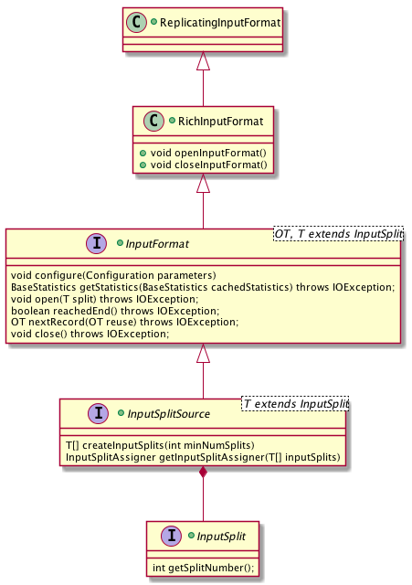

# InputFormat

在 DataSet API 中 Source 对应的核心接口为 InputFormat。InputFormat 命名风格上借鉴了 Hadoop 的风格，在功能上也比较相近，具体有以下三点:

1. 描述输入的数据如何被划分为不同的 InputSplit（继承于 InputSplitSource）。
2. 描述如何从单个 InputSplit 读取记录，具体包括如何打开一个分配到的 InputSplit，如何从这个 InputSplit 读取一条记录，如何得知记录已经读完和如何关闭这个 InputSplit。
3. 描述如何获取输入数据的统计信息（比如文件的大小、记录的数目），以帮助更好地优化执行计划。

第 1、3 两点功能会被 JobManager (JobMaster) 在调度 Exection 时使用，而第 2 点读取数据功能则会在运行时被 TaskManager 使用。

围绕 InputFormat，DataSet 还提供一系列接口，总体的类图如下:

- `InputSplitSource` 为 `InputFormat` 的超类，负责划分 `InputSplit` （第一点功能），不再赘述。
- `InputSplit` 表示一个逻辑分区，必要的信息其实只有 Split 的 ID（或者下标），`InputFormat` 会根据这个 ID 来读取输入数据的对应分区。
- `RichInputFormat` 拓展 InputFormat，加上 `openInputFormat()` 和 `closeInputFormat()` 方法来管理运行时的状态。比起 `InputFormat` 的 `open()` 和 `close()` 是在每个 InputSplit 级别调用，它们是在每次 Task Exectuion 级别调用，而每次 Task Exectuion 可以读多个 InputSplit。比如 TaskManager 要读取 HBase Table，那么它要打开和关闭一个 HTable 的连接，这个连接可以在多读多个 TableInputSplit 时复用。
- `ReplicatingInputFormat` 拓展 RichInputFormat，为输入数据提供广播的能力。换句话说，通过 `ReplicatingInputFormat` 输入的数据会被每个实例重复读取，典型的应用是 Join 操作。