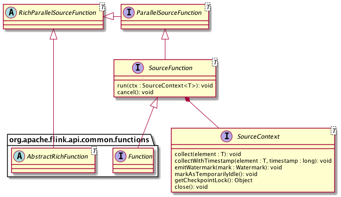

# SourceFunction

在 DataStream API 中 Source 对应的核心接口为 SourceFunction 以及 SourceContext。前者直接继承 Function 接口与 Operator 交互，负责通用的状态管理（比如初始化或取消）；后者代表运行时的上下文，负责与单条记录级别的数据的交互。此外还有其他一些辅助类型的类或接口，整体的类图设计如下:

其中 ParallelSourceFunction 进一步继承 SourceFunction，标记该 Source 为可并行化的，否则直接实现 SourceFunction 的 Source 的并行度只能为 1。而 RichParallelSourceFunction 则是在 ParallelSourceFunction 基础之上再结合 AbstractRichFunction，提供有状态的并行 Source 基类。用户要实现一个 Source，可以选择 SourceFunction、ParallelSourceFunction 或
RichParallelSourceFunction 中任意一个来作为切入口。但值得注意的是，如果 Source 是有状态的，那么为了保证一致性，状态的更新和正常的数据输出是不可以并行的。为此，SourceContext 提供了 Checkpoint 锁来方便 Source 进行同步阻塞。

运行时，Source 主要通过 SourceContext 来控制数据的输出。从 SourceContext 接口的方法即可以看出，Source 在接受到数据后的主要工作有以下几点:

1. 从外部摄入数据或生成数据，输出到下游。
2. 为数据生成 Event Time Timestamp（仅在 Time Characteristic 为 Event Time 时有用），比如 Kafka Source 的 Partition 级别的 Event time。
3. 计算 Watermark 并输出（仅在 Time Charateristic 为 Event Time 时有用）。
4. 当暂时不会有新数据时将自己标记为 Idle，以避免下游一直等待自己的 Watermark。