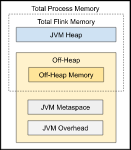
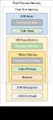

# Flink 内存模型

本文的内存模型是基于 Flink1.12 版本分析的。

> 注：内存模型分为两个阶段，目前最新的内存模型，TaskManager 是从 1.10 版本开始，JobManager 是从 1.11 版本开始。

## 内存模型

Flink JVM 进程的 `Total Process Memory` 包括 Flink 应用程序（`Total Flink Memory`）和运行该进程的 JVM 所消耗的内存。 Flink的 `Total Flink Memory` 消耗包括 JVM Heap 和 Off-heap（直接或本机）内存的使用。

| 组件                   | TaskManager 参数                  | JobManager 参数                  |
| ---------------------- | --------------------------------- | -------------------------------- |
| `Total Flink memory`   | `taskmanager.memory.flink.size`   | `jobmanager.memory.flink.size`   |
| `Total process memory` | `taskmanager.memory.process.size` | `jobmanager.memory.process.size` |

**JobManager 详细内存模型**

**TaskManager 详细内存模型**

内存组件配置列表：

| 组件              | TaskManager 参数                             | JobManager 参数                           | 默认值 |
| ----------------- | -------------------------------------------- | ----------------------------------------- | ------ |
| **JVM Heap**      |                                              |                                           |        |
|                   | `taskmanager.memory.framework.heap.size`     | `jobmanager.memory.heap.size`             |        |
|                   | `taskmanager.memory.task.heap.size`          |                                           |        |
| **Off-Heap**      |                                              |                                           |        |
|                   | `taskmanager.memory.managed.size`            | `jobmanager.memory.off-heap.size`         |        |
|                   | `taskmanager.memory.managed.fraction`        |                                           |        |
|                   | `taskmanager.memory.framework.off-heap.size` |                                           |        |
|                   | `taskmanager.memory.task.off-heap.size`      |                                           |        |
|                   | `taskmanager.memory.network.min`             |                                           |        |
|                   | `taskmanager.memory.network.max`             |                                           |        |
|                   | `taskmanager.memory.network.fraction`        |                                           |        |
| **JVM Metaspace** |                                              |                                           |        |
|                   | `taskmanager.memory.jvm-metaspace.size`      | `jobmanager.memory.jvm-metaspace.size`    | 256m   |
| **JVM Overhead**  |                                              |                                           |        |
|                   | `taskmanager.memory.jvm-overhead.fraction`   | `jobmanager.memory.jvm-overhead.fraction` | 0.1    |
|                   | `taskmanager.memory.jvm-overhead.max`        | `jobmanager.memory.jvm-overhead.max`      | 1g     |
|                   | `taskmanager.memory.jvm-overhead.min`        | `jobmanager.memory.jvm-overhead.min`      | 192m   |

### JVM Overhead

受3个参数的控制，如果`总内存*系数`不在最大最小范围内，取最大最小界限值，反之取`总内存*系数`
