# ~~CDH6.2.0 集成安装 `flink on yarn` 服务（编译源码，制作 parcel）~~【1.12.2 版本下编译成功，但部署不可用】

> 引用 <https://blog.csdn.net/qq_31454379/article/details/110440037>

## 一、环境准备

1. 操作系统 Centos7.5

2. CDH6.2.0 集群，需添加 yarn 服务、zookeeper 服务

3. 本文 flink 版本 1.12.2

4. 准备Git环境，maven环境 ，jdk环境（编译源码需要）

   ```bash
   [root@node001 ~]# git --version
   git version 1.8.3.1
   [root@node001 ~]# mvn -version
   Apache Maven 3.6.1 (d66c9c0b3152b2e69ee9bac180bb8fcc8e6af555; 2019-04-05T03:00:29+08:00)
   Maven home: /opt/module/apache-maven-3.6.1
   Java version: 1.8.0_191, vendor: Oracle Corporation, runtime: /opt/module/jdk1.8.0_191/jre
   Default locale: zh_CN, platform encoding: UTF-8
   OS name: "linux", version: "3.10.0-862.14.4.el7.x86_64", arch: "amd64", family: "unix"
   ```
   

5. Maven 镜像源配置

   ```xml
   <!-- flink 源码编译-->
   <mirror>
       <id>alimaven</id>
       <mirrorOf>central</mirrorOf>
       <name>aliyun maven</name>
       <url>http://maven.aliyun.com/nexus/content/repositories/central/</url>
   </mirror>
   <mirror>
       <id>alimaven</id>
       <name>aliyun maven</name>
       <url>http://maven.aliyun.com/nexus/content/groups/public/</url>
       <mirrorOf>central</mirrorOf>
   </mirror>
   <mirror>
       <id>central</id>
       <name>Maven Repository Switchboard</name>
       <url>http://repo1.maven.org/maven2/</url>
       <mirrorOf>central</mirrorOf>
   </mirror>
   <mirror>
       <id>repo2</id>
       <mirrorOf>central</mirrorOf>
       <name>Human Readable Name for this Mirror.</name>
       <url>http://repo2.maven.org/maven2/</url>
   </mirror>
   <mirror>
       <id>ibiblio</id>
       <mirrorOf>central</mirrorOf>
       <name>Human Readable Name for this Mirror.</name>
       <url>http://mirrors.ibiblio.org/pub/mirrors/maven2/</url>
   </mirror>
   <mirror>
       <id>jboss-public-repository-group</id>
       <mirrorOf>central</mirrorOf>
       <name>JBoss Public Repository Group</name>
       <url>http://repository.jboss.org/nexus/content/groups/public</url>
   </mirror>
   <mirror>
       <id>google-maven-central</id>
       <name>Google Maven Central</name>
       <url>https://maven-central.storage.googleapis.com
       </url>
       <mirrorOf>central</mirrorOf>
   </mirror>
   <!-- 中央仓库在中国的镜像 -->
   <mirror>
       <id>maven.net.cn</id>
       <name>oneof the central mirrors in china</name>
       <url>http://maven.net.cn/content/groups/public/</url>
       <mirrorOf>central</mirrorOf>
   </mirror>
   ```

   

## 二、下载安装包

### 1. Flink-shaded包

下载地址：<https://flink.apache.org/downloads.html>

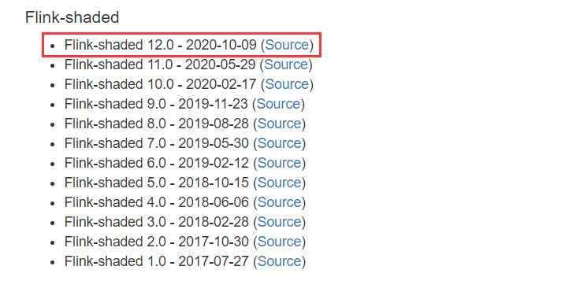

### 2. flink1.12.2 源码包

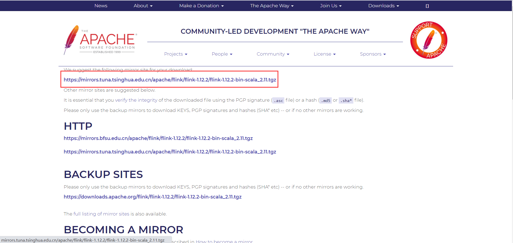

## 三、编译flink-shaded版本

### 1. 解压tar包

```bash
tar -zxvf flink-shaded-12.0-src.tgz
```

### 2. 解压文件后目录结构

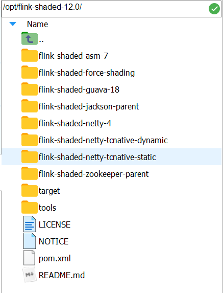

### 3. 修改pom文件

```bash
vim flink-shaded-12.0/pom.xml
```

在里面的profiles中添加如下配置参数：

```xml
<profile>
    <id>vendor-repos</id>
    <activation>
        <property>
            <name>vendor-repos</name>
        </property>
    </activation>
 
    <!-- Add vendor maven repositories -->
    <repositories>
        <!-- Cloudera -->
        <repository>
            <id>cloudera-releases</id>
            <url>https://repository.cloudera.com/artifactory/cloudera-repos</url>
            <releases>
                <enabled>true</enabled>
            </releases>
            <snapshots>
                <enabled>false</enabled>
            </snapshots>
        </repository>
        <!-- Hortonworks -->
        <repository>
            <id>HDPReleases</id>
            <name>HDP Releases</name>
            <url>https://repo.hortonworks.com/content/repositories/releases/</url>
            <snapshots><enabled>false</enabled></snapshots>
            <releases><enabled>true</enabled></releases>
        </repository>
        <repository>
            <id>HortonworksJettyHadoop</id>
            <name>HDP Jetty</name>
            <url>https://repo.hortonworks.com/content/repositories/jetty-hadoop</url>
            <snapshots><enabled>false</enabled></snapshots>
            <releases><enabled>true</enabled></releases>
        </repository>
        <!-- MapR -->
        <repository>
            <id>mapr-releases</id>
            <url>https://repository.mapr.com/maven/</url>
            <snapshots><enabled>false</enabled></snapshots>
            <releases><enabled>true</enabled></releases>
    	</repository>
	</repositories>
</profile>
```

### 4. 执行编译

**注**：maven 版本需要达到一定的版本，不然编译一定是不通过的

进入到 `flink-shaded-12.0` 文件夹下执行以下命令：

```bash
mvn clean install -DskipTests -Pvendor-repos -Dhadoop.version=3.0.0-cdh6.2.0 -Dscala-2.11 -Drat.skip=true -T10C
```

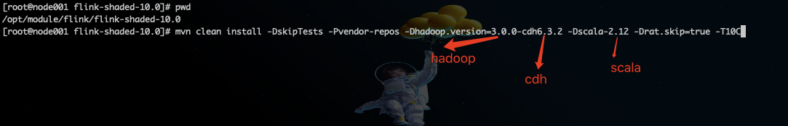

> 耐心等待编译，可能会失败多次，重复执行命令编译就行

## 四、编译 Flink1.12.2 源码

### 1. 解压tar包

```bash
tar -zxvf flink-1.12.2-src.tgz
```

### 2. 修改 pom

如上修改pom是一样的

### 3. 执行编译

```bash
mvn clean install -DskipTests -Dfast -Drat.skip=true -Dhaoop.version=3.0.0-cdh6.2.0 -Pvendor-repos -Dinclude-hadoop -Dscala-2.11 -T10C
```

> 本工程编译时间会比较长！！！

### 4. 打包编译好的文件

进入对应的目录

```bash
cd flink-dist/target/flink-1.12.2-bin/
tar -zcf flink-1.12.2-bin-scala_2.11.tgz flink-1.12.2/
```

## 五、制作parcel包

### 1. 下载git开源制作parcel包的项目

```bash
git clone https://github.com/pkeropen/flink-parcel.git
```

### 2. 修改配置文件 flink-parcel.properties

```bash
vim flink-parcel.properties
```

修改后的内容如下：

```properties
#FLINK 下载地址
FLINK_URL=https://mirrors.tuna.tsinghua.edu.cn/apache/flink/flink-1.12.2/flink-1.12.2-bin-scala_2.11.tgz

#flink版本号
FLINK_VERSION=1.12.2

#扩展版本号
EXTENS_VERSION=BIN-SCALA_2.11

#操作系统版本，以centos为例
OS_VERSION=7

#CDH 小版本
CDH_MIN_FULL=5.2
CDH_MAX_FULL=6.3.3

#CDH大版本
CDH_MIN=5
CDH_MAX=6
```

### 3. 赋予 `build.sh` 文件执行权限

```bash
chmod +x build.sh
```

### 4. 将上一步打包好的 `flink-1.12.2-bin-scala_2.11.tgz` 放到 flink-parcel 根目录

### 5. 编译parcel

```bash
./build.sh parcel
```

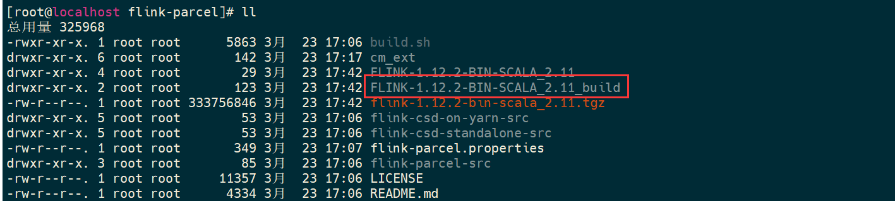

### 6. 生成csd文件

#### 6.1. yarn 版本

```bash
./build.sh csd_on_yarn
```

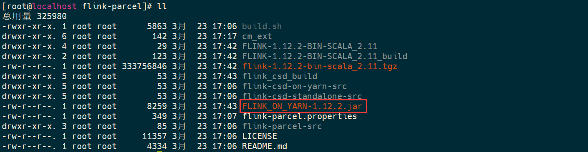

#### 6.2. standalone 版本

```bash
./build.sh csd_standalone
```

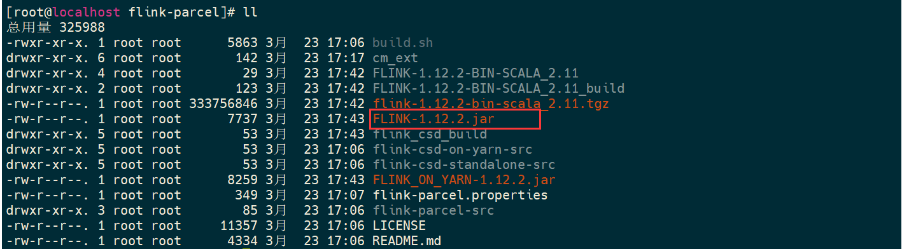

### 7. 将生成的 csd 文件，复制到 cloudera-manager-server 服务所在节点的  `/opt/cloudera/csd` 目录下

### 8. parcel 文件操作

#### 方式一：直接将 parcel 包复制到 cloudera-manager-server 服务所在节点的 `/opt/cloudera/parcel-repo` 目录下

> **注**：使用这种方式需要重启manager的服务
>
> ```bash
> systemctl stop cloudera-scm-server
> systemctl start cloudera-scm-server
> ```

#### 方式二：将parcel包和manidest.json文件部署到httpd服务中

```bash
## 创建目录
mkdir /var/www/html/flink-1.12.2

## 移动parcel文件 与 manidest.json到目录下
cp FLINK-1.12.2-BIN-SCALA_2.11_build/* /var/www/html/flink-1.12.2/
```

测试能否正常访问

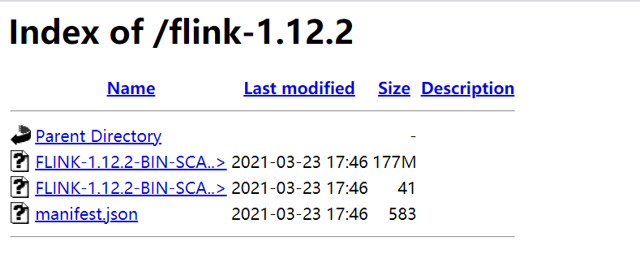

## 六、配置parcel库

#### CM页面—>主机—> parcel —> 配置【方式二需要这样配置】

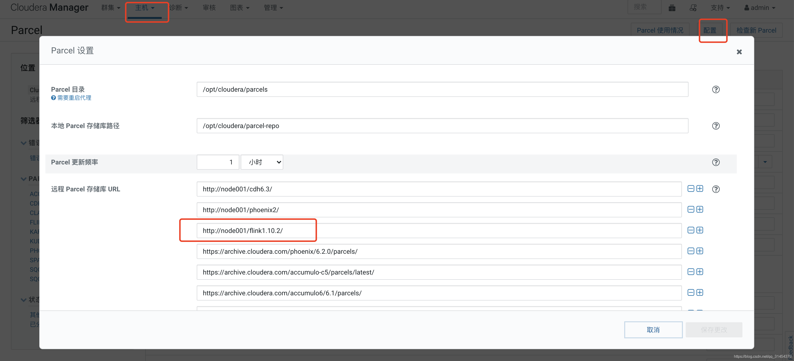

## 检查新Parcel , 下载—>分配—>激活

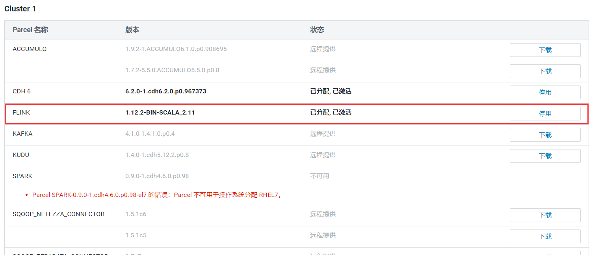

**可能遇到的问题**

**1.flink所需版本号不对，导致不能激活**

检查制作parcel包时配置文件参数是否正确

**2.hash不对**

先对比文件hash值是否一致，如果不一致就修改一致


如果一致还报错，就修改httpd配置文件

```bash
vi /etc/httpd/conf/httpd.conf
```

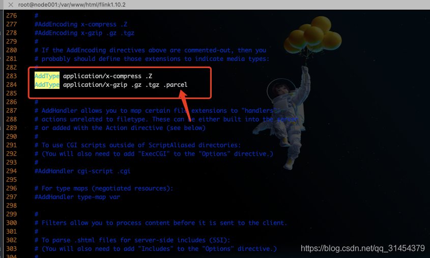

重启httpd的服务 `systemctl restart httpd`

## 七、部署yarn服务

