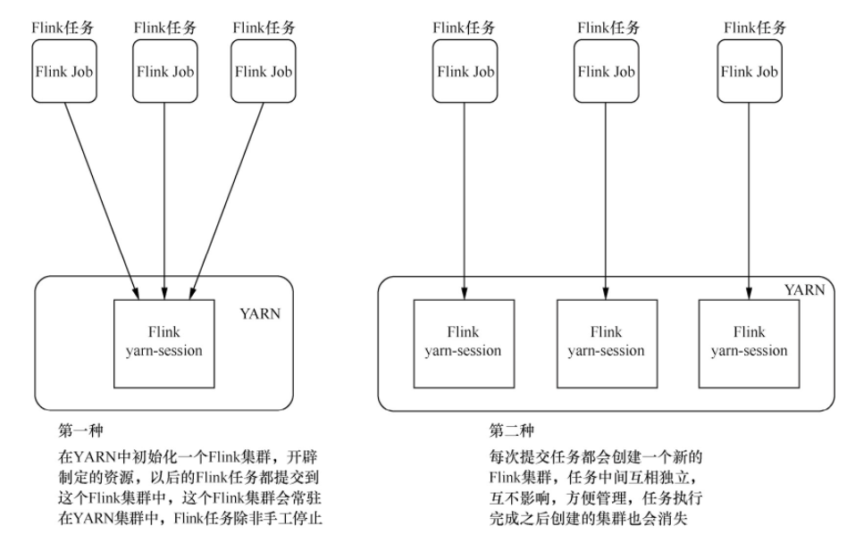
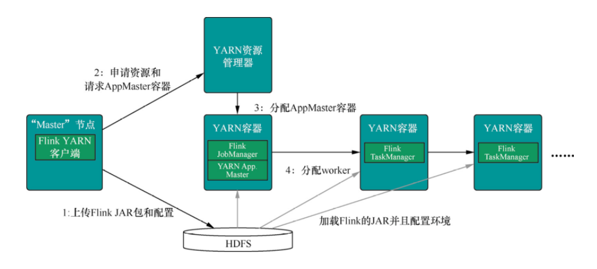
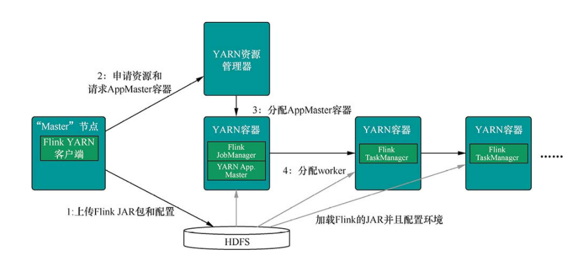

# Flink on Yarn 模式

Flink on Yarn 模式的原理是依靠 YARN 来调度 Flink 任务，这种模式的好处是可以充分利用集群资源，提高集群机器的利用率，并且只需要 1 套 Hadoop 集群，就可以执行 MapReduce 和 Spark 任务，还可以执行 Flink 任务等，操作非常方便，不需要维护多套集群，运维方面也很轻松。

Flink on Yarn 模式在使用的时候又可以分为两种，如下图所示：



- 第 1 种模式，是在 YARN 中提前初始化一个 Flink 集群(称为 Flink yarn-session)，开辟指定的资源，以后的 Flink 任务都提交到这里。这个 Flink 集群会常驻在 YARN 集群中，除非手工停止。这种方式创建的 Flink 集群会独占资源，不管有没有 Flink 任务在执行，YARN 上面的其他任务都无法使用这些资源。
- 第 2 种模式，每次提交 Flink 任务都会创建一个新的 Flink 集群，每个 Flink 任务之间相互独立、互不影响，管理方便。任务执行完成之后创建的 Flink 集群也会消失，不会额外占用资源，按需使用，这使资源利用率达到最大，在工作中推荐使用这种模式。

### 第 1 种模式

1. 创建一个一直运行的 Flink 集群(也可以称为 Flink yarn-session)
    ```bash
    # 参数最后面的-d参数是可选项，表示是否在后台独立运行
    ${FLINK_HOME}/bin/yarn-session.sh -n 2 -jm 1024 -tm 1024 -d
    ```
    执行以后可以到任务界面确认是否有 Flink 任务成功运行
2. 附着到一个已存在的Flink集群中
   ```bash
   # 参数最后面的applicationId是一个变量，需要获取第1步创建的Flink集群对应的applicationId信息。
   ${FLINK_HOME}/bin/yarn-session.sh -id ${applicationId}
   ```
3. 执行Flink任务
   ```bash
   ${FLINK_HOME}/bin/flink run ${FLINK_HOME}/examples/batch/WordCount.jar
   ```

### 第 2 种模式

提交 Flink 任务的同时创建 Flink 集群：

```bash
${FLINK_HOME}/bin/flink run -m yarn-cluster ${FLINK_HOME}/examples/batch/WordCount.jar
```

Flink on Yarn 的内部实现如下图所示：



1. 当启动一个新的 Flink YARN Client 会话时，客户端首先会检查所请求的资源（容器和内存）是否可用。之后，它会上传 Flink 配置和 JAR 文件到 HDFS。
2. 客户端的下一步是请求一个 YARN 容器启动 ApplicationMaster。JobManager 和 ApplicationMaster(AM) 运行在同一个容器中，一旦它们成功地启动了，AM 就能够知道 JobManager 的地址，它会为 TaskManager 生成一个新的 Flink 配置文件（这样它才能连上 JobManager），该文件也同样会被上传到 HDFS。另外，AM 容器还提供了 Flink 的 Web 界面服务。Flink 用来提供服务的端口是由用户和应用程序 ID 作为偏移配置的，这使得用户能够并行执行多个 YARN 会话。
3. 之后，AM 开始为 Flink 的 TaskManager 分配容器，从 HDFS 下载 JAR 文件和修改过的配置文件。一旦这些步骤完成了，Flink 就安装完成并准备接受任务了。

### 总结

- 如果是平时的本地测试或者开发，可以采用第一种模式；如果是生产环境推荐使用第二种模式；
- Flink on Yarn 模式部署时，不需要对 Flink 做任何修改配置，只需要将其解压传输到各个节点之上。但如果要实现高可用的方案，这个时候就需要到 Flink 相应的配置修改参数，具体的配置文件是 `$FLINK_HOME/conf/flink-conf.yaml`；
- 对于 Flink on Yarn 模式，并不需要在 conf 配置目录下配置 masters 和 slaves。因为在指定 TaskManager 的时候可以通过参数 `-n` 来标识需要启动几个 TaskManager；Flink on Yarn 启动后，如果是在分离式模式下，在所有的节点只会出现一个 YarnSessionClusterEntrypoint 进程；如果是客户端模式会出现 2 个进程一个 YarnSessionClusterEntrypoint 和一个 FlinkYarnSessionCli 进程。

## 原理

Flink on Yarn 的内部实现如下所示：



YARN 客户端需要访问 Hadoop 配置，从而连接 YARN 资源管理器和 HDFS。使用下面的策略来决定 Hadoop 配置：

1. 测试是否设置了 `YARN_CONF_DIR`、`HADOOP_CONF_DIR` 或 `HADOOP_CONF_PATH` 环境变量（按该顺序测试）。如果设置了任意一个，就会用其来读取配置。
2. 如果上面的策略失败了（在正确安装 YARN 的情况下，这不会发生），客户端就会使用 HADOOP_HOME 环境变量。如果已经设置了该变量，客户端就会尝试访问 `$HADOOP_HOME/etc/Hadoop`(Hadoop 2) 和 `$HADOOP_HOME/conf`(Hadoop 1)。

## FAQ

### 报错信息为 `java.lang.NoClassDefFoundError: org/apache/hadoop/yarn/exceptions/YarnException`

**报错信息**

```
Error: A JNI error has occurred, please check your installation and try again
Exception in thread "main" java.lang.NoClassDefFoundError: org/apache/hadoop/yarn/exceptions/YarnException
        at java.lang.Class.getDeclaredMethods0(Native Method)
        at java.lang.Class.privateGetDeclaredMethods(Class.java:2701)
        at java.lang.Class.privateGetMethodRecursive(Class.java:3048)
        at java.lang.Class.getMethod0(Class.java:3018)
        at java.lang.Class.getMethod(Class.java:1784)
        at sun.launcher.LauncherHelper.validateMainClass(LauncherHelper.java:544)
        at sun.launcher.LauncherHelper.checkAndLoadMain(LauncherHelper.java:526)
Caused by: java.lang.ClassNotFoundException: org.apache.hadoop.yarn.exceptions.YarnException
        at java.net.URLClassLoader.findClass(URLClassLoader.java:382)
        at java.lang.ClassLoader.loadClass(ClassLoader.java:424)
        at sun.misc.Launcher$AppClassLoader.loadClass(Launcher.java:349)
        at java.lang.ClassLoader.loadClass(ClassLoader.java:357)
        ... 7 more
```

**解决方法**

在 `~/.bashrc` 中添加

```bash
export HADOOP_CONF_DIR=/etc/hadoop/conf
export HADOOP_CLASSPATH=`/opt/cloudera/parcels/CDH/bin/hadoop classpath`
```

**注**：hadoop 是 Hadoop 安装目录 bin 下可执行的文件，需要用反向单引号包裹住。