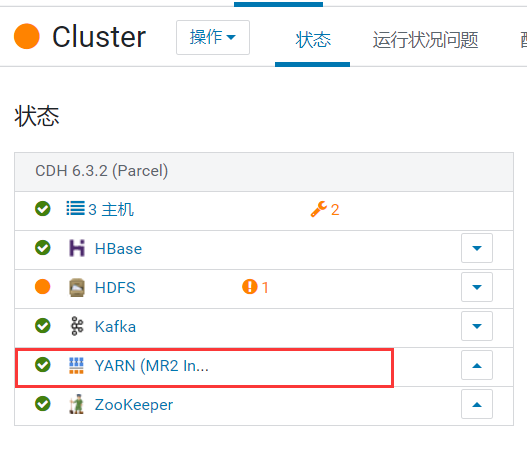
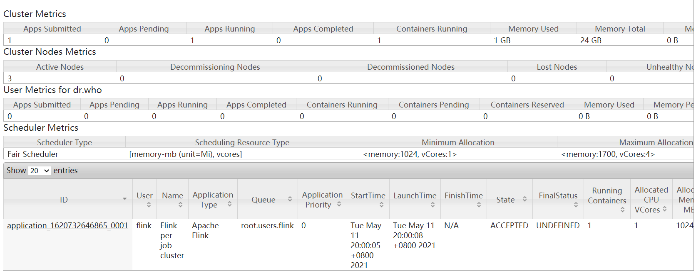

# CDH 上部署执行 Flink on Yarn

1. CDH 上安装 yarn 服务
    
2. 各节点上新增用户 flink，用户组 flink
   ```bash
   # 新增用户组
   groupadd flink
   # 新增用户
   useradd flink -g flink -d /var/lib/flink
   # 设置密码
   passwd flink
   ```
3. 赋予 flink 用户 root 权限
   ```bash
   vim /etc/sudoers

   ### 新增内容如下
   ## Allow root to run any command anywhere
   root   ALL=(ALL)   ALL
   flink  ALL=(ALL)   ALL
   ```
   > 使用 `wq!` 进行强制保存退出
4. 新增用户组 supergroup
   ```bash
   groupadd supergroup
   ```
5. 将 flink 用户加入到 supergroup 组中，并同步到 hdfs 的权限中
   ```bash
   usermod -a -G supergroup flink
   # 同步到 hdfs 权限中
   hdfs dfsadmin -refreshUserToGroupsMappings
   ```
6. 上传 flink 安装包【已验证版本：`flink-1.12.2-bin-scala_2.11.tgz`】
7. 修改安装包的所有者
   ```bash
   chown flink:flink ~/flink-1.12.2-bin-scala_2.11.tgz
   ```
8. 解压
   ```bash
   tar -zxvf ~/flink-1.12.2-bin-scala_2.11.tgz -C /opt/
   mv /opt/flink-1.12.2 /opt/flink/
   ```
9.  修改环境变量，并使其生效
    ```bash
    vim ~/.bashrc
    
    ## 增加如下内容
    export HADOOP_CONF_DIR=/etc/hadoop/conf
    export HADOOP_CLASSPATH=`/opt/cloudera/parcels/CDH/bin/hadoop classpath`

    # 环境变量生效
    source ~/.bashrc
    ```
10. 测试执行任务
    ```bash
    # 注意：FLINK_HOME为安装的目录，如：`/opt/flink`，需要根据实际情况来修改
    ${FLINK_HOME}/bin/flink run -m yarn-cluster ${FLINK_HOME}/examples/batch/WordCount.jar
    ```
    