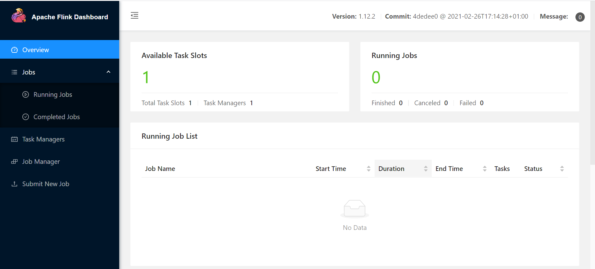

# Flink 的安装部署

版本：1.12.2

> **注**：安装 Flink 需提前安装 JDK 环境。

Flink 官网下载地址：<https://flink.apache.org/downloads.html>

Flink 的安装和部署主要分为*本地模式*和*集群模式*，其中本地模式只需直接解压就可以使用，不需要修改任何参数，一般在做一些简单测试的时候使用。集群模式包含 Standalone、Flink on Yarn 等模式，适合在生产环境下面使用，且需要修改对应的配置参数。

## 本地模式

```bash
# 下载Flink
wget archive.apache.org/dist/flink/flink-1.12.2/flink-1.12.2-bin-scala_2.11.tgz

# 解压压缩包
mkdir /opt/flink
tar -zxvf flink-1.12.2-bin-scala_2.11.tgz -C /opt/flink
```

**启动 Flink**

```bash
# 启动flink
/opt/flink/flink-1.12.2/bin/start-cluster.sh
```

**查看是否启动成功**

```bash
jps
```


**访问 UI 页面**

> 注：默认 UI 访问的端口是 8081



**关闭 flink**

```bash
/opt/flink/flink-1.12.2/bin/stop-cluster.sh
```

[Standalone 模式](./Standalone.md ':include')

[Flink On Yarn 模式](./Flink_on_Yarn.md ':include')