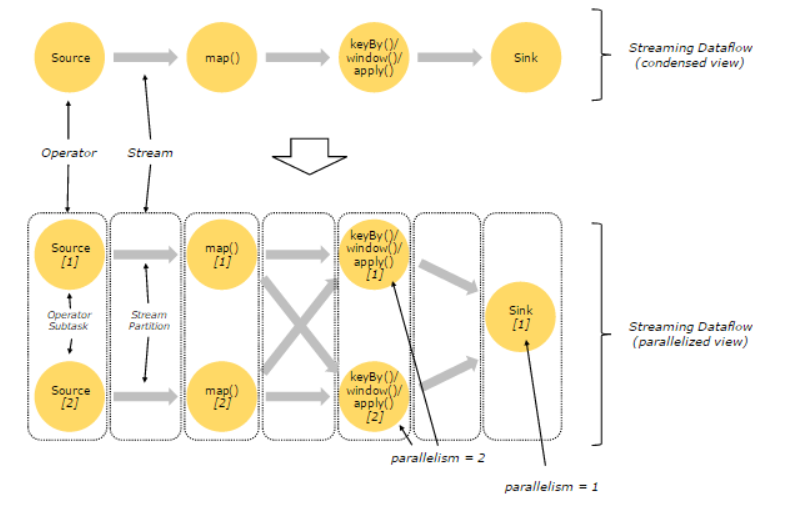

# Flink 并行度

在 Flink 中，程序天生是并行和分布式的：一个 Stream 可以被分成多个 Stream 分区（Stream Partitions），一个 Operator 可以被分成多个 Operator Subtask，每一个 Operator Subtask 是在不同的线程中独立执行的。一个 Operator 的并行度，等于 Operator Subtask 的个数，一个 Stream 的并行度总是等于生成它的 Operator 的并行度。

一个并行度的实例，如下图所示：



上图中展现了两个 Operator 之间的 Stream 的两种模式：

- One-to-one 模式
  比如从 `Source[1]` 到 `map()[1]`，它保持了 Source 的分区特性（Partitioning）和分区内元素处理的有序性，也就是说 `map()[1]` 的 Subtask 看到数据流中记录的顺序，与 `Source[1]` 中看到的记录顺序是一致的。
- Redistribution 模式
  这种模式改变了输入数据流的分区，比如从 `map()[1]`、`map()[2]` 到 `keyBy()/window()/apply()[1]`、`keyBy()/window()/apply()[2]`，上游的 Subtask 向下游的多个不同的 Subtask 发送数据，改变了数据流的分区，这与实际应用所选择的 Operator 有关系。

另外，Source Operator 对应 2 个 Subtask，所以并行度为 2，而 Sink Operator 的 Subtask 只有 1 个，故而并行度为 1。

## 并行度的设置

一个任务的并行度设置可以从4个层面指定：

- Operator Level（算子层面）
- Execution Environment Level（执行环境层面）
- Client Level（客户端层面）
- System Level（系统层面）

这些并行度的优先级为 `Operator Level>Execution Environment Level>ClientLevel>System Level`。

### 并行度设置之 Operator Level

Operator、Source 和 Sink 目的地的并行度可以通过调用 `setParallelism()` 方法来指定。

### 并行度设置之 Execution Environment Level

任务的默认并行度可以通过调用 `setParallelism()` 方法指定。为了以并行度 3 来执行所有的 Operator、Source 和 Sink，可以通过如下方式设置执行环境的并行度，如下所示：

```java
env.setParallelism(3);
```

注意：执行环境（env）的并行度可以通过显式设置算子的并行度来重写。

### 并行度设置之 Client Level

并行度还可以在客户端提交 Job 到 Flink 时设定。对于 CLI 客户端，可以通过 `-p` 参数指定并行度。

```bash
${FLINK_HOME}/bin/flink run -p 10 WordCount.jar
```

### 并行度设置之 System Level

在系统级可以通过设置 `flink-conf.yaml` 文件中的 `parallelism.default` 属性来指定所有执行环境的默认并行度。