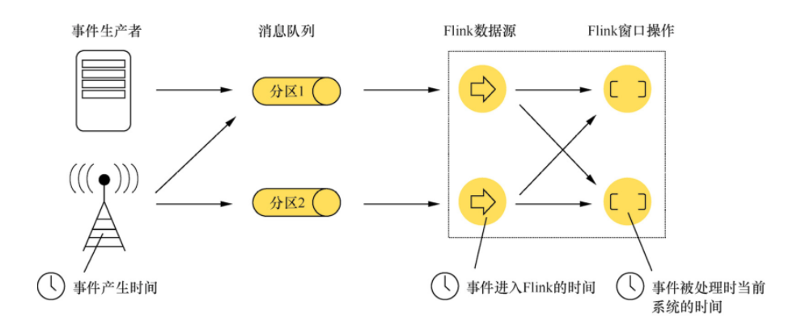
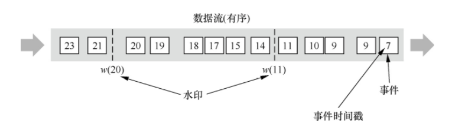
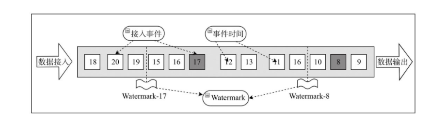
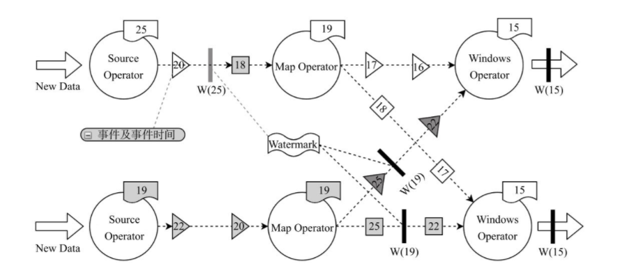

# Time

Flink 在流程序中支持不同的 Time 概念，有如下 3 种：

- Event Time：事件产生的时间，它通常由事件中的时间戳描述
- Ingestion Time：事件进入 Flink 的时间
- Processing Time：事件被处理时当前系统的时间，~~默认情况下的时间~~

> **注**：在 Flink1.12 中，默认使用的时间是 Event Time。【2021年4月2日 update】

这几种时间的对应关系如下图所示：



## 时间戳

所有由 Flink 事件-时间流应用生成的条目都必须伴随着一个时间戳。时间戳将一个条目与一个特定的时间点关联起来，一般这个时间点表示的是这条记录发生的时间。不过应用可以随意选择时间戳的含义，只要流中条目的时间戳是随着流的前进而递增即可。

当 Flink 以事件-时间的模式处理流数据时，它基于条目的时间戳来评估（evaluate）基于时间（time-based）的 operators。例如，一个 time-window operator 根据条目的时间戳，将它们分派给不同的 windows。Flink 将时间戳编码为 16-byte，Long 类型的值，并将它们以元数据（metadata）的方式附加到流记录（records）中。它内置的 operators 将这个Long 型的值解释为 Unix 时间戳，精确到毫秒，也就是自 `1970-01-01-00:00:00.000` 开始，所经过的毫秒数。不过，用户自定义的 operators 可以有它们自己的解释方法（interpretation），例如，将精确度指定为微秒级别。

### Event Time

Event Time 是事件发生的时间，一般就是数据本身携带的时间。这个时间通常是在事件到达 Flink 之前就确定的，并且可以从每个事件中获取到事件时间戳。在 Event Time 中，时间取决于数据，而跟其他没什么关系。**Event Time 程序必须指定如何生成 Event Time 水印，这是表示 Event Time 进度的机制**。

完美的说，无论事件什么时候到达或者其怎么排序，最后处理 Event Time 将产生完全一致和确定的结果。但是，除非事件按照已知顺序（按照事件的时间）到达，否则处理 Event Time 时将会因为要等待一些无序事件而产生一些延迟。由于只能等待一段有限的时间，因此就难以保证处理 Event Time 将产生完全一致和确定的结果。

假设所有数据都已到达， Event Time 操作将按照预期运行，即使在处理无序事件、延迟事件、重新处理历史数据时也会产生正确且一致的结果。 例如，每小时事件时间窗口将包含带有落入该小时的事件时间戳的所有记录，无论它们到达的顺序如何。

请注意，有时当 Event Time 程序实时处理实时数据时，它们将使用一些 Processing Time 操作，以确保它们及时进行。

### Ingestion Time

Ingestion Time 是事件进入 Flink 的时间。 在源操作处，每个事件将源的当前时间作为时间戳，并且基于时间的操作（如时间窗口）会利用这个时间戳。

Ingestion Time 在概念上位于 Event Time 和 Processing Time 之间。 与 Processing Time 相比，它稍微贵一些，但结果更可预测。因为 Ingestion Time 使用稳定的时间戳（在源处分配一次），所以对事件的不同窗口操作将引用相同的时间戳，而在 Processing Time 中，每个窗口操作符可以将事件分配给不同的窗口（基于机器系统时间和到达延迟）。

与 Event Time 相比，Ingestion Time 程序无法处理任何无序事件或延迟数据，但程序不必指定如何生成水印。

在 Flink 中，Ingestion Time 与 Event Time 非常相似，但 Ingestion Time 具有自动分配时间戳和自动生成水印功能。

### Processing Time

Processing Time 是指事件被处理时机器的系统时间。

当流程序在 Processing Time 上运行时，所有基于时间的操作(如时间窗口)将使用当时机器的系统时间。每小时 Processing Time 窗口将包括在系统时钟指示整个小时之间到达特定操作的所有事件。

例如，如果应用程序在上午 9:15 开始运行，则第一个每小时 Processing Time 窗口将包括在上午 9:15 到上午 10:00 之间处理的事件，下一个窗口将包括在上午 10:00 到 11:00 之间处理的事件。

Processing Time 是最简单的 “Time” 概念，不需要流和机器之间的协调，它提供了最好的性能和最低的延迟。但是，在分布式和异步的环境下，Processing Time 不能提供确定性，因为它容易受到事件到达系统的速度（例如从消息队列）、事件在系统内操作流动的速度以及中断的影响。

### ~~时间戳概念设定~~【下面方法在 Flink1.12 版本被标注为废弃】

在 Flink 的 Stream 程序中处理数据时，默认情况下，Flink 在 Stream 程序中处理数据使用的时间是 Processing Time，想要修改使用时间可以使用  `setStreamTimeCharacteristic()`，代码如下：

```java
StreamExecutionEnvironment env = StreamExecutionEnvironment.getExecutionEnvironment();

env.setStreamTimeCharacteristic(TimeCharacteristic.ProcessingTime);
// env.setStreamTimeCharacteristic(TimeCharacteristic.IngestionTime);
// env.setStreamTimeCharacteristic(TimeCharacteristic.EventTime);
```

## Watermark

通常情况下，由于网络或系统等外部因素影响，事件数据往往不能及时传输至 Flink 系统中，导致数据乱序到达或者延迟到达等问题，因此，需要有一种机制能够控制数据处理的过程和进度，比如基于事件时间的 （time-window） 创建后，具体该如何确定属于该 Window 的数据元素已经全部到达。如果确定全部到达，就可以对 Window 的所有数据做窗口计算操作（如汇总、分组等），如果数据没有全部到达，则继续等待该窗口中的数据全部到达才开始处理。这种情况下就需要用到水位线（Watermark）机制，它能够衡量数据处理进度（表达数据到达的完整性），保证事件数据（全部）到达 Flink 系统，或者在乱序及延迟到达时，也能够像预期一样计算出正确并且连续的结果。*Flink 会将用读取进入系统的最新事件时间减去固定的时间间隔作为 Watermark，该固定的时间间隔为用户外部配置的支持最大延迟到达的时间长度，也就是说理论上认为不会有事件超过该间隔到达，否则就认为是迟到事件或异常事件。*

简单来讲，当事件接入到 Flink 系统时，会在 Sources Operator 中根据当前最新事件时间产生 Watermarks 时间戳，记为 X，进入到 Flink 系统中的数据事件时间，记为 Y，因为 Watermark X 时间戳代表它之前的所有事件均已到达，如果 `Y < X` 则表明当前事件是迟到事件或者异常事件；同时 Window 的 EndTime 小于 Watermark X，则触发窗口计算结果并输出。从另一个角度讲，如果想触发对 Window 内的数据元素的计算，就必须保证对所有进入到窗口的数据元素满足其事件时间 `Y >= X`，否则窗口会继续等待 Watermark 大于窗口结束时间的条件满足。可以看出当有了 Watermarks 机制后，对基于事件时间的流数据处理会变得特别灵活，可以有效地处理乱序事件的问题，保证数据在流式统计中的结果的正确性。

Watermark 有 3 种应用场景。

- 顺序事件中的 Watermarks
- 乱序事件中的 Watermarks
- 并行数据流中的 Watermarks

### 顺序事件中的 Watermarks

如果数据元素的事件时间是有序的，Watermark 时间戳会随着数据元素的事件时间按顺序生成，此时水位线的变化和事件时间保持一致，也就是理想状态下的水位线。当 Watermark 时间大于 Windows 结束时间就会触发对 Windows 的数据计算，并创建另一个新的 Windows 将事件时间 `Y < X` 的数据元素分配到新的 Window 中。如下图所示，事件按照其原本的顺序进入系统中，Watermark 跟随着事件时间之后生成，可以看出 Watermarks 其实只是对 Stream 简单地进行周期性地标记，并没有特别大的意义，也就是说在顺序事件的数据处理过程中，Watermarks 并不能发挥太大的价值，反而会因为设定了超期时间而导致延迟输出计算结果。



### 乱序事件中的 Watermarks

现实情况下数据元素往往并不是按照其产生顺序接入到 Flink 系统中进行处理，而频繁出现乱序或迟到的情况，这种情况就需要使用 Watermarks 来应对。如下图所示。事件 11 和事件 17 进入到系统中，Flink 系统根据设定的延时值分别计算出 Watermark W(11) 和 W(17)，这两个 Watermark 到达一个 Operator 中后，便立即调整算子基于事件时间的虚拟时钟与当前的 Watermark 的值匹配，然后再触发相应的计算以及输出操作。



### 并行数据流中的 Watermarks

Watermark 在 Source Operator 中生成，并且在每个 Source Operator 的子 Task 中都会独立生成 Watermark。在 Source Operator 的子任务中生成后就会更新该 Task 的 Watermark ，且会逐步更新下游算子中的 Watermark 水位线，随后一致保持在该并发之中，直到下一次 Watermarks 的生成，并对前面的 Watermarks 进行覆盖。如下图所示，W(17) 水位线已经将 Source 算子和 Map 算子的子任务时钟的时间全部更新为值 17，并且一直会随着事件向后移动更新下游算子中的事件时间。如果多个 Watermark 同时更新一个算子 Task 的当前事件时间，Flink 会选择最小的水位线来更新，当一个 Window 算子 Task 中水位线大于了 Window 结束时间，就会立即触发窗口计算。



## 指定 Timestamps 与生成 Watermarks

如果使用 Event Time 时间概念处理流式数据，除了在 StreamExecationEviromment 中指定 TimeCharacteristic 外，还需要在 Flink 程序中指定 Event Time 时间戳在数据中的字段信息，在 Flink 程序运行过程中会通过指定字段抽取出对应的事件时间，该过程叫作 Timestamps Assigning。简单来讲，就是告诉系统需要用哪个字段作为事件时间的数据来源。另外 Timestamps 指定完毕后，下面就需要制定创建相应的 Watermarks，需要用户定义根据 Timestamps 计算出 Watermarks 的生成策略。目前 Flink 支持两种方式指定 Timestamps 和生成 Watermarks，一种方式在 DataStream Source 算子接口的 SourceFunction 中定义，另外一种方式是通过自定义 Timestamp Assigner 和 Watermark Generator 生成。

### 在 SourceFunction 中直接定义 Timestamps 和 Watermarks

在 DataStream Source 算子中指定 EventTime Timestamps，也就是说在数据进入到 Flink 系统中就直接指定分配 Event Time 和 Watermark。用户需要复写 SourceFunciton接口中 `run()` 方法实现数据生成逻辑，同时需要调用 SourceContext 的 `collectWithTimestamp()` 方法生成 EventTime 时间戳，调用 `emitWatermark()` 方法生成 Watermarks。如下代码所示，在 addSource 中通过匿名类实现 SourceFunction 接口，将本地集合数据读取到系统中，并且分别调用 `collectWithTimestamp` 和 `emitWatermark` 方法指定 Event Time 和生成 Watermark。

```java
import org.apache.flink.api.java.tuple.Tuple3;
import org.apache.flink.streaming.api.datastream.DataStreamSource;
import org.apache.flink.streaming.api.environment.StreamExecutionEnvironment;
import org.apache.flink.streaming.api.functions.source.SourceFunction;
import org.apache.flink.streaming.api.watermark.Watermark;

import java.util.ArrayList;
import java.util.List;

/**
 * 2020年11月24日 superz add
 */
public class JavaEventTimeAndWatermark
{
    public static void main(String[] args) {
        StreamExecutionEnvironment env = StreamExecutionEnvironment.getExecutionEnvironment();

        List<Tuple3<String, Long, Integer>> input = new ArrayList<>();
        input.add(new Tuple3("a", 1L, 1));
        input.add(new Tuple3("b", 1L, 1));
        input.add(new Tuple3("b", 3L, 1));

        DataStreamSource<Tuple3<String, Long, Integer>> source = env
                .addSource(new SourceFunction<Tuple3<String, Long, Integer>>()
                {
                    @Override
                    public void run(SourceContext<Tuple3<String, Long, Integer>> ctx) throws Exception {
                        // 读取的数据源
                        // List<Tuple3<String, Long, Integer>> input=???

                        for (Tuple3<String, Long, Integer> value : input) {
                            // 调用collectionWithTimestamp增加Event Time抽取
                            ctx.collectWithTimestamp(value, value.f1);

                            // 调用emitWaterTimestamp，创建Watermark，最大延时设定为1
                            ctx.emitWatermark(new Watermark(value.f1 - 1));
                        }

                        // 设定默认Watermark
                        ctx.emitWatermark(new Watermark(Long.MAX_VALUE));
                    }

                    @Override
                    public void cancel() {
                    }
                });
    }
}
```

### 通过 Flink 自带的 Timestamp Assigner 指定 Timestamp 和生成 Watermark

如果用户使用了 Flink 已经定义的外部数据源连接器，就不能再实现 SourceFuncton 接口来生成流式数据以及相应的 Event Time 和 Watermark，这种情况下就需要借助 Timestamp Assigner 来管理数据流中的 Timestamp 元素和 Watermark。Timestamp Assigner 一般是跟在 Data Source 算子后面指定，也可以在后续的算子中指定，只要保证 Timestamp Assigner 在第一个时间相关的 Operator 之前即可。如果用户已经在 SourceFunciton 中定义 Timestamps 和 Watermarks 的生成逻辑，同时又使用了 Timestamp Assigner，此时 Assigner 会覆盖 SourceFunction 中定义的逻辑。

Flink 将 Watermarks 根据生成形式分为两种类型，分别是 Periodic Watermarks 和 Punctuated Watermarks。Periodic Watermarks 是根据设定时间间隔周期性地生成 Watermarks，Punctuated Watermarks 是根据接入数据的数量生成，例如数据流中特定数据元素的数量满足条件后触发生成 Watermark。在 Flink 中两种生成 Watermarks 的逻辑分别借助于 AssignerWithPeriodicWatermarks 和 AssignerWithPunctuatedWatermarks 接口定义。

#### 内置实现

在 Flink 系统中实现了两种 Periodic Watermark Assigner，一种为升序模式，会将数据中的 Timestamp 根据指定字段提取，并用当前的 Timestamp 作为最新的 Watermark，这种 Timestamp Assigner 比较适合于事件按顺序生成，没有乱序事件的情况；另外一种是通过设定固定的时间间隔来指定 Watermark 落后于 Timestamp 的区间长度，也就是最长容忍迟到多长时间内的数据到达系统。

**使用 Ascending Timestamp Assigner 指定 Timestamps 和 Watermarks**

如下代码所示，通过调用 DataStream API 中的 assignAscendingTimestamps 来指定 Timestamp 字段，不需要显示地指定 Watermark，因为已经在系统中默认使用 Timestamp 创建 Watermark。

```java
import java.util.ArrayList;
import java.util.List;

import org.apache.flink.api.java.tuple.Tuple3;
import org.apache.flink.streaming.api.TimeCharacteristic;
import org.apache.flink.streaming.api.datastream.DataStreamSource;
import org.apache.flink.streaming.api.datastream.SingleOutputStreamOperator;
import org.apache.flink.streaming.api.environment.StreamExecutionEnvironment;
import org.apache.flink.streaming.api.functions.AscendingTimestampExtractor;
import org.apache.flink.streaming.api.windowing.time.Time;

/**
 * 2020年11月24日 superz add
 */
public class JavaAssignAscendingTimestampsDemo
{
    public static void main(String[] args) {
        StreamExecutionEnvironment env = StreamExecutionEnvironment.getExecutionEnvironment();
        // 指定系统时间概念为Event Time
        env.setStreamTimeCharacteristic(TimeCharacteristic.EventTime);

        List<Tuple3<String, Long, Integer>> input = new ArrayList<>();
        input.add(new Tuple3("a", 1L, 1));
        input.add(new Tuple3("b", 1L, 1));
        input.add(new Tuple3("b", 3L, 1));

        DataStreamSource<Tuple3<String, Long, Integer>> dss = env.fromCollection(input);

        // 使用系统默认Ascending分配时间信息和Watermark
        SingleOutputStreamOperator<Tuple3<String, Long, Integer>> withTimestampAndWatermarks = dss
            .assignTimestampsAndWatermarks(new AscendingTimestampExtractor<Tuple3<String, Long, Integer>>(){
                    @Override
                    public long extractAscendingTimestamp(Tuple3<String, Long, Integer> element) {
                        return element.f2;
                    }
                });

        // 对数据集进行窗口运算
        SingleOutputStreamOperator<Tuple3<String, Long, Integer>> result = withTimestampAndWatermarks
            .keyBy(0)
            .timeWindow(Time.seconds(10))
            .sum(2);
    }
}
```

**使用固定时延间隔的 Timestamp Assigner 指定 Timestamps 和 Watermarks**

如下代码所示，通过创建 BoundedOutOfOrdernessTimestampExtractor 实现类来定义 Timestamp Assigner，其中第一个参数 `Time.seconds(10)` 代表了最长的时延为 10s，第二个参数为 extractTimestamp 抽取逻辑。在代码中选择使用 input 数据集中第三个元素作为 Event Timestamp，其中 Watermarks 的创建是根据 Timestamp 减去固定时间长度生成，如果当前数据中的时间大于 Watermarks 的时间，则会被认为是迟到事件。

```java
import java.util.ArrayList;
import java.util.List;

import org.apache.flink.api.java.tuple.Tuple3;
import org.apache.flink.streaming.api.TimeCharacteristic;
import org.apache.flink.streaming.api.datastream.DataStreamSource;
import org.apache.flink.streaming.api.datastream.SingleOutputStreamOperator;
import org.apache.flink.streaming.api.environment.StreamExecutionEnvironment;
import org.apache.flink.streaming.api.functions.timestamps.BoundedOutOfOrdernessTimestampExtractor;
import org.apache.flink.streaming.api.windowing.time.Time;

/**
 * 2020年11月25日 superz add
 */
public class JavaBoundedOutOfOrdernessTimestampDemo
{
    public static void main(String[] args) {
        StreamExecutionEnvironment env = StreamExecutionEnvironment.getExecutionEnvironment();
        // 指定系统时间概念为Event Time
        env.setStreamTimeCharacteristic(TimeCharacteristic.EventTime);

        List<Tuple3<String, Long, Integer>> input = new ArrayList<>();
        input.add(new Tuple3("a", 1L, 1));
        input.add(new Tuple3("b", 1L, 1));
        input.add(new Tuple3("b", 3L, 1));

        DataStreamSource<Tuple3<String, Long, Integer>> dss = env.fromCollection(input);

        SingleOutputStreamOperator<Tuple3<String, Long, Integer>> withTimestampAndWatermarks = dss
            .assignTimestampsAndWatermarks(
                    new BoundedOutOfOrdernessTimestampExtractor<Tuple3<String, Long, Integer>>(Time.seconds(10)){
                            @Override
                            public long extractTimestamp(Tuple3<String, Long, Integer> element) {
                                return element.f2;
                            }
                        });
    }
}
```

#### 自定义实现

前面使用 Flink 系统中已经定义好的两种 Timestamp Assigner，用户也可以自定义实现 AssignerWithPeriodicWatermarks 和 AssignerWithPunctuatedWatermarks 两个接口来分别生成 Periodic Watermarks 和 Punctuated Watermarks。

**Periodic Watermarks 自定义生成**

Periodic Watermarks 根据固定的时间间隔，周期性地在 Flink 系统中分配 Timestamps 和生成 Watermarks，在定义和实现 AssignerWithPeriodicWatermarks 接口之前，需要先在 ExecutionConfig 中调用 `setAutoWatermarkInterval()` 方法设定 Watermarks 产生的时间周期。

```java
ExecutionConfig.setAutoWatermarkInterval(...)
```

通过创建 Class 实现 AssignerWithPeriodicWatermarks 接口，重写 extractTimestamp 和 getCurrentWatermark 两个方法，其中 extractTimestamp 定义了抽取 TimeStamps 的逻辑，getCurrentWatermark 定义了生成 Watermark 的逻辑。其中 getCurrentWatermark 生成 Watermark 依赖于 currentMaxTimestamp，`getCurrentWatermark()` 方法每次都会被调用时，如果新产生的 Watermark 比现在的大，就会覆盖掉现有的 Watermark，从而实现对 Watermarks 数据的更新。

```java
@Deprecated
class PeriodicAssigner implements AssignerWithPeriodicWatermarks<Tuple3<String, Long, Integer>>
{
    // 1s时延设定，表示在1s以内的数据延时都是有效，超过1s的数据被认定为迟到事件
    private Long maxOutOfOrderness = 1000L;
    private Long currentMaxTimestamp = 0L;

    /**
        * 定义了生成Watermark的逻辑
        * @return
        */
    @Override
    public Watermark getCurrentWatermark() {
        // 根据最大事件时间减去最大的乱序时延延长度，然后得到Watermark
        return new Watermark(currentMaxTimestamp - maxOutOfOrderness);
    }

    /**
        * 定义了抽取Timestamp的逻辑
        * @param element
        * @param recordTimestamp
        * @return
        */
    @Override
    public long extractTimestamp(Tuple3<String, Long, Integer> element, long recordTimestamp) {
        Long currentTimstamp = element.f1;
        // 对比当前的事件时间和历史最大事件时间，将最新的时间赋值给currentMaxTimestamp变量
        currentMaxTimestamp = Math.max(currentTimstamp, currentMaxTimestamp);
        return currentTimstamp;
    }
}
```

**Punctuated Watermarks 自定义生成**

除了根据时间周期生成 Periodic Watermark，用户也可以根据某些特殊条件生成 Punctuated Watermarks，例如判断某个数据元素的当前状态，如果接入事件中状态为 0 则触发生成 Watermarks，如果状态不为 0，则不触发生成 Watermarks 的逻辑。生成 Punctuated Watermark 的逻辑需要通过实现 AssignerWithPunctuatedWatermarks 接口定义，然后分别重写 extractTimestamp 方法和 checkAndGetNextWatermark 方法，完成抽取 Event Time 和生成 Watermark 逻辑的定义。

```java
@Deprecated
class PunctuatedAssigner implements AssignerWithPunctuatedWatermarks<Tuple3<String, Long, Integer>>
{
    @Override
    public Watermark checkAndGetNextWatermark(Tuple3<String, Long, Integer> lastElement, long extractedTimestamp) {
        // 根据元素中第三位字段状态是否为0生成Watermark
        if (lastElement.f2 == 0)
            return new Watermark(extractedTimestamp);
        else
            return null;
    }

    @Override
    public long extractTimestamp(Tuple3<String, Long, Integer> element, long recordTimestamp) {
        return element.f1;
    }
}
```

**总结**

Watermark的生成方式有两种：

1. With Periodic Watermarks
   - 周期性地触发Watermark的生成和发送，默认是100ms
   - 每隔N秒自动向流里注入一个Watermark，时间间隔由ExecutionConfig.setAutoWatermarkInterval决定。每次调用getCurrentWatermark方法，如果得到的Watermark不为空并且比之前的大，就注入流中
   - 可以定义一个最大允许乱序的时间，这种比较常用
   - 实现AssignerWithPeriodicWatermarks接口
2. With Punctuated Watermarks
   - 基于某些事件触发Watermark的生成和发送
   - 基于事件向流里注入一个Watermark，每一个元素都有机会判断是否生成一个Watermark。如果得到的Watermark不为空并且比之前的大，就注入流中
   - 实现AssignerWithPunctuatedWatermarks接口

## Watermark 时间

触发 Window 的条件如下：

```md
1. Watermark时间>=Window_End_Time
2. 在[Window_Start_Time,Window_End_Time)中有数据存在
```
