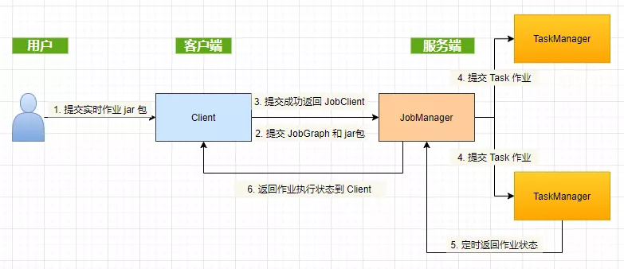
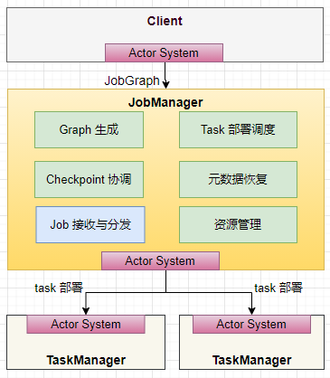
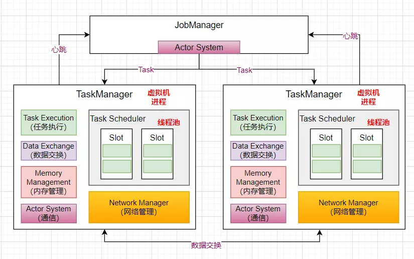
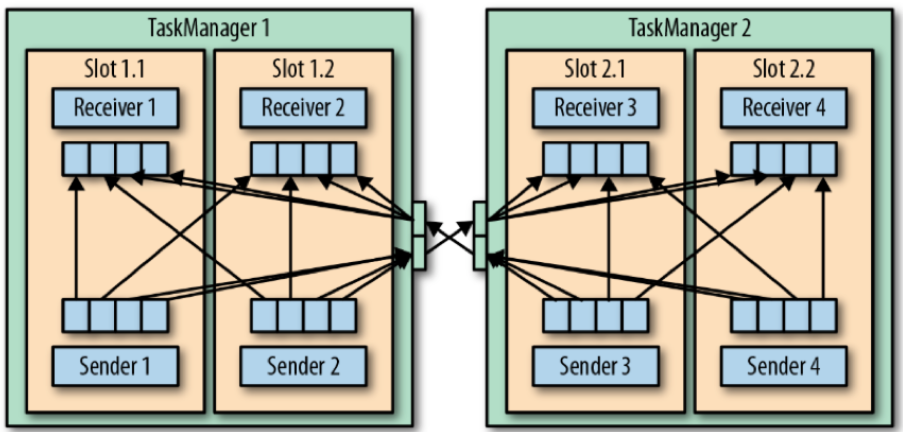
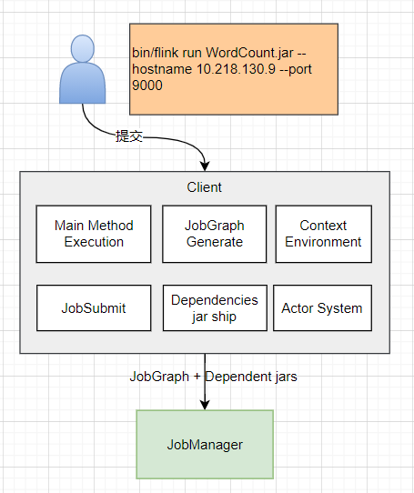
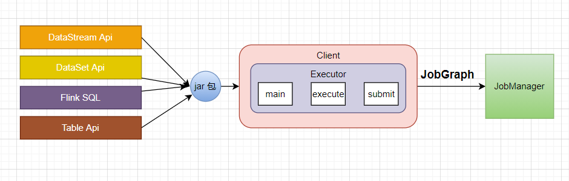
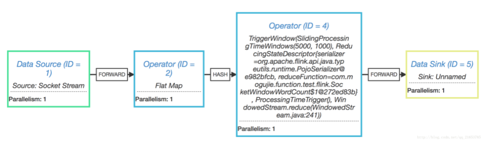

# 架构

## 整体架构

Flink 集群整体遵循 Master，Worker 这样的架构模式。

**JobManager**

JobManager 是管理节点，有以下几个职责：

- 接受 application，包含 StreamGraph（DAG），JobGraph（优化过的）和 JAR，将 JobGraph 转换为 Execution Graph
- 申请资源，调度任务，执行任务，保存作业的元数据，如 Checkpoint
- 协调各个 Task 的 Checkpoint。

**TaskManager**

TaskManager 是工作节点，负责数据交换，跑多个线程的 task，执行任务。

**Client**

Client 是客户端，接收用户提交的 jar 包，产生一个 JobGraph 对象，提交到 JobManager。如果成功提交会返回一个 JobClient，用来和 JobManager 通信获得任务执行的状态。

## JobManager 内部组成原理

1. 负责 Checkpoint 的协调，通过定时做快照的方式记录任务状态信息；
2. Job Dispatch 负责接收客户端发送过来的 JobGraph 对象（DAG），并且在内部生成 ExecutionGraph（物理执行图）；
3. 将作业拆分成 Task，部署到不同的 TaskManager 上去执行；ctorSystem 是 基于 akka 实现的一个通信模块，负责节点之间的通信，如 Client 和 JobManager 之间，JobManager 和 TaskManager 之间的通信；
4. 负责资源管理，对于不同的部署模式，有相应的 ResourceManager 的实现；
5. TaskManager 启动时，会向 JobManager 注册自己，并时刻和 JobManager 保持心跳。

## TaskManager 内部组成原理

1. TaskManager 是作为一个虚拟机进程存在，TaskManager 启动的时候，会向 JobManager 注册自己；
2. JobManager 提交作业的时候，TaskManager 会启动 Task 线程将 Job 运行起来，TaskManager 里面有线程池负责线程的调度执行。
3. 在 Flink 内部也会有类似 Spark 或者 MapReduce 节点 shuffle 的过程，比如进行了一个 GroupByKey 的操作，就会涉及到数据的交互；Network Manager 是基于 Netty 实现的一个数据传输模块；
4. 而节点和节点之间的通信是基于 akka 实现的 Actor System，来进行远程的 rpc 通信；
5. Memory Management 是内存管理模块，当数据进来时，负责申请内存来运行任务。

### TaskManager 如何负责数据传输

在一个运行的application中，它的tasks在持续交换数据。TaskManager负责做数据传输。

TaskManager的网络组件首先从缓冲buffer中收集records，然后再发送。也就是说，records并不是一个接一个的发送，而是先放入缓冲，然后再以batch的形式发送。这个技术可以高效使用网络资源，并达到高吞吐。

每个TaskManager有一组网络缓冲池（默认每个buffer是32KB），用于发送与接受数据。

如发送端和接收端位于不同的TaskManager进程中，则它们需要通过操作系统的网络栈进行交流。

流应用需要以管道的模式进行数据交换，也就是说，每对TaskManager会维持一个永久的TCP连接用于做数据交换。

在shuffle连接模式下（多个sender与多个receiver），每个sender task需要向每个receiver task，此时TaskManager需要为每个receiver task都分配一个缓冲区。下图展示了此架构：

在上图中，有四个sender 任务，对于每个sender，都需要有至少四个network buffer用于向每个receiver发送数据。

每个receiver都需要有至少四个buffer用于接收数据。

TaskManager之间的buffer以多路复用的方式使用同一网络连接。为了提供平滑的数据管道型的数据交换，一个TaskManager必须能提供足够的缓冲，以服务所有并行的出入连接。

对于shuffle或broadcast 连接，每个发送任务和每个接受任务之间都需要一个buffer。Flink的默认网络缓冲配置足够适用与小型与中型的集群任务。对于大型的集群任务，需要对此配置进行调优。

若sender与receiver任务都运行在同一个TaskManager进程，则sender任务会将发送的条目做序列化，并存入一个字节缓冲。然后将缓冲放入一个队列，直到队列被填满。Receiver任务从队列中获取缓冲，并反序列化输入的条目。所以，在同一个TaskManager内，任务之间的数据传输并不经过网络交互。

## Client 内部组成原理

Client 是客户端，当用户写好一个 Flink 的程序之后，会用 `bin/flink run` 这样的方式去提交 jar 包。

然后会启动一个 Client 的进程，找到 jar 包中的 main 方法，创建 Context Environment （执行环境），把代码解析成 JobGraph （有向无环图表示的作业）， 向 JobManager 提交 JobGraph ，并传递用户提交的 jar 包。

当程序部署在 yarn session 或者 kerbernetes Session 的时候，客户端也会进行部署的操作。

## JobGraph

不管用户写的程序是 DataStream Api，DateSet Api，或者是 Flink SQL，都会打成 jar 包，jar 包中包含 main 方法的类，Client 进程启动的时候就会执行 main 方法，解析出程序中所表达的逻辑，生成 StreamGraph，再优化生成 JobGraph，再提交到 JobManager。

这里说的 JobGraph 其实就是在 Flink UI 界面上看到的有向无环图，如下图：

另外，JobGraph 也是对集群组件的一个解耦过程，不管什么程序最终都生成 JobGraph，JobGraph 作为 客户端和 JobManager 提交的规范。