# Batch 模式下数据流转

## Source和Transformation算子在一个算子链上

1. Transformation的数据直接从数据源根据分片信息读取数据
   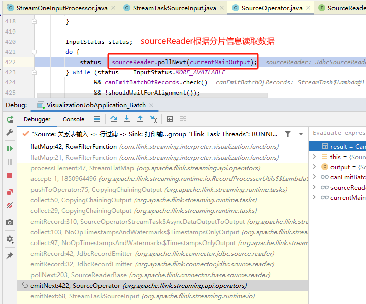
2. 实际数据源实现 `pollNext` 读取数据，如 `JdbcSourceReader`
   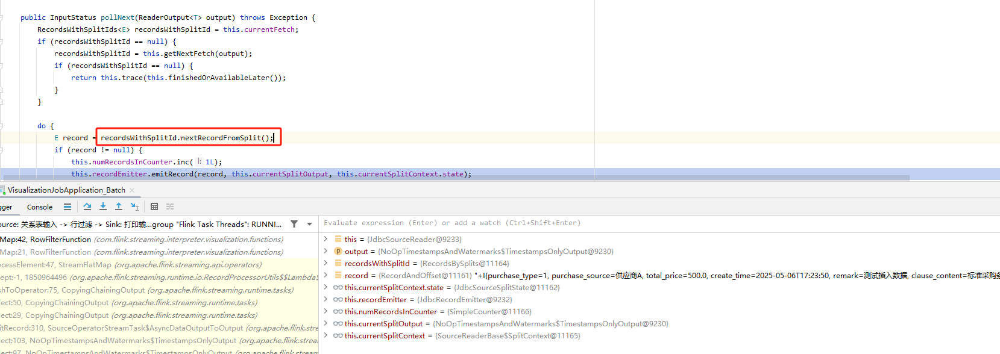
3. 将读取到的数据 `emitRecord` 到下一个算子
   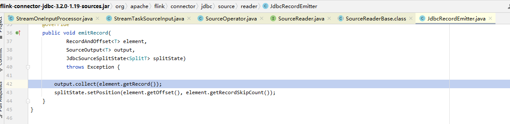
   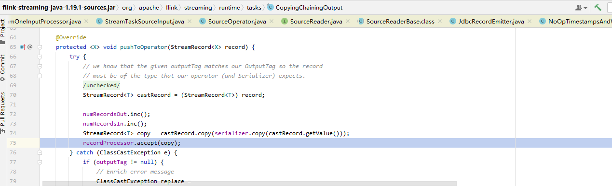
4. Transformation 进行处理
   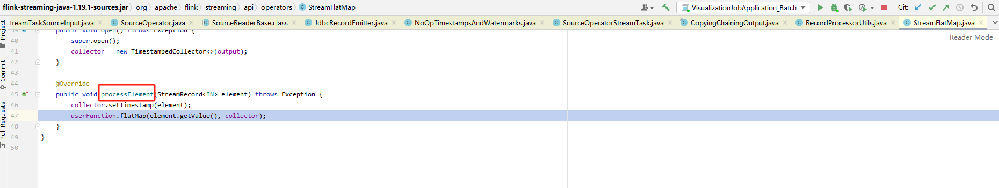

## Transformation算子在一个独立的算子链

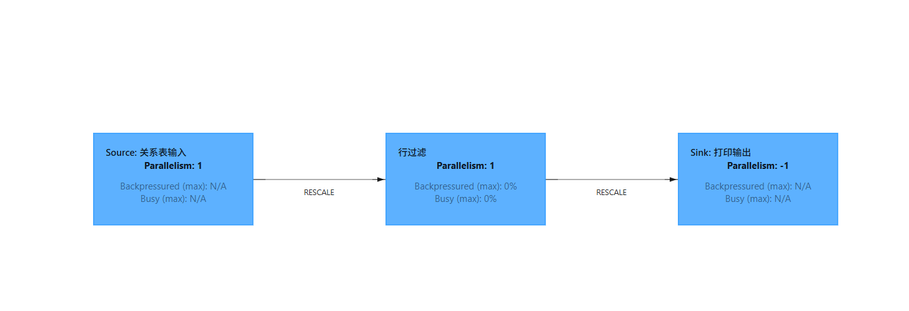

1. Transformation算子的输入源是 `StreamTaskNetworkInput`
    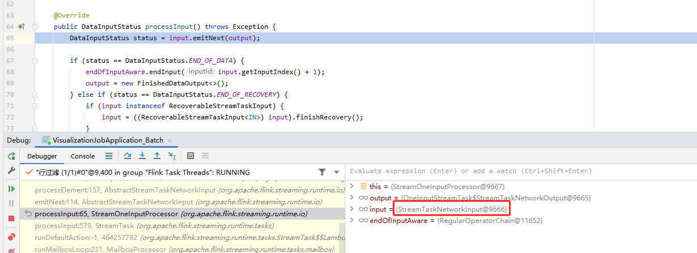
2. 读取数据【根据偏移量从内存读取一条条记录】
   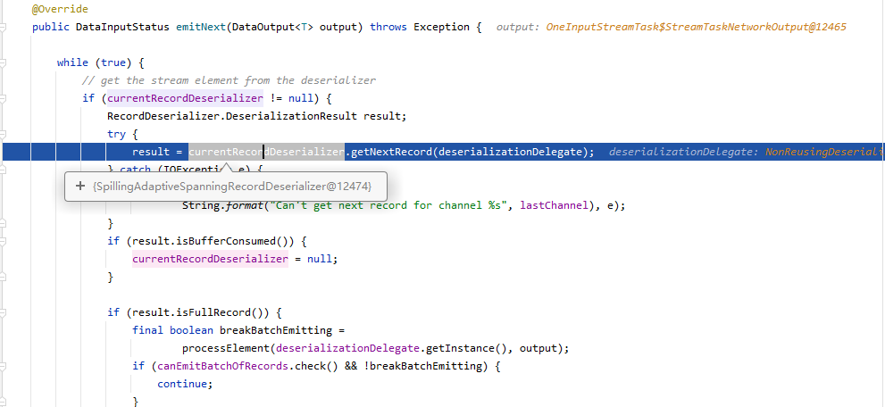
   <!--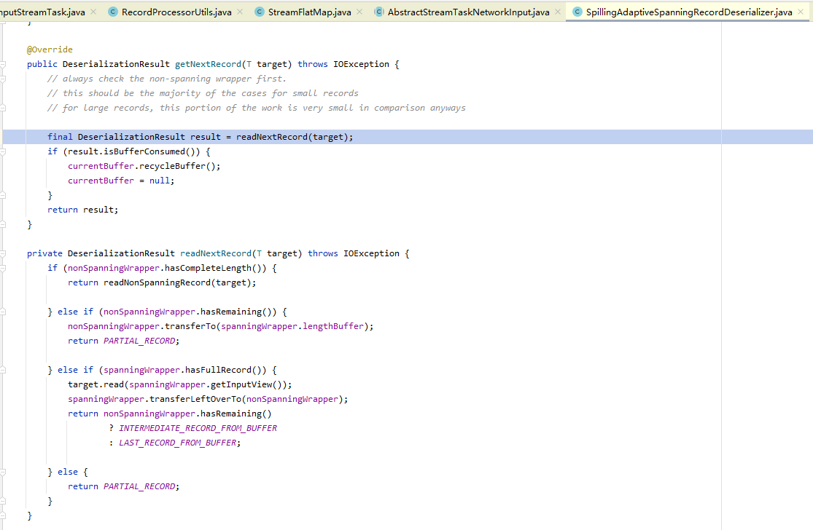-->
   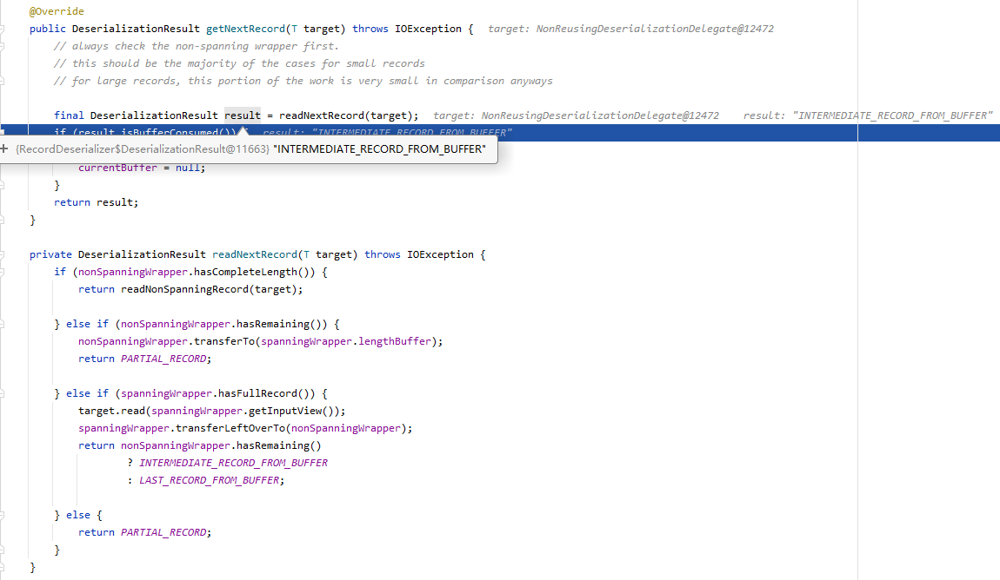
3. 每条记录处理
   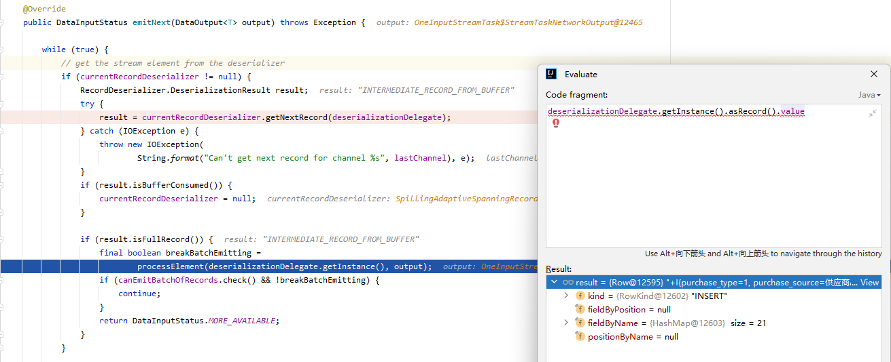
   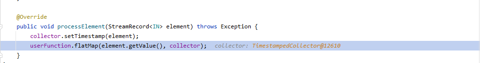