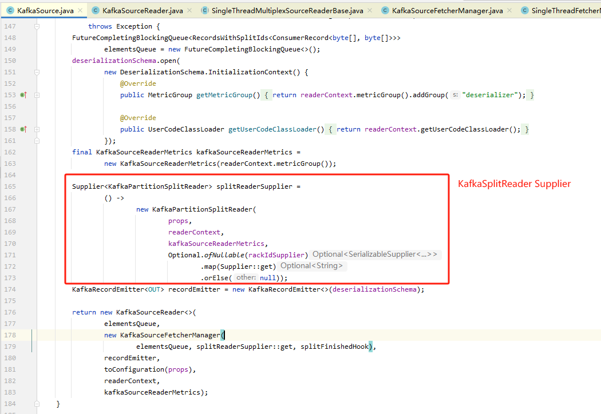
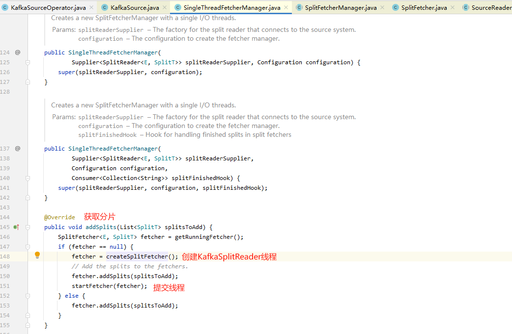
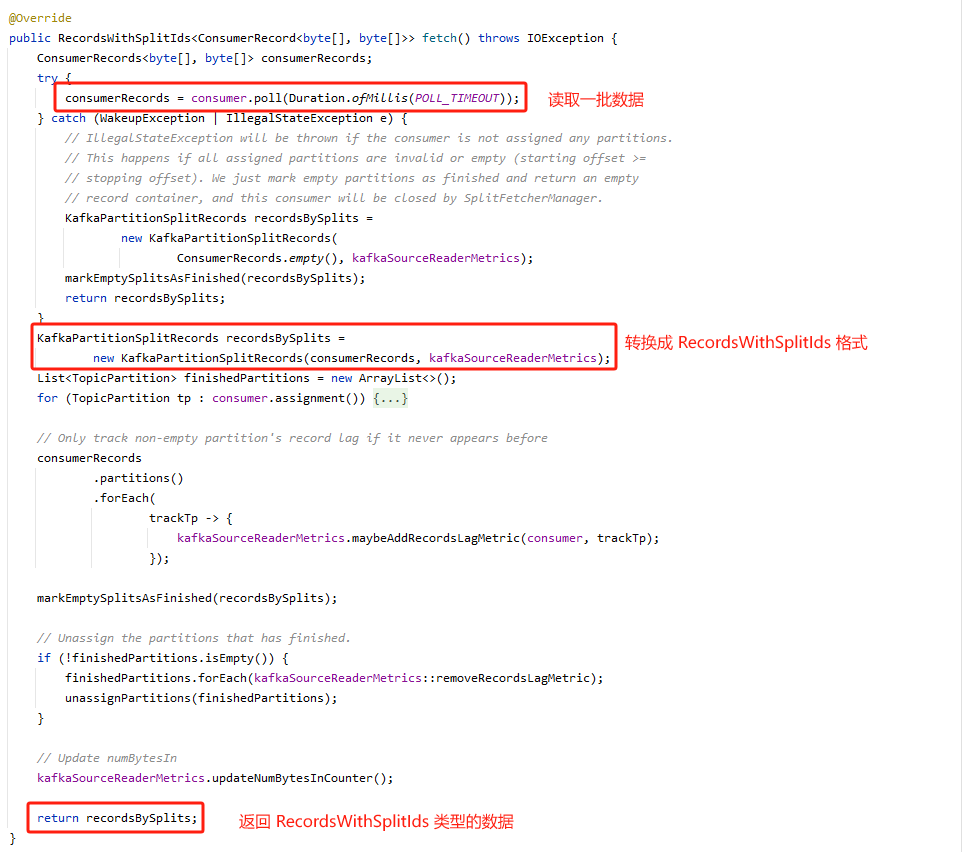
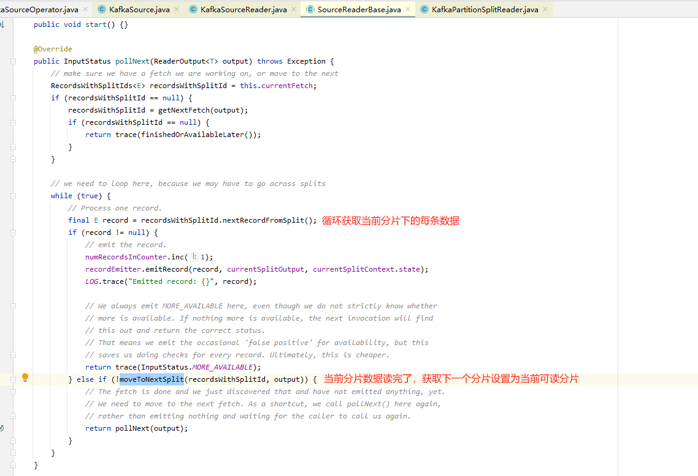
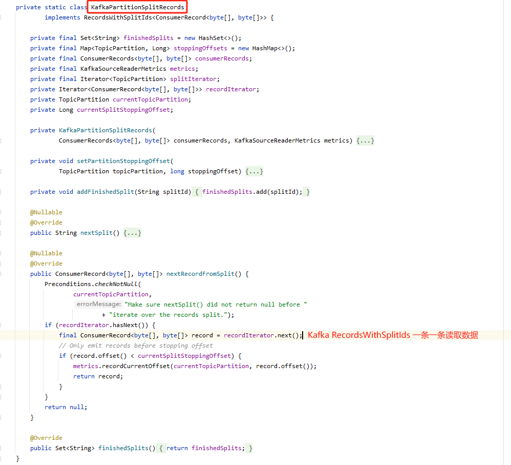

# `flink-connector-kafka`:Source

## SourceSplit

## SourceReader

> SourceReader 提供了一个拉动式（pull-based）处理接口。Flink 任务会在循环中不断调用 pollNext(ReaderOutput) 轮询来自 SourceReader 的记录。

Kafka 的 `poll()` 是阻塞调用的，因此 Kafka Source Reader 通过单独的 SplitReader 线程进行数据读取，SplitReader 是基于同步读取/轮询的 Source 的高级 API。

1. KafkaSourceEnumerator 将分片分配给各 KafkaSourceReader
2. KafkaSourceReader 获取分片通过线程池创建 KafkaSplitReader 线程，并提交该线程
   
   
3. SplitReader 提取 `fetch()` 获取 RecordsWithSplitIds
    
4. SourceReader 调用 `pollNext(ReaderOutput)` 读取数据，遍历分片，对每个分片中的每条数据进行读取
   
5. 分片中的数据
   