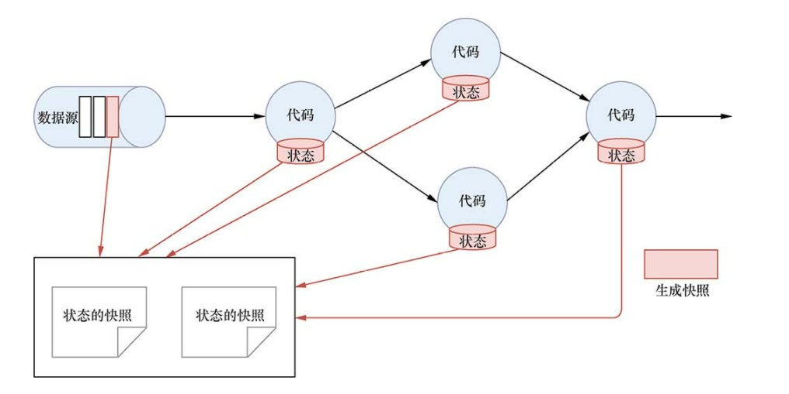
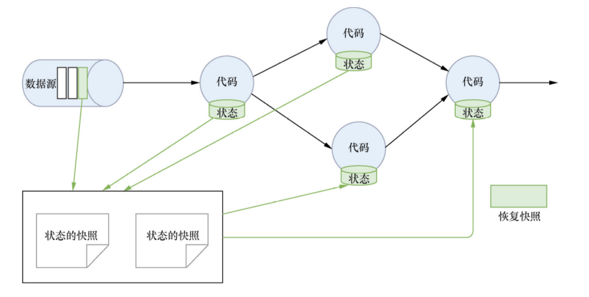

# State 的容错

State 的容错需要依靠 CheckPoint 机制。

1. 生成快照
   Flink 通过 CheckPoint 机制可以实现对 Source 中的数据和 Task 中的 State 数据进行存储。如下图所示：
   
2. 恢复快照
   Flink 还可以通过 Restore 机制来恢复之前 CheckPoint 快照中保存的 Source 数据和 Task 中的 State 数据。如下图所示：
   