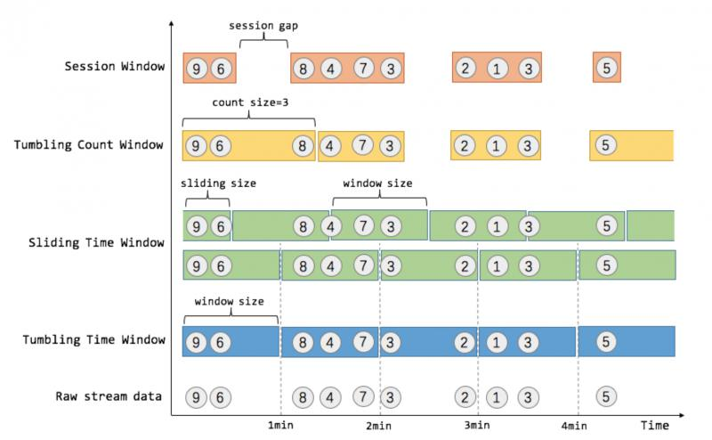
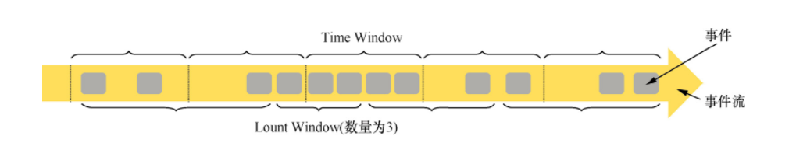
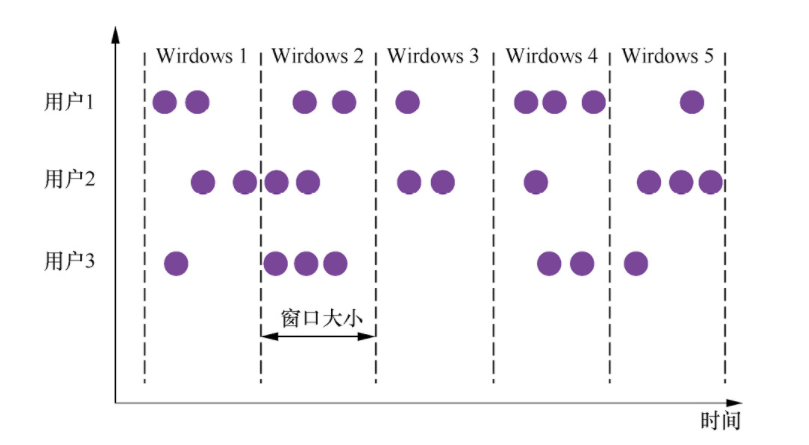
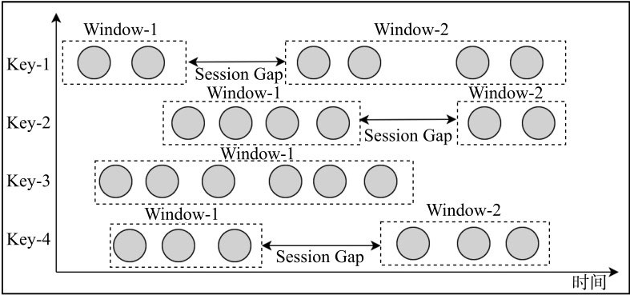
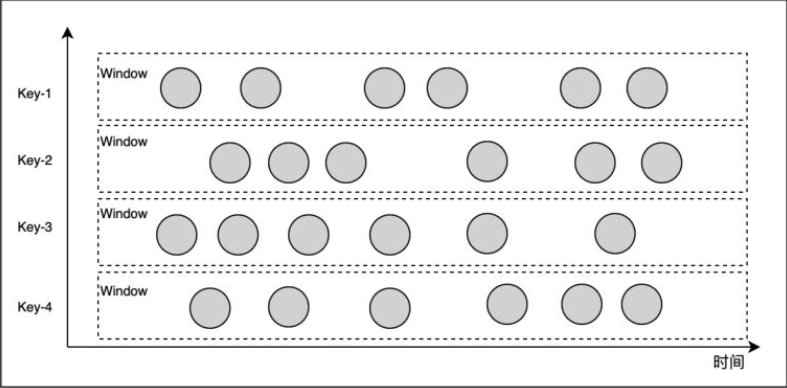

# Window

Flink 认为 Batch 是 Streaming 的一个特例，因此 Flink 底层引擎是一个流式引擎，在上面实现了流处理和批处理。而 Window 就是从 Streaming 到 Batch 的桥梁。

通常来讲，**Window 就是用来对一个无限的流设置一个有限的集合，从而在有界的数据集上进行操作的一种机制**。

## 窗口类型

窗口的所有类型如下图所示：



Window 根据类型可以分为：

- Tumbling Window：滚动窗口，表示窗口内的数据没有重叠
- Sliding Window：滑动窗口，表示窗口内的数据有重叠
- Session Windows：会话窗口
- Global Windows：全局窗口

## DataStream API

Flink DataStream API 将窗口抽象成独立的 Operator，且在 Flink DataStream API 中已经内建了大多数窗口算子。如下代码展示了如何定义 Keyed Windows 算子，在每个窗口算子中包含了 Windows Assigner、Windows Trigger（窗口触发器）、Evictor（数据剔除器）、Lateness（时延设定）、Output Tag（输出标签）以及 Windows Funciton 等组成部分，其中 Windows Assigner 和 WindowsFunciton 是所有窗口算子必须指定的属性，其余的属性都是根据实际情况选择指定。

```java
// Keyed Window
dss
    .keyBy(...)                     // 是Keyed类型数据集
    .window(...)                    // 指定窗口分配器类型
    [.trigger(...)]                 // 指定触发器类型（可选）
    [.evictor(...)]                 // 指定evictor或者不指定（可选）
    [.allowedLateness(...)]         // 指定是否延迟处理数据（可选）
    [.sideOutputLateData(...)]      // 指定Output Lag（可选）
    .reduce/aggregate/fold/apply()  // 指定窗口计算函数
    [.getSideOutput(...)]           // 根据Tag输出数据（可选）

// Non-Keyed Window
dss
    .windowAll(...)                 // 指定窗口分配器类型
    [.trigger(...)]                 // 指定触发器类型（可选）
    [.evictor(...)]                 // 指定evictor或者不指定（可选）
    [.allowedLateness(...)]         // 指定是否延迟处理数据（可选）
    [.sideOutputLateData(...)]      // 指定Output Lag（可选）
    .reduce/aggregate/fold/apply()  // 指定窗口计算函数
    [.getSideOutput(...)]           // 根据Tag输出数据（可选）
```

- Windows Assigner：指定窗口的类型，定义如何将数据流分配到一个或多个窗口；
- Windows Trigger：指定窗口触发的时机，定义窗口满足什么样的条件触发计算；
- Evictor：用于数据剔除；
- Lateness：标记是否处理迟到数据，当迟到数据到达窗口中是否触发计算；
- Output Tag：标记输出标签，然后再通过getSideOutput将窗口中的数据根据标签输出；
- Windows Funciton：定义窗口上数据处理的逻辑，例如对数据进行sum操作。

### 窗口分配器：Windows Assigner

Flink 支持两种类型的窗口，一种是基于时间的窗口，窗口基于起始时间戳（闭区间）和终止时间戳（开区间）来决定窗口的大小，数据根据时间戳被分配到不同的窗口中完成计算。Flink 使用 TimeWindow 类来获取窗口的起始时间和终止时间，以及该窗口允许进入的最新时间戳信息等元数据。另一种是基于数量的窗口，根据固定的数量定义窗口的大小，例如每 5000 条数据形成一个窗口，窗口中接入的数据依赖于数据接入到算子中的顺序，如果数据出现乱序情况，将导致窗口的计算结果不确定。在 Flink 中可以通过调用 DataSteam API 中的 `countWindows()` 来定义基于数量的窗口。



*注：后续是基于时间的窗口来进行分析*

在 Flink 流式计算中，通过 Windows Assigner 将接入数据分配到不同的窗口，根据 Windows Assigner 数据分配方式的不同将 Windows 分为 4 大类，分别是**滚动窗口**(Tumbling Windows)、**滑动窗口**（Sliding Windows）、**会话窗口**（Session Windows）和**全局窗口**（Global Windows）。并且这些 Windows Assigner 已经在 Flink 中实现，用户调用 DataStream API 的 windows 或 windowsAll 方法来指定 Windows Assigner 即可。

> **Keyed 和 Non-Keyed 窗口**
> 
> 在运用窗口计算时，Flink 根据上游数据集是否为 KeyedStream 类型（将数据集按照 Key 分区），对应的 Windows Assigner 也会有所不同。上游数据集如果是 KeyedStream 类型，则调用 DataStream API 的 `window()` 方法指定 WindowsAssigner，数据会根据 Key 在不同的 Task 实例中并行分别计算，最后得出针对每个 Key 统计的结果。如果是 Non-Keyed 类型，则调用 `windowsAll()` 方法来指定 Windows Assigner，所有的数据都会在窗口算子中路由到一个 Task 中计算，并得到全局统计结果。

#### 滚动窗口



如上图所示，滚动窗口是根据固定时间或大小进行切分，且窗口和窗口之间的元素互不重叠。

DataStream API 中提供了基于 Event Time 和 Process Time 两种时间类型的 Tumbling 窗口，对应的 Assigner 分别为 TumblingEventTimeWindows 和TumblingProcessTimeWindows。调用 DataStream API 的 window 方法来指定相应的 Assigner，并使用每种 Assigner 的 `of()` 方法来定义窗口的大小，其中时间单位可以是 `org.apache.flink.streaming.api.windowing.time.Time` 中的 `Time.milliseconds(x)`、`Time.seconds(x)`或 `Time.minutes(x)`，也可以是不同时间单位的组合。

```java
// 定义Event Time Tumbling Windows
dss.keyBy(1)
    // 通过使用TumblingEventTimeWindows定义Event Time滚动窗口
    .window(TumblingEventTimeWindows.of(Time.seconds(10)))
    // 定义窗口函数
    .process(...)

// 定义Process Time Tumbling Windows
dss.keyBy(1)
    // 通过使用TumblingProcessTimeWindows定义Process Time滚动窗口
    .window(TumblingProcessTimeWindows.of(Time.seconds(10)))
    // 定义窗口函数
    .process(...)
```

~~上述对滚动窗口定义相对比较常规，用户还可以直接使用 DataStream API 中 `timeWindow()` 快捷方法、定义 TumblingEventTimeWindows 或 TumblingProcessTimeWindows，时间的类型根据用户事先设定的时间概念确定。~~

```java
  data.keyBy(1)
	.timeWindow(Time.minutes(1)) //tumbling time window 每分钟统计一次数量和
    // 定义窗口函数
	.process(...);
```

#### 滑动窗口

滑动窗口也是一种比较常见的窗口类型，其特点是在滚动窗口基础之上增加了窗口滑动时间（Slide Time），且允许窗口数据发生重叠。如下图所示，当 Windows size 固定之后，窗口并不像滚动窗口按照 Windows Size 向前移动，而是根据设定的 Slide Time 向前滑动。窗口之间的数据重叠大小根据 Windows size 和 Slide time 决定，当 Slide time小于 Windows size 便会发生窗口重叠，Slide size 大于 Windows size 就会出现窗口不连续，数据可能不能在任何一个窗口内计算，Slide size 和 Windows size 相等时，Sliding Windows 其实就是 Tumbling Windows。滑动窗口能够帮助用户根据设定的统计频率计算指定窗口大小的统计指标。


DataStream API 针对 Sliding Windows 也提供了不同时间类型的 Assigner，其中包括基于 Event Time 的 SlidingEventTimeWindows 和基于 Process Time 的 SlidingProcessingTimeWindows。

```java
dss.keyBy(1)
    // 定义Event Time滑动窗口
    .window(SlidingEventTimeWindows.of(Time.seconds(10),Time.seconds(5)))
    // 定义窗口函数
    .process(...)

dss.keyBy(1)
    // 定义Process Time滑动窗口
    .window(SlidingProcessingTimeWindows.of(Time.seconds(10),Time.seconds(5)))
    // 定义窗口函数
    .process(...)
```

~~和滚动窗口一样，Flink DataStream API 中也提供了创建两种窗口的快捷方式，通过调用 DataStream API 的 timeWindow 方法就能够创建对应的窗口。~~

```java
data.keyBy(1)
    .timeWindow(Time.minutes(1), Time.seconds(30)) //sliding time window 每隔 30s 统计过去一分钟的数量和
    // 定义窗口函数
    .process(...);
```

#### 会话窗口

会话窗口（Session Windows）主要是将某段时间内活跃度较高的数据聚合成一个窗口进行计算，窗口的触发的条件是 Session Gap，是指在规定的时间内如果没有数据活跃接入，则认为窗口结束，然后触发窗口计算结果。需要注意的是如果数据一直不间断地进入窗口，也会导致窗口始终不触发的情况。与滑动窗口、滚动窗口不同的是，Session Windows 不需要有固定 windows size 和 slide time，只需要定义 session gap，来规定不活跃数据的时间上限即可。如下图所示，通过 sessiongap 来判断数据是否属于同一活跃数据集，从而将数据切分成不同的窗口进行计算。



Session Windows 窗口类型比较适合非连续型数据处理或周期性产生数据的场景，根据用户在线上某段时间内的活跃度对用户行为数据进行统计。和前面两个窗口一样， DataStream API 中可以创建基于 Event Time 和 Process Time 的 Session Windows，对应的 Assigner 分别为 EventTimeSessionWindows 和 ProcessTimeSessionWindows，如下代码所示，用户需要调用 `withGap()` 方法来指定 Session Gap，来规定不活跃数据的时间周期。

```java
dss.keyBy(0)
    // 定义Event Time Session Windows
    .window(EventTimeSessionWindows.withGap(Time.seconds(30)))
    .process(...)

dss.keyBy(0)
    // 定义Process Time Session Windows
    .window(ProcessTimeSessionWindows.withGap(Time.seconds(30)))
    .process(...)
```

在创建 Session Windows 的过程中，除了调用 withGap 方法输入固定的 Session Gap, Flink 也能支持动态的调整 Session Gap。只需要实现 SessionWindowTimeGapExtractor 接口，并重写 extract 方法，完成动态 Session Gap 的抽取，然后将创建好的 Session Gap 抽取器传入 `withDynamicGap()` 方法中即可。

```java
dss.keyBy(0)
    .window(EventTimeSessionWindows.withDynamicGap(
            // 实例化SessionWindowTimeGapExtractor接口
            new SessionWindowTimeGapExtractor<Tuple3<String, Long, Integer>>()
            {
                @Override
                public long extract(Tuple3<String, Long, Integer> element) {
                    // 动态指定返回Session Gap
                    ...
                }
            }))
    .process(...)

dss.keyBy(0)
    .window(ProcessTimeSessionWindows.withDynamicGap(
            // 实例化SessionWindowTimeGapExtractor接口
            new SessionWindowTimeGapExtractor<Tuple3<String, Long, Integer>>()
            {
                @Override
                public long extract(Tuple3<String, Long, Integer> element) {
                    // 动态指定返回Session Gap
                    ...
                }
            }))
    .process(...)
```

> 由于 Session Windows 本质上没有固定的起止时间点，因此底层计算逻辑和 Tumbliing Windows 及 Sliding Windows 有一定的区别。Session Windows 为每个进入的数据都创建了一个窗口，最后再将距离 Session Gap 最近的窗口进行合并，然后计算窗口结果。因此对于 Session Windows 来说需要能够合并的 Trigger 和 Windows Funciton，比如ReduceFunction、AggregateFunction、ProcessWindowFunction 等。

#### 全局窗口

全局窗口（Global Windows）将所有相同的 key 的数据分配到单个窗口中计算结果，窗口没有起始和结束时间，窗口需要借助于 Triger 来触发计算，如果不对 Global Windows 指定 Triger，窗口是不会触发计算的。因此，使用 Global Windows 需要非常慎重，用户需要非常明确自己在整个窗口中统计出的结果是什么，并指定对应的触发器，同时还需要有指定相应的数据清理机制，否则数据将一直留在内存中。



定义 Global Windows 相对比较简单，可以通过 GlobalWindows 创建 Global Windows 的分配器。

```java
dss.keyBy(0)
    .window(GlobalWindows.create())
    .process(...)
```

### 窗口处理函数：Windows Funciton

Flink 中提供了四种类型的 Window Function，分别为 ReduceFunction、AggregateFunction、FoldFunction 以及 ProcessWindowFunction。

四种类型的 Window Fucntion 按照计算原理的不同可以分为两大类，一类是**增量聚合函数**，对应有 ReduceFunction、AggregateFunction 和 FoldFunction；另一类是**全量窗口函数**，对应有 ProcessWindowFunction。增量聚合函数计算性能较高，占用存储空间少，主要因为基于中间状态的计算结果，窗口中只维护中间结果状态值，不需要缓存原始数据。而全量窗口函数使用的代价相对较高，性能比较弱，主要因为此时算子需要对所有属于该窗口的接入数据进行缓存，然后等到窗口触发的时候，对所有的原始数据进行汇总计算。如果接入数据量比较大或窗口时间比较长，就比较有可能导致计算性能的下降。

#### ReduceFunction

ReduceFunction 定义了对输入的两个相同类型的数据元素按照指定的计算方法进行聚合的逻辑，然后输出类型相同的一个结果元素。

通过在 `reduce()` 方法中指定 ReduceFunction 逻辑：

```java
dss.keyBy(0)
    .window(...)
    .reduce(new ReduceFunction<Tuple3<String, Long, Integer>>()
    {
        @Override public Tuple3<String, Long, Integer> reduce(Tuple3<String, Long, Integer> value1, 
                Tuple3<String, Long, Integer> value2) throws Exception {
            ...
        }
    })
```

#### AggregateFunction

和 ReduceFunction 相似，AggregateFunction 也是基于中间状态计算结果的增量计算函数，但 AggregateFunction 在窗口计算上更加通用。AggregateFunction 接口相对 ReduceFunction 更加灵活，实现复杂度也相对较高。AggregateFunction 接口中定义了三个需要复写的方法，其中 `add()` 定义数据的添加逻辑，`getResult` 定义了根据 accumulator 计算结果的逻辑，`merge` 方法定义合并 accumulator 的逻辑。

**源码分析**

```java
public interface AggregateFunction<IN, ACC, OUT> extends Function, Serializable {

   // 在一次新的aggregate发起时，创建一个新的Accumulator，Accumulator是我们所说的中间状态数据，简称ACC
   // 这个函数一般在初始化时调用
   ACC createAccumulator();

   // 当一个新元素流入时，将新元素与状态数据ACC合并，返回状态数据ACC
   ACC add(IN value, ACC accumulator);
  
   // 将两个ACC合并
   ACC merge(ACC a, ACC b);

   // 将中间数据转成结果数据
   OUT getResult(ACC accumulator);

}
```

根据上面的代码，这个类输入类型是 IN，输出类型是 OUT，中间状态数据是 ACC，这样复杂的设计主要是为了解决输入类型、中间状态和输出类型不一致的问题。同时，ACC 可以自定义，可以在 ACC 里构建用户想要的数据结构。

**示例**

```java
dss.keyBy(0)
    .window(...)
    .aggregate(new AggregateFunction<Tuple3<String, Long, Integer>, Tuple2<Long, Long>, Double>()
    {
        @Override
        public Tuple2<Long, Long> createAccumulator() {
            return new Tuple2<>(0L, 0L);
        }

        @Override
        public Tuple2<Long, Long> add(Tuple3<String, Long, Integer> value, Tuple2<Long, Long> accumulator) {
            return new Tuple2<>(accumulator.f0 + value.f2, accumulator.f1 + 1L);
        }

        @Override
        public Double getResult(Tuple2<Long, Long> accumulator) {
            return (accumulator.f0 + 0.0) / accumulator.f1;
        }

        @Override
        public Tuple2<Long, Long> merge(Tuple2<Long, Long> a, Tuple2<Long, Long> b) {
            return new Tuple2<>(a.f0 + b.f0, a.f1 + b.f1);
        }
    })
```

#### FoldFunction

FoldFunction 定义了如何将窗口中的输入元素与外部的元素合并的逻辑。

FoldFunction 已经在 Flink DataStream API 中被标记为 `@Deprecated`，也就是说很可能会在未来的版本中移除，Flink 建议用户使用 AggregateFunction 来替换使用 FoldFunction。

#### ProcessWindowFunction

前面提到的 ReduceFunction 和 AggregateFunction 都是基于中间状态实现增量计算的窗口函数，虽然已经满足绝大多数场景，但在某些情况下，统计更复杂的指标可能需要依赖于窗口中所有的数据元素，或需要操作窗口中的状态数据和窗口元数据，这时就需要使用到 ProcessWindowsFunction，ProcessWindowsFunction 能够更加灵活地支持基于窗口全部数据元素的结果计算。

**源码分析**

```java
/**
 * 函数接收四个泛型
 * IN   输入类型
 * OUT  输出类型
 * KEY  keyBy中按照Key分组，Key的类型
 * W    窗口的类型
 */
public abstract class ProcessWindowFunction<IN, OUT, KEY, W extends Window> extends AbstractRichFunction {

  /**
   * 对一个窗口内的元素进行处理，窗口内的元素缓存在Iterable<IN>，进行处理后输出到Collector<OUT>中
   * 我们可以输出一到多个结果
   */
	public abstract void process(KEY key, Context context, Iterable<IN> elements, Collector<OUT> out) throws Exception;
  
  /** 
    * 当窗口执行完毕被清理时，删除各类状态数据。
  	*/
	public void clear(Context context) throws Exception {}

  /**
   * 一个窗口的上下文，包含窗口的一些元数据、状态数据等。
   */
	public abstract class Context implements java.io.Serializable {
	
        // 返回当前正在处理的Window
        public abstract W window();

        // 返回当前Process Time
        public abstract long currentProcessingTime();

        // 返回当前Event Time对应的Watermark
        public abstract long currentWatermark();

        // 返回某个Key下的某个Window的状态
        public abstract KeyedStateStore windowState();

        // 返回某个Key下的全局状态
        public abstract KeyedStateStore globalState();

        // 迟到数据发送到其他位置
        public abstract <X> void output(OutputTag<X> outputTag, X value);
	}
}
```

使用时，需要实现 `process()` 方法，Flink 将某个 Key 下某个窗口的所有元素都缓存在 `Iterable<IN>` 中，需要对其进行处理，然后用 `Collector<OUT>` 收集输出。可以使用 Context 获取窗口内更多的信息，包括时间、状态、迟到数据发送位置等。

Context 中有两种状态：一种是针对 Key 的全局状态，它是跨多个窗口的，多个窗口都可以访问，通过 `Context.globalState()` 获取；另一种是该 Key 下的单窗口的状态，通过 `Context.windowState()` 获取。单窗口的状态只保存该窗口的数据，主要是针对 `process()` 函数多次被调用的场景，比如处理迟到数据或自定义 Trigger 等场景。当使用单个窗口状态时，要在 `clear()` 方法中清理状态。

ProcessWindowFunction 相比 AggregateFunction 和 ReduceFunction 的应用场景更广，能解决的问题也更复杂。但 ProcessWindowFunction 需要将窗口中所有元素缓存起来，这将占用大量的存储资源，尤其是在数据量大窗口多的场景下，使用不慎可能导致整个作业崩溃。假如每天的数据在 TB 级别，需要 Slide 为十分钟 Size 为一小时的滑动窗口，这种设置会导致窗口数量很多，而且一个元素会被复制好多份分给每个所属窗口，这将带来巨大的内存压力。

### 窗口触发器：Trigger

数据接入窗口后，窗口是否触发 Window Funciton 计算，取决于窗口是否满足触发条件，每种类型的窗口都有对应的窗口触发机制，保障每一次接入窗口的数据都能够按照规定的触发逻辑进行统计计算。Flink 在内部定义了窗口触发器来控制窗口的触发机制，分别有 EventTimeTrigger、ProcessTimeTrigger 以及 CountTrigger 等。每种触发器都对应于不同的 Window Assigner，例如 Event Time 类型的 Windows 对应的触发器是 EventTimeTrigger，其基本原理是判断当前的 Watermark 是否超过窗口的 EndTime，如果超过则触发对窗口内数据的计算，反之不触发计算。以下对 Flink 自带的窗口触发器进行分类整理，用户可以根据需要选择合适的触发器：

- EventTimeTrigger：通过对比 Watermark 和窗口 EndTime 确定是否触发窗口，如果 Watermark 的时间大于 Windows EndTime 则触发计算，否则窗口继续等待；
- ProcessTimeTrigger：通过对比 ProcessTime 和窗口 EndTime 确定是否触发窗口，如果窗口 Process Time 大于 Windows EndTime 则触发计算，否则窗口继续等待；、
- ContinuousEventTimeTrigger：根据间隔时间周期性触发窗口或者 Window 的结束时间小于当前 EventTime 触发窗口计算；
- ContinuousProcessingTimeTrigger：根据间隔时间周期性触发窗口或者 Window 的结束时间小于当前 ProcessTime 触发窗口计算；
- CountTrigger：根据接入数据量是否超过设定的阈值确定是否触发窗口计算；
- DeltaTrigger：根据接入数据计算出来的 Delta 指标是否超过指定的 Threshold，判断是否触发窗口计算；
- PurgingTrigger：可以将任意触发器作为参数转换为 Purge 类型触发器，计算完成后数据将被清理。

### 数据剔除器：Evictors

Evictors 是 Flink 窗口机制中一个可选的组件，其主要作用是对进入 Window Fuction 前后的数据进行剔除处理，Flink 内部实现 CountEvictor、DeltaEvictor、TimeEvitor 三种 Evictors。在 Flink 中 Evictors 通过调用 DataStream API 中 `evictor()` 方法使用，且默认的 Evictors 都是在 Windows Function 计算之前对数据进行剔除处理。

- CountEvictor：保持在窗口中具有固定数量的记录，将超过指定大小的数据在窗口计算前剔除；
- DeltaEvictor：通过定义 DeltaFunction 和指定 threshold，并计算 Windows 中的元素与最新元素之间的 Delta 大小，如果超过 threshold 则将当前数据元素剔除；
- TimeEvictor：通过指定时间间隔，将当前窗口中最新元素的时间减去 Interval，然后将小于该结果的数据全部剔除，其本质是将具有最新时间的数据选择出来，删除过时的数据。

### 延迟数据处理：Allowed Lateness

基于 Event Time 的窗口处理流式数据，虽然提供了 Watermark 机制，却只能在一定程度上解决了数据乱序的问题。但在某些情况下数据可能延时会非常严重，即使通过 Watermark 机制也无法等到数据全部进入窗口再进行处理。Flink 中默认会将这些迟到的数据做丢弃处理，但是有些时候用户希望即使数据延迟到达的情况下，也能够正常按照流程处理并输出结果，此时就需要使用 Allowed Lateness 机制来对迟到的数据进行额外的处理。

DataStream API 中提供了 allowedLateness 方法来指定是否对迟到数据进行处理，在该方法中传入 Time 类型的时间间隔大小(t)，其代表允许延时的最大时间，Flink 窗口计算过程中会将 Window 的 Endtime 加上该时间，作为窗口最后被释放的结束时间（P），当接入的数据中 Event Time 未超过该时间（P），但 Watermak 已经超过 Window 的 EndTime 时直接触发窗口计算。相反，如果事件时间超过了最大延时时间（P），则只能对数据进行丢弃处理。

需要注意的是，默认情况下 GlobleWindow 的最大 Lateness 时间为 Long.MAX_VALUE，也就是说不超时。因此数据会源源不断地累积到窗口中，等待被触发。其他窗口类型默认的最大 Lateness 时间为 0，即不允许有延时数据的情况。

通常情况下用户虽然希望对迟到的数据进行窗口计算，但并不想将结果混入正常的计算流程中，例如用户大屏数据展示系统，即使正常的窗口中没有将迟到的数据进行统计，但为了保证页面数据显示的连续性，后来接入到系统中迟到数据所统计出来的结果不希望显示在屏幕上，而是将延时数据和结果存储到数据库中，便于后期对延时数据进行分析。对于这种情况需要借助 Side Output 来处理，通过使用 `sideOutputLateData(OutputTag)` 来标记迟到数据计算的结果，然后使用 `getSideOutput(lateOutputTag)` 从窗口结果中获取 lateOutputTag 标签对应的数据，之后转成独立的 DataStream 数据集进行处理。

```java
OutputTag lateOutputTag = new OutputTag("late-data")
result = dss.keyBy(0)
    .window(...)
    .allowedLateness(<time>)
    // 对迟到数据进行标记
    .sideOutputLateData(lateOutputTag)
    .process(...)

// 从窗口结果中获取迟到数据产生的统计结果
lateStream = result.getSideOutput(lateOutputTag)
```

## 窗口机制

窗口机制如下图所示：


所涉及到的组件：

到达窗口操作符的元素被传递给 WindowAssigner。WindowAssigner 将元素分配给一个或多个窗口，可能会创建新的窗口。

窗口本身只是元素列表的标识符，它可能提供一些可选的元信息，例如 TimeWindow 中的开始和结束时间。注意，元素可以被添加到多个窗口，这也意味着一个元素可以同时在多个窗口存在。

每个窗口都拥有一个 Trigger(触发器)，该 Trigger(触发器) 决定何时计算和清除窗口。当先前注册的计时器超时时，将为插入窗口的每个元素调用触发器。在每个事件上，触发器都可以决定触发(即、清除(删除窗口并丢弃其内容)，或者启动并清除窗口。一个窗口可以被求值多次，并且在被清除之前一直存在。注意，在清除窗口之前，窗口将一直消耗内存。

当 Trigger(触发器) 触发时，可以将窗口元素列表提供给可选的 Evictor，Evictor 可以遍历窗口元素列表，并可以决定从列表的开头删除首先进入窗口的一些元素。然后其余的元素被赋给一个计算函数，如果没有定义 Evictor，触发器直接将所有窗口元素交给计算函数。

计算函数接收 Evictor 过滤后的窗口元素，并计算窗口的一个或多个元素的结果。 DataStream API 接受不同类型的计算函数，包括预定义的聚合函数，如 `sum()`，`min()`，`max()`，以及 ReduceFunction，FoldFunction 或 WindowFunction。

## 基于 Key 的自定义 Window 详解

**0. 获取数据并进行分组**

```java
SingleOutputStreamOperator<xxx> data = env.addSource(...);
data.keyBy(...)
```

**1. WindowAssigner 定义**

WindowAssigner 负责将元素分配到不同的 window

Window API 提供了自定义的 WindowAssigner 接口，可以实现 WindowAssigner 的 `assignWindows` 方法。

**2. Trigger 定义**

Trigger 即触发器，定义何时或什么情况下移除 window

**3. Evictor 定义【可选】**

Evictor 保留上一 window 留下的某些元素

**4. 通过 apply WindowFunction 来返回 DataStream 类型数据**

