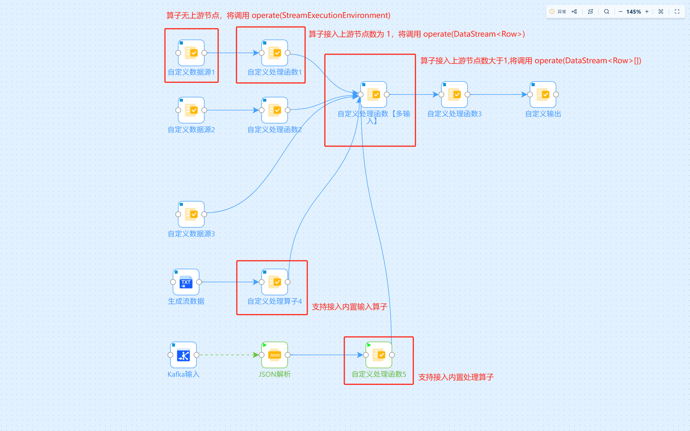
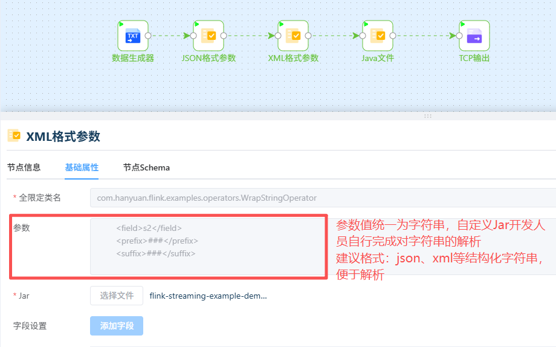

# 自定义算子开发

> 2025年11月26日 新增参数注入

> `org.apache.flink.streaming.api.datastream.DataStream` 简称：`DataStream`
>
> `org.apache.flink.types.Row` 简称：`Row`
> 
> `org.apache.flink.streaming.api.datastream.DataStream<org.apache.flink.types.Row>` 简称：`DataStream<Row>`

## 自定义算子类规则

1. 该类必须声明为 `public` ，而不是 `abstract`、`interface`，并且可以被全局访问。不允许使用非静态内部类或匿名类，该类必须具有默认构造器，且在运行时可实例化。
2. 自定义算子必须实现 `operate` 方法名的类，支持~~三种~~参数类型：`StreamExecutionEnvironment`、`DataStream<Row>`、`DataStream<Row>[]`
   - `operate(StreamExecutionEnvironment)`
   - `operate(DataStream<Row>)`
   - `operate(DataStream<Row>[])`
   - `operate(StreamExecutionEnvironment, String)`
   - `operate(DataStream<Row>, String)`
   - `operate(DataStream<Row>[], String)`
3. 自定义算子的 `operate` 方法需声明为 `public`，而不是 `abstract` 且非 `static`
4. 自定义算子的 `operate` 方法返回值如果是 `DataStream` 类型，则泛型的必须是 `Row`，即 `DataStream<Row>`【流批一体的可视化流程中，中间的所有流转类型是 `Row`】

## 自定义算子函数详解

自定义算子函数支持自定义实现 Source、Transformation、Sink 能力。

自定义算子函数 `operate` 通过重载支持三种参数类型：`StreamExecutionEnvironment`、`DataStream<Row>`、`DataStream<Row>[]`；对于具体调用哪个方法根据接入的上游节点数量决定的：

- 无上游节点，调用 `operate(StreamExecutionEnvironment)` 或 `operate(StreamExecutionEnvironment, String)`
- 单输入上游节点，调用 `operate(DataStream<Row>)` 或 `operate(DataStream<Row>, String)`
- 多输入上游节点，调用 `operate(DataStream<Row>[])` 或 `operate(DataStream<Row>[], String)`



### `operate(StreamExecutionEnvironment)`

**场景**

- 自定义数据源读取

**示例**

```java
public DataStream<Row> operate(StreamExecutionEnvironment environment) {
    return environment.fromSequence(1, 100).map(new MapFunction<Long, Row>() {
        @Override
        public Row map(Long value) throws Exception {
            Row row = Row.withNames();
            row.setField("name", String.format("generator_%d", value));
            return row;
        }
    });
}
```

**注意** 返回的数据是 `DataStream<Row>`，全程数据流转都是 Row 类型

### `operate(DataStream<Row>)`

**场景**

- 对单输入数据进行处理
- 对数据进行输出

**示例1:对单输入数据进行处理**

```java
public DataStream<Row> operate(DataStream<Row> ds) {
    return ds;
}
```

**示例2:对数据进行输出**

```java
public DataStreamSink<String> operate(DataStream<Row> ds) {
    return ds.map(Row::toString).print();
}
```

**注意** 返回值非 `DataStream` 类型的数据，将不对返回值进行校验

### `operate(DataStream<Row>[])`

对多输入数据进行处理

**示例**

```java
public DataStream<Row> operate(DataStream<Row>[] dss) {
    if (dss.length == 0) {
        return null;
    } else if (dss.length == 1) {
        return dss[0];
    } else {
        DataStream<Row> base = dss[0];
        DataStream<Row>[] others = Arrays.copyOfRange(dss, 1, dss.length);
        return base.union(others);
    }
}
```

### 参数注入

通过可视化界面填写参数，将参数字符串值注入函数



**示例**

```java
public DataStream<Row> operate(DataStream<Row> ds, String parameter) {
    JSONObject parameterObj = JSONUtil.parseObj(parameter);
    final String field = parameterObj.getStr("field");
    return ds.map(row->{
        String value=row.getFieldAs(field);
        value.setField(field, String.format("%s_%d",value,1));
        return value;
    });
}
```

## 示例

```java
import org.apache.flink.api.common.functions.MapFunction;
import org.apache.flink.streaming.api.datastream.DataStream;
import org.apache.flink.streaming.api.environment.StreamExecutionEnvironment;
import org.apache.flink.types.Row;

import java.util.Arrays;

public class CustomUDFOperator {
    public DataStream<Row> operate(StreamExecutionEnvironment environment) {
        return environment.fromSequence(1, 100).map(new MapFunction<Long, Row>() {
            @Override
            public Row map(Long value) throws Exception {
                Row row = Row.withNames();
                row.setField("name", String.format("generator_%d", value));
                return row;
            }
        });
    }

    public DataStream<Row> operate(DataStream<Row> ds) {
        return ds;
    }

    public DataStream<Row> operate(DataStream<Row>[] dss) {
        if (dss.length == 0) {
            return null;
        } else if (dss.length == 1) {
            return dss[0];
        } else {
            DataStream<Row> base = dss[0];
            DataStream<Row>[] others = Arrays.copyOfRange(dss, 1, dss.length);
            return base.union(others);
        }
    }
}
```