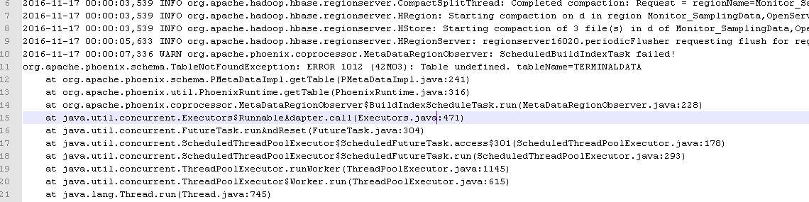
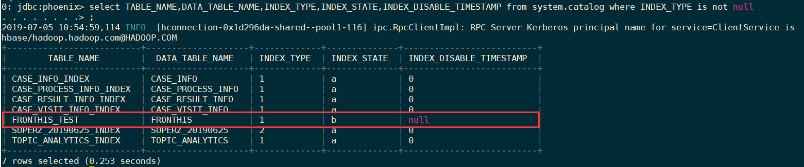
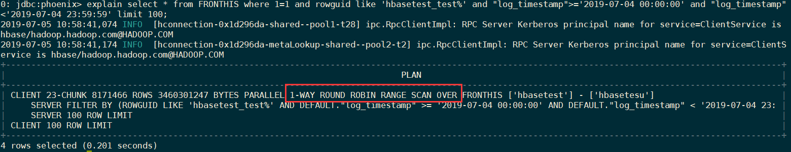

索引的修复可以通过 **2 种**方式：（关于pehoenix的索引的生命周期可以参考 <https://community.hortonworks.com/articles/58818/phoenix-index-lifecycle.html>)

- 一 手工执行修复命令 

- 手动执行修复命令
- 依赖 phoenix 的自动修复命令

### 自动修复<font color="red">TODO</font>

Phoenix 对于索引状态异常的情况，按照设计会自动进行修复的，也就是autorebuild，不过发现在HDP2.2 下，不能正常修复，后台（regionserver）提示找不到schema



针对这个bug，社区已经反馈为HDP2.2的bug，在2.3版本已经修复.可以参考<https://community.hortonworks.com/questions/66446/phoenix-index-becom-unavaiable.html#comment-67349>

### 手工修复

当数据量比较小的时候，正常的修复命令可以正常执行，但是由于数据量较大，容易出现修复超时、修复错误等问题

#### 一般修复流程如下

1. 查看当前索引的状态：【一般执行错误的状态为 x，正在修复的状态状态为b】

   ```sql
   select TABLE_NAME,DATA_TABLE_NAME,INDEX_TYPE,INDEX_STATE,INDEX_DISABLE_TIMESTAMP from system.catalog where INDEX_TYPE is not null
   ```

	

2. 验证 sql 是否走索引，发现没有走

   ```sql
   explain select * from FRONTHIS where 1=1 and rowguid like 'hbasetest_test%' and "log_timestamp">='2019-07-04 00:00:00' and "log_timestamp"<'2019-07-04 23:59:59' limit 100;
   ```

   

3. 修复索引

   ```sql
   alter index if exists fronthis_test on fronthis rebuild
   ```


上述步骤在大数据量的时候，容易**执行出现超时**，错误信息如下：

```log
java.util.concurrent.ExecutionException: org.apache.phoenix.exception.PhoenixIOException: Failed after attempts=36, exceptions:
Fri Jul 05 11:02:03 CST 2019, null, java.net.SocketTimeoutException: callTimeout=60000, callDuration=60103: Call to hd6/192.168.186.67:21302 failed on local exception: org.apache.hadoop.hbase.ipc.CallTimeoutException: Call id=103, waitTime=60002, operationTimeout=60000 expired. row '' on table 'FRONTHIS_TEST' at region=FRONTHIS_TEST,,1562237860014.cd70620d44724fd04fd38ea1862ace2c., hostname=hd6,21302,1562234609399, seqNum=89164

        at java.util.concurrent.FutureTask.report(FutureTask.java:122)
        at java.util.concurrent.FutureTask.get(FutureTask.java:192)
        at org.apache.phoenix.iterate.BaseResultIterators.close(BaseResultIterators.java:1116)
        at org.apache.phoenix.iterate.BaseResultIterators.getIterators(BaseResultIterators.java:1029)
        at org.apache.phoenix.iterate.BaseResultIterators.getIterators(BaseResultIterators.java:916)
        at org.apache.phoenix.iterate.ConcatResultIterator.getIterators(ConcatResultIterator.java:50)
        at org.apache.phoenix.iterate.ConcatResultIterator.currentIterator(ConcatResultIterator.java:97)
        at org.apache.phoenix.iterate.ConcatResultIterator.next(ConcatResultIterator.java:117)
        at org.apache.phoenix.iterate.BaseGroupedAggregatingResultIterator.next(BaseGroupedAggregatingResultIterator.java:64)
        at org.apache.phoenix.iterate.UngroupedAggregatingResultIterator.next(UngroupedAggregatingResultIterator.java:39)
        at org.apache.phoenix.compile.PostDDLCompiler$2.execute(PostDDLCompiler.java:290)
        at org.apache.phoenix.query.ConnectionQueryServicesImpl.updateData(ConnectionQueryServicesImpl.java:3460)
        at org.apache.phoenix.schema.MetaDataClient.alterIndex(MetaDataClient.java:4014)
        at org.apache.phoenix.jdbc.PhoenixStatement$ExecutableAlterIndexStatement$1.execute(PhoenixStatement.java:1201)
        at org.apache.phoenix.jdbc.PhoenixStatement$2.call(PhoenixStatement.java:394)
        at org.apache.phoenix.jdbc.PhoenixStatement$2.call(PhoenixStatement.java:377)
        at org.apache.phoenix.call.CallRunner.run(CallRunner.java:53)
        at org.apache.phoenix.jdbc.PhoenixStatement.executeMutation(PhoenixStatement.java:375)
        at org.apache.phoenix.jdbc.PhoenixStatement.executeMutation(PhoenixStatement.java:364)
        at org.apache.phoenix.jdbc.PhoenixStatement.execute(PhoenixStatement.java:1738)
        at sqlline.Commands.execute(Commands.java:822)
        at sqlline.Commands.sql(Commands.java:732)
        at sqlline.SqlLine.dispatch(SqlLine.java:813)
        at sqlline.SqlLine.begin(SqlLine.java:686)
        at sqlline.SqlLine.start(SqlLine.java:398)
        at sqlline.SqlLine.main(SqlLine.java:291)
```

再次查询查看索引的状态，变为了正在进行修复，即`INDEX_STATE`还是为b；

**修改超时时间**

需要在 `hbase/conf` 及 `phoenix/bin` 下的 `hbase-site.xml` 同时配置如下配置：

```xml
<!-- 指定查询在客户端上超时的毫秒数。 默认值是10分钟。-->
<property>
    <name>phoenix.query.timeoutMs</name>
    <value>1200000</value>
</property>
<!-- 当线程数大于客户端线程池数量，线程在终止之前等待新任务的最长时间（以毫秒为单位）。默认值为60秒 -->
<property>
    <name>phoenix.query.keepAliveMs</name>
    <value>1200000</value>
</property>
<!-- 默认60s，该参数表示一次RPC请求的超时时间。RPC时间超过该值，客户端就会主动关闭socket -->
<property>
    <name>hbase.rpc.timeout</name>
    <value>1200000</value>
</property>
<!-- regionserer租约时间，默认值是60s -->
<property>
    <name>hbase.regionserver.lease.period</name>
    <value>1200000</value>
</property>
<!-- 默认20min，该参数表示HBase客户端发起一次数据操作直至得到响应之间总的超时时间 -->
<property>
    <name>hbase.client.operation.timeout</name>
    <value>1200000</value>
</property>
<!-- scan缓存，默认为2147483647，不可太大，避免占用过多内存。 -->
<property>
    <name>hbase.client.scanner.caching</name>
    <value>1000</value>
</property>
<!-- 默认60s，该参数是表示HBase客户端发起一次scan操作的rpc调用至得到响应之间总的超时时间 -->
<property>
    <name>hbase.client.scanner.timeout.period</name>
    <value>1200000</value>
</property>
```


