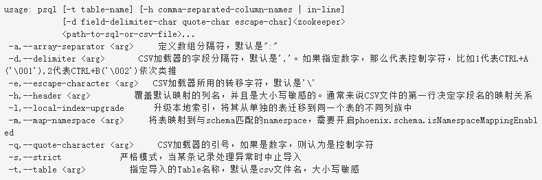

## `Sqlline.py`-交互式 REPL

sqlline 工具提供了 Phoenix 的交互式查询界面，该命令位于 Phoenix 的 bin 目录下。

使用方式：`sqlline.py [<zookeeper quorum>[:<port number>[:<root node>]]]`

- 对于开启了 Kerberos 认证的 HBase 集群，需要先通过 kinit 命令进行认证。
- 若本地配置文件已经配置好了相关参数，可以省略 zk 连接参数，程序将会自动从配置文件中获取 Zookeeper 集群的相关参数来连接

基本SQL操作参考:[SQL操作](Phoenix_SQL操作.md)

## Psql 工具

psql 提供了若干直接操作HBase 的功能集。比如批量执行 DDL，执行数据导入。该命令位于 Phoenix 的 bin 目录下。

示例如下：

- 使用默认的 zk 配置，直接执行 DDL 语句：`psql my_ddl.sql`
- 连接到远程的 zk 集群，执行 `my_ddl.sql` 中的语句：`psql zkpath my_ddl.sql`
- 连接到远程的 zk 集群，先执行 `my_ddl.sql` 中的语句，再导入 `my_table.csv` 中数据到 `my_table` 表中：`psql zkpath my_ddl.sql my_table.csv`
- 连接到远程的 zk 集群，将 `my_table2012-Q3.csv` 中的数据加载到 `my_table` 中，字段分隔符是 `,`：`psql -t MY_TABLE zkpath my_table2012-Q3.csv`
- 将 `mytable2012-Q3.csv` 中的数据加载到 `my_table` 中，字段分隔符 `:` ，只更新 col1，col2，col3 列：`psql -t MY_TABLE -h col1,col2,col3 -d zkpath my_table2012-Q3.csv`

使用 psql 进行小数据量的 csv 文件加载时，文件的后缀名必须为 csv。

## 批量导入

少量的数据导入（百兆字节以下）可使用 PSQL 工具来执行（要么通过 csv 导入，要么转换成 DML 语句），但是对于大批量数据的数据导入，这种方式性能会很差，所以 Phoenix 提供了相应的批量导入工具-使用 MapReduce 将数据文件转换成相应表的 HFile 存储格式，然后再通过 HBase 的 BulkLoad 方式将这些 HFile 批量加载到表的 HStore 中。

#### CsvBulkLoadTool

本工具类用于将 CSV 格式的文件批量导入至HBase表，相关参数如下：

- -a,--array-delimiter <arg> 数组列分隔符 （可选）
- -c,--import-columns <arg> 指定要导入的列名
- -d,--delimiter <arg> 字段分隔符，默认是逗号
- -e,--escape <arg> 指定转义符，默认是反引号
- -g,--ignore-errors 忽略错误
- -i,--input <arg> 输入路径（逗号分隔，必选）
- -it,--index-table <arg> 需要同时加载的索引表名
- -o,--output <arg> HFiles的临时输出路径 （可选）
- -q,--quote <arg> 定义分词符, 默认是双引号
- -s,--schema <arg> Phoenix库名（可选）
- -t,--table <arg> Phoenix表名 （必选）
- -z,--zookeeper <arg> zk连接字符串（可选）

#### JsonBulkLoadTool

本工具类用于将 json 格式的文件批量导入到HBase表，相关参数如下：

- -c,--import-columns <arg> 指定要导入的列名
- -g,--ignore-errors 忽略错误
- -i,--input <arg> 输入路径（逗号分隔，必选）
- -it,--index-table <arg> 需要同时加载的索引表名
- -o,--output <arg> HFiles的临时输出路径 （可选）
- -s,--schema <arg> Phoenix库名（可选）
- -t,--table <arg> Phoenix表名 （必选）
- -z,--zookeeper <arg> zk连接字符串（可选）

使用JsonBulkLoadTool是有几点需要注意:

1. Json字符串中的各属性名是大小写敏感的，而HBase表的字段是大小写不敏感的，且字段映射采用小写名称。故Json字符串属性名最好都使用小写，以免出现无法对应上的问题。
2. Json字符串中数字只有整型和浮点型，在序列化成Java对象时会统一转成Integer或者Float对象。若在表字段定义成非对应类型时，可能会出现类型转换异常。
故使用这种方式导入时，无法解决复杂的类型转换问题。此种情况下需要自己定义JsonToKeyValueMapper类，将Object对象显示进行转换。

#### 定制 BulkLoadTool工具

在实际的数据分析业务中，用户还会遇到很多其他格式的数据文件，用户可以针对这些不同的数据格式实现不同的 BulkLoad 类将其导入至 HBase。

具体的实现可参考 CsvBulkLoadTool 或 JsonBulkLoadTool 这两个工具类的实现

