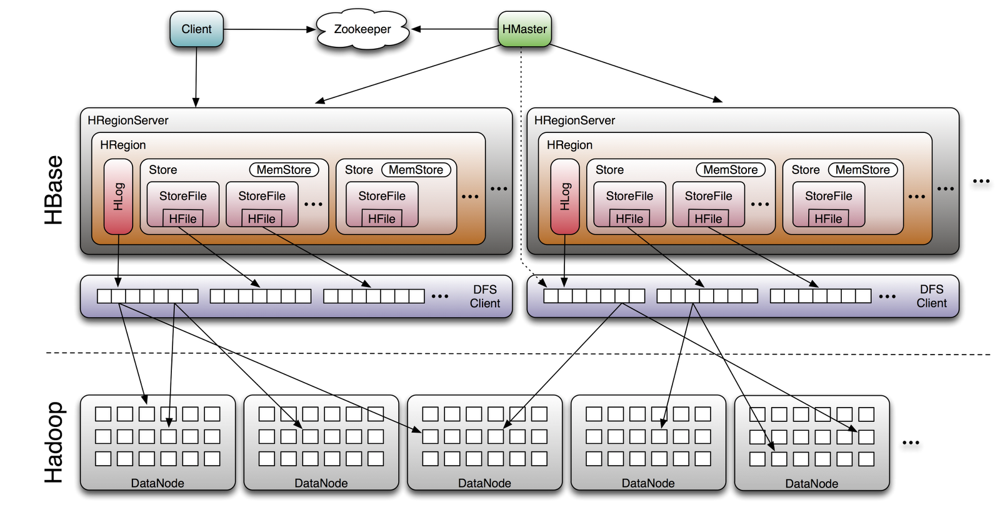
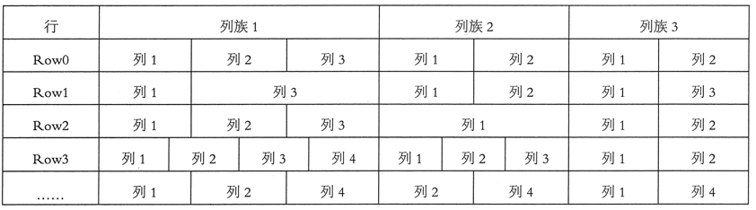

<!--
 * @Github       : https://github.com/superzhc/BigData-A-Question
 * @Author       : SUPERZHC
 * @CreateDate   : 2020-05-15 08:44:55
 * @LastEditTime : 2020-12-07 13:59:39
 * @Copyright 2020 SUPERZHC
-->

# HBase

## 简介

HBase 是基于 Apache Hadoop 的面向列的 NoSQL 数据库，是 Google 的 BigTable 的开源实现。HBase 是一个针对半结构化数据的开源的、多版本的、可伸缩的、高可靠的、高性能的、分布式的和面向列的动态模式数据库。

HBase 和传统关系数据库不同，它采用了 BigTable 的数据模型增强的 **稀疏排序映射表（Key/Value）**，其中，键由*行关键字*、*列关键字* 和 *时间戳* 构成。

HBase 提供了对大规模数据的随机、实时读写访问。HBase 的目标是存储并处理大型的数据，也就是仅用普通的硬件配置，就能够处理上千亿的行和几百万的列所组成的超大型数据库。

Hadoop 是一个高容错、高延时的分布式文件系统和高并发的批处理系统，不适用于提供实时计算，而 HBase 是可以提供实时计算的分布式数据库，数据被保存在 HDFS 上，**由 HDFS 保证其高容错性**。

*HBase 上的数据是以 StoreFile(HFile) 二进制流的形式存储在 HDFS 上的数据块中的，但是，HBase 的存储数据对于 HDFS 文件系统是透明的*。

HBase 可以直接使用本地文件系统，也可以使用 Hadoop 的 HDFS。HBase 中保存的数据可以使用 MapReduce 来处理，它将数据存储和并行计算有机地结合在一起。

HBase 是按列簇进行数据存储的。每个列簇会包括许多列，并且这些列是经常需要同时处理的属性。也就是说，HBase 把经常需要一起处理的列构成列簇一起存放，从而避免了需要对这些列进行重构的操作。

HBase 在充分利用列式存储优势的同时，通过列簇减少列连接的需求。

## 架构

HBase 的体系结构是典型的 Master-Slave 模型。系统中有一个管理集群的 Master 节点以及大量实际服务用户读写的 RegionServer 节点。除此之外，HBase 中所有数据最终都存储在 HDFS 系统中；系统中还有一个 Zookeeper 节点，协助 Master 对集群进行管理。HBase 体系结构如下图所示：



通过上图可以得到 HBase 中的每张表都按照一定的范围被分割成多个子表（Region），默认一个 Region 超过 256M 就要被分割成两个，由 RegionServer 管理，管理哪些 Region 由 Master 分配。

- **Client**
  
  提供了 Shell 命令行接口、原生 Java API 编程接口、Thrift/REST API 编程接口以及 MapReduce 编程接口。HBase 客户端支持所有常见的 DML 操作以及 DDL 操作，即数据的增删改查和表的日常维护等。其中 Thrift/REST API 主要用于支持非 Java 的上层业务需求，MapReduce 接口主要用于批量数据导入以及批量数据读取。
  
  HBase 客户端访问数据行之前，首先需要通过元数据表定位目标数据所在 RegionServer，之后才会发送请求到该 RegionServer。同时这些元数据会被缓存在客户端本地，以方便之后的请求访问。如果集群 RegionServer 发生宕机或者执行了负载均衡等，从而导致数据分片发生迁移，客户端需要重新请求最新的元数据并缓存在本地。
  
- **Zookeeper**
  
  HBase 依赖 Zookeeper，默认情况下 HBase 管理 Zookeeper 实例（启动或关闭 Zookeeper），Master 与 RegionServers 启动时会向 Zookeeper 注册。Zookeeper 的作用如下：

  - 实现 Master 高可用：通常情况下系统中只有一个 Master 工作，一旦 ActiveMaster 由于异常宕机，ZooKeeper 会检测到该宕机事件，并通过一定机制选举出新的 Master，保证系统正常运转
  - 管理系统核心元数据：比如，管理当前系统中正常工作的 RegionServer 集合，保存系统元数据表 `hbase:meta` 所在的 RegionServer 地址等
  - 参与 RegionServer 宕机恢复：ZooKeeper 通过心跳可以感知到 RegionServer 是否宕机，并在宕机后通知 Master 进行宕机处理
  - 实现分布式表锁：HBase 中对一张表进行各种管理操作（比如 alter 操作）需要先加表锁，防止其他用户对同一张表进行管理操作，造成表状态不一致。和其他 RDBMS 表不同， HBase 中的表通常都是分布式存储，ZooKeeper 可以通过特定机制实现分布式表锁

- **Master**
  
  Master 主要负责 HBase 系统的各种管理工作：
  
  - 处理用户的各种管理请求，包括建表、修改表、权限操作、切分表、合并数据分片以及 Compaction 等
  - 管理集群中所有 RegionServer，包括 RegionServer 中 Region 的负载均衡、RegionServer 的宕机恢复以及 Region 的迁移等
  - 清理过期日志以及文件，Master 会每隔一段时间检查 HDFS 中 HLog 是否过期、HFile 是否已经被删除，并在过期之后将其删除

  > 由于 Master 只维护表和 Region 的元数据，而不参与表数据 I/O 的过程，Master 下线仅导致所有的元数据的修改被冻结（无法创建删除表，无法修改表的 schema，无法进行 Region 的负载均衡，无法处理 Region 上下线，无法进行 Region 的合并，唯一例外的是 Region 的 split 可以正常进行，因为只有 RegionServer 参与），表的数据读写还可以正常进行。因此 Master 下线短时间内对整个 HBase 集群没有影响

- **RegionServer**：用来维护 Master 分配给它的 Region，处理对这些 Region 的 I/O 请求；负责切分正在运行过程中变的过大的 Region。

- **Region**：HBase 表在行的方向上分隔为多个 Region。Region 是 HBase 中分布式存储和负载均衡的最小单元，即不同的 Region 可以分别在不同的 RegionServer 上，但同一个 Region 是不会拆分到多个 server 上。Region 按大小分隔，每个表一般是只有一个 Region，当 Region 的某个列簇达到一个阈值（默认256M）时就会分成两个新的 Region。

- **Store**：每一个 Region 由一个或多个 Store 组成，至少是一个 Store，HBase 会把一起访问的数据放在一个 Store 里面，即为每个列簇建一个 Store，如果有几个列簇，也就有几个 Store。一个 Store 由一个 memStore 和 0 或者多个 StoreFile 组成。Store 的大小被 HBase 用来判断是否需要切分 Region。

- **StoreFile**：memStore 内存中的数据写到文件后就是 StoreFile，StoreFile 底层是以 HFile 的格式保存。
- **HLog**：HLog 记录数据的所有变更，可以用来恢复文件，一旦 RegionServer 宕机，就可以从 HLog 中进行恢复。
- **LogFlusher**：一个 LogFlusher 的类是用来调用 `HLog.optionalSync()` 的。

## 数据模型

HBase 是一个稀疏、多维度、有序的映射表。

*这张表中每个单元是通过由 **行键**、**列簇**、**列限定符** 和 **时间戳** 组成的索引来标识的*。每个单元的值是一个未经解释的字符串，没有数据类型。当用户在表中存储数据时，每一行都有一个唯一的行键和任意多的列。

表的每一行由一个或多个列簇组成，一个列簇中可以包含任意多个列。在同一个表模式下，每行所包含的列簇是相同的，也就是说，列簇的个数与名称都是相同的，但是每一行中的每个列簇中列的个数可以不同，如下图所示：



HBase 中的同一个列簇里面的数据存储在一起，列簇支持动态扩展，可以随时添加新的列，无须提前定义列的数量。所以，尽管表中的每一行会拥有相同的列簇，但是可能具有截然不同的列。正因为如此，对于整个映射表的每行数据而言，有些列的值就是空的，所以 HBase 的表是稀疏的。

HBase 执行更新操作时，并不会删除数据旧的版本，而是生成一个新的版本，原有的版本仍然保留。

用户可以对 HBase 保留的版本数量进行设置。在查询数据库的时候，用户可以选择获取距离某个时间最近的版本，或者一次获取所有版本。如果查询的时候不提供时间戳，那么系统就会返回离当前时间最近的那一个版本的数据。

HBase 提供了两种数据版本回收方式：一种是保存数据的最后个版本；另一种是保存最近一段时间内的版本，如最近一个月。

### 数据模型的基本概念

HBase 中的数据被存储在表中，具有行和列，是一个多维的映射结构。

数据存储模式：

```
(Table,RowKey,Family,Column,Timestamp)->Value
```

#### 1. 表（Table)

HBase采用表来组织数据，表由许多行和列组成，列划分为多个列簇。

#### 2. 行（Row)

在表里面，每一行代表着一个数据对象。每一行都是由一个**行键**（**Row Key**）和一个或者多个列组成的。

行键是用来表示唯一一行记录的**主键**，HBase 的数据是按照 RowKey 的**字典顺序**进行全局排序的，所有的查询，这一个排序维度。

因为表的行是按照行键顺序来进行存储的，所以行键的设计相当重要。设计行键的一个重要原则就是相关的行键要存储在接近的位置，例如，设计记录网站的表时，行键需要将域名反转（例如，`org.apache.www`、`org.apache.mail`、`org.apache.jira`），这样的设计能使与 apache 相关的域名在表中存储的位置非常接近。

访问表中的行只有 3 种方式：

- 通过单个行键获取单行数据；
- 通过一个行键的区间来访问给定区间的多行数据；
- 全表扫描。

#### 3. 列（Column）

列由**列簇（Column Family）**和**列限定符（Column Qualifier）**联合标识，由`:`进行间隔，如 `family:qualifier`

#### 4. 列簇（Column Family)

在定义 HBase 表的时候需要提前设置好列簇，表中所有的列都需要组织在列簇里面。列簇一旦确定后，就不能轻易修改，因为它会影响到 HBase 真实的物理存储结构，但是列簇中的列限定符及其对应的值可以动态增删。

表中的每一行都有相同的列簇，但是不需要每一行的列簇里都有一致的列限定符，所以说是一种稀疏的表结构，这样可以在一定程度上避免数据的冗余。

HBase 中的列簇是一些列的集合。一个列簇的所有列成员都有着相同的前缀，例如，`courses:history` 和 `courses:math` 都是列簇 `courses` 的成员。`:` 是列簇的分隔符，用来区分前缀和列名。列簇必须在表建立的时候声明，列随时可以新建。

#### 5. 列限定符（Column Qualifier）

列簇中的数据通过列限定符来进行映射。列限定符不需要事先定义，也不需要在不同行之间保持一致。列限定符没有特定的数据类型，以二进制字节来存储。

#### 6. 单元（Cell）

行键、列簇和列限定符一起标识一个单元，存储在单元里的数据称为单元数据，没有特定的数据类型，以二进制字节（Byte array）来存储。

#### 7. 时间戳（Timestamp）

默认情况下，每一个单元中的数据插入时都会用时间戳来进行版本标识。

读取单元数据时，如果时间戳没有被指定，则默认返回最新的数据；写入新的单元数据时，如果没有设置时间戳，则默认使用当前时间。每一个列簇的单元数据的版本数量都被 HBase 单独维护，默认情况下，HBase 保留 3 个版本数据。

## HBase 物理模型

一个列簇的所有列存储在同一个底层的**存储文件**（store file）里，这个存储文件叫做 HFile。HFile 中存储的是经过排序的键值映射结构。文件内部由连续的块组成，块的索引信息存储在文件的尾部。当把 HFile 打开并加载到内存中时，索引信息会优先加载到内存中，每个块的默认大小是 64KB，可以根据需要配置不同的块大小。

每一个 HFile 都有一个块索引，通过一个磁盘查找就可以实现。首先，在内存的块索引中进行二分查找，确定可能包含给定键的块，然后读取磁盘块找到实际要找的键。

存储文件通常保存在 Hadoop 分布式文件系统中，HDFS 提供了一个可扩展的、持久的、冗余的 HBase 存储层。存储文件通过将更改写入到可配置数目的物理服务器中，以保证不丢失数据。

每次更新数据时，都会先将数据记录在*提交日志*（commit log）中，在 HBase 中这叫做**预写日志**（write-ahead log，WAL），然后才会将这些数据写入内存中的 memstore 中。一旦内存保存的写入数据的累计大小超过了一个给定的最大值，系统就会将这些数据移出内存作为 HFile 文件刷写到磁盘中。数据移出内存之后，系统就会丢弃对应的提交日志，只保留未持久化到磁盘中的提交日志。在系统将数据移出 memstore 写入磁盘的过程中，可以不必阻塞系统的读写，通过滚动内存中的 memstore 就能达到这个目的，即用空的新 memstore 获取更新数据，将满的旧 memstore 转换成一个文件。请注意，memstore 中的数据已经按照行键排序，持久化到磁盘中的 HFile 也是按照这个顺序排列的，所以不必执行排序或其他特殊处理。

因为存储文件是不可被改变的，所以无法通过移除某个键/值对来简单地删除值。可行的办法是，做个*删除标记*（delete marker，又称墓碑标记），表明给定行已被删除的事实。在检索过程中，这些被删除标记掩盖了实际值，客户端读不到实际值。

读回的数据是两部分数据合并的结果，一部分是 memstore 中还没写入磁盘的数据，另一部分是磁盘上的存储文件。值得注意的是，数据检索时用不着 WAL，只有服务器内存中的数据在服务器崩溃前没有写入到磁盘，而后进行恢复数据时才会用到 WAL。

随着 memstore 中的数据不断刷写到磁盘中，会产生越来越多的 HFile 文件，HBase 内部有一个解决这个问题的管家机制，即用合并将多个文件合并成一个较大的文件。合并有两种类型：minor 合并和 major 压缩合并。minor 合并将多个小文件重写为数量较少的大文件，减少存储文件的数量，这个过程实际上是个多路归并的过程。因为 HFile 的每个文件都是经过归类的，所以合并速度很快，只收到磁盘 I/O 性能的影响。

major 合并将一个 region 中的一个列族的若干个 HFile 重写为一个 HFile，与 minor 合并相比，major 合并能扫描所有的键/值对，顺序重写全部的数据，重写数据的过程中会略过做了删除标记的数据。断言删除此时生效。