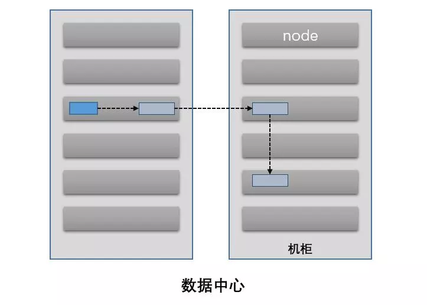

# HDFS

HDFS(Hadoop 分布式文件系统)是运行在通用硬件上的分布式文件系统。

HDFS 提供了一个高度容错性和高吞吐量的海量数据存储解决方案。

HDFS 被设计为可以运行在通用硬件上、提供流式数据操作、能够处理超大文件的分布式文件系统。HDFS 具有**高度容错**、**高吞吐量**、**容易扩展**、**高可靠性特征**，为大型数据集的处理提供了一个强有力的工具。

## HDFS 体系结构

HDFS 是一个主/从（Master/Slave）体系结构的分布式系统，HDFS 集群拥有一个 NameNode 和多个 DataNode，用户可以通过 HDFS 客户端同 NameNode 和 DataNode 交互以访问文件系统。

## [HDFS 基本概念](hadoop/hdfs/HDFS核心概念.md)

## HDFS 主要流程

### DataNode 副本存储逻辑

Hadoop 的默认布局策略是在运行客户端的节点上放第1个复本（如果客户端运行在集群之外，就随机的选择一个节点，但是系统会避免挑选那些存储太满或太忙的节点）。第2个复本放在与第1个不同且是随机选择的另外的机架中的节点上。第3个复本与第2个复本放在同一个机架上面，且是随机选择的一个节点，其他的复本放在集群中随机选择的节点上面，但是系统会尽量避免在相同的机架上面放太多的复本。 

### [HDFS 客户端读流程](hadoop/hdfs/HDFS的存储原理.md)

### [HDFS 客户端写流程](hadoop/hdfs/HDFS的存储原理.md)

### HDFS 客户端追加写流程

### DataNode 启动、心跳以及执行名称节点指令流程

### HA 切换流程

## F&Q

### `hadoop fs`、`hadoop dfs`和`hdfs dfs`的区别？

> **`hadoop fs`**：该命令可以用于其他文件系统，不止是 hdfs 文件系统内，也就是说该命令的使用范围更广
>
> ~~**`hadoop dfs`**：专门针对 hdfs 分布式文件系统。注：*该命令已废弃，推荐使用下面的命令*~~
>
> **`hdfs dfs`**：和上面的命令作用相同，相比于上面的命令更为推荐，并且当使用 `hadoop dfs` 时内部会被转为 `hdfs dfs` 命令

