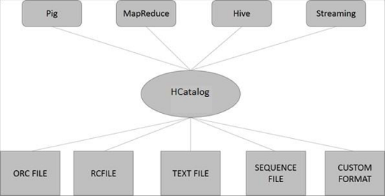

# HCatalog

> HCatalog 已与 Hive 合并在一块了

## 简介

HCatalog 是 Hadoop 的表存储管理工具。它暴露了 Hive 转移到其他 Hadoop 应用程序的表格数据。它使具有不同数据处理工具（Pig，MapReduce）的用户可以轻松地将数据写入网格。它确保用户不必担心数据的存储位置或格式。

HCatalog 像 Hive 的关键组件一样工作，它使用户能够以任何格式和任何结构存储他们的数据。

**为什么选择HCatalog**？

- 为正确的作业启用正确的工具
    Hadoop 生态系统包含不同的数据处理工具，如 Hive，Pig 和 MapReduce。虽然这些工具不需要元数据，但它们在存在时仍然可以从中受益。共享元数据存储还使得工具之间的用户能够更轻松地共享数据。使用 MapReduce 或 Pig 加载和归一化数据，然后通过 Hive 进行分析的工作流程非常常见。如果所有这些工具共享一个转移，那么每个工具的用户可以立即访问使用另一个工具创建的数据。不需要加载或传输步骤。
- 捕获处理状态以启用共享
    HCatalog 可以发布您的分析结果。所以其他程序员可以通过“REST”访问您的分析平台。您发布的模式对其他数据科学家也是有用的。其他数据科学家将您的发现用作后续发现的输入。
- 将 Hadoop 与所有内容集成
    Hadoop 作为处理和存储环境为企业开辟了很多机会; 然而，为了加油，它必须与现有工具配合使用。Hadoop 应作为您的分析平台的输入，或与您的运营数据存储和 Web 应用程序集成。组织应该享受 Hadoop 的价值，而不必学习一个全新的工具集。REST 服务使用熟悉的 API 和类似 SQL 的语言为企业打开平台。企业数据管理系统使用 HCatalog 更深入地与 Hadoop 平台集成。

## HCatalog 架构

HCatalog 支持可以写入 SerDe 的任何格式读取和写入文件。默认情况下，HCatalog 支持 RCFile，CSV，JSON，SequenceFile 和 ORC 文件格式。要使用自定义格式，必须提供 InputFormat，OutputFormat 和 SerDe。

HCatalog 建立在 Hive 转移顶部，并包含 Hive 的 DDL。HCatalog 为 Pig 和 MapReduce 提供读写接口，并使用 Hive 的命令行界面发布数据定义和元数据探索命令。

