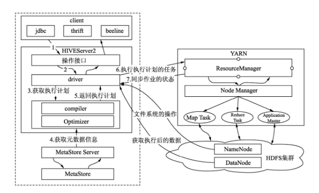

# Hive

> 官网地址：<https://cwiki.apache.org/confluence/display/Hive/Home>

## 简介

Hive 是一种建立在 Hadoop 文件系统上的数据仓库架构，并对存储在 HDFS 中的数据进行分析和管理；它可以将结构化的数据文件映射为一张数据库表，并提供完整的 SQL 查询功能，可以将 SQL 语句转换为 MapReduce 任务进行运行，通过自己的 SQL 去查询分析需要的内容，这套 SQL 简称 HiveQL（HQL），使不熟悉 MapReduce 的用户也能很方便地利用 SQL 语言对数据进行查询、汇总、分析。

Hive 最适合数据仓库应用程序，使用该应用程序进行相关的静态数据分析，不需要快速响应给出结果，而且数据本身不会频繁变化。

但 Hive 不是一个完整的数据库，Hadoop 以及 HDFS 的 **设计本身约束和局限性** 地限制了 Hive 所能胜任的工作。其中最大的限制就是 **Hive不支持记录级别的更新、插入或者删除操作**，但是用户可以通过查询生成新表或者将查询结果导入到文件中。同时，因为 Hadoop 是一个面向批处理的系统，而 MapReduce 任务（job）的启动过程需要消耗较长的时间，所以 **Hive查询延时比较严重**。传统数据库中在秒级别可以完成的查询，在 Hive 中，即使数据集相对较小，往往也需要执行更长的时间。最后需要说明的是，**Hive不支持事务**。

Hive 是最适合数据仓库应用程序的，其可以维护海量数据，而且可以对数据进行挖掘，然后形成意见和报告等。

> Hive 提供了一个被称为 **Hive查询语言**（简称 HiveQL 或 HQL）的 SQL 方言来查询存储在 Hadoop 集群中的数据。但 HiveQL 并不符合 ANSI SQL 标准，其和 Oracle，Mysql，SQL Server 支持的常规 SQL 方言在很多方面存在差异（注：**HiveQL 和 Mysql 提供的 SQL 方言最接近**）

## Hive 系统架构

Hive 框架如下图：



1. 用户提交查询等任务给 Driver
2. 编译器获得该用户的任务 Plan
3. 编译器 Compiler 根据用户任务去 MetaStore 中获取需要的 Hive 的元数据信息
4. 编译器 Compiler 得到元数据信息，对任务进行编译，先将 HiveQL 转换为抽象语法树，然后将抽象语法树转换为查询块，将查询块转化为逻辑的查询计划，重写逻辑查询计划，将逻辑计划转化为物理的计划（MapReduce），最后选择最佳的策略
5. 将最终的计划提交给 Driver
6. Driver 将计划 Plan 转交给 ExecutionEngine 去执行，获取元数据消息，提交给 YARN 执行该任务，任务会直接读取 HDFS 中文件进行相应的操作
7. 获取执行的结果
8. 取得并返回执行结果

详细见：[Hive 架构](Hive/Hive架构.md)

## 元数据

所有的 Hive 客户端都需要一个 metastoreservice（元数据服务），Hive 使用这个服务来存储表模式信息和其他元数据信息。通常情况下会使用一个关系型数据库中的表来存储这些信息。默认情况下，Hive 会使用内置的Derby SQL服务器，其可以提供有限的、单进程的存储服务。

元数据存储中存储了如表的模式和分区信息等元数据信息。

## Hive 的数据模型

Hive 没有专门的数据存储格式，也没有为数据建立索引，用户可以非常自由的组织 Hive 中的表，只需要在创建表的时候告诉 Hive 数据中的列分隔符和行分隔符，Hive 就可以解析数据。

Hive 中所有数据都存储在 HDFS 中，Hive 包含以下数据模型：`DataBase`，`Table`，`External Table`，`Partition`，`Bucket`。

- `DataBase/Schema`:数据库
- `Table`:Hive 中的 Table 和数据库中的 Table 在概念上是类似的，每一个 Table 在 Hive 中都有一个相应的目录存储数据。
- `Partition`:对应于数据库中的 Partition 列的密集索引，但是 Hive 中 Partition 的组织方式和数据库中的很不相同。在 Hive 中，表中的一个Partition 对应于表下的一个目录，所有的 Partition 的数据都存储在对应的目录中。
- `Bucket`:对指定列计算 hash，根据 hash 值切分数据，目的是为了并行，每一个 Bucket 对应一个文件。
- `External Table`:指向已经在 HDFS 中存在的数据，可以创建 Partition。它和 Table 在元数据的组织上是相同的，而实际数据的存储则有较大的差异。

### 表（Table）

Hive中的表分为**内部表(MANAGED_TABLE)**和**外部表(EXTERNAL_TABLE)**。

- 内部表和外部表最大的区别
  - 内部表DROP时候**会删除**HDFS上的数据;
  - 外部表DROP时候**不会删除**HDFS上的数据;
- 内部表适用场景：Hive中间表、结果表、一般不需要从外部（如本地文件、HDFS上load数据）的情况。
- 外部表适用场景：源表，需要定期将外部数据映射到表中。
- 使用场景：
  - 每天将收集到的网站日志定期流入HDFS文本文件，一天一个目录；
  - 在Hive中建立外部表作为源表，通过添加分区的方式，将每天HDFS上的原始日志映射到外部表的天分区中；
  - 在外部表（原始日志表）的基础上做大量的统计分析，用到的中间表、结果表使用内部表存储，数据通过SELECT+INSERT进入内部表。

### 视图（View）

和关系型数据库一样，Hive中也提供了视图的功能，注意Hive中视图的特性，和关系型数据库中的稍有区别：

- 只有逻辑视图，没有物化视图；
- 视图只能查询，不能 Load/Insert/Update/Delete 数据；
- 视图在创建时候，只是保存了一份元数据，当查询视图的时候，才开始执行视图对应的那些子查询；

### 分区（Partition）

Hive中的表分区比较简单，就是将同一组数据放到同一个HDFS目录下，当查询中过滤条件指定了某一个分区值时候，只将该分区对应的目录作为Input，从而减少MapReduce的输入数据，提高查询效率。

## 安装配置

[Hive的安装配置](Hive/Hive的安装配置.md)

## 配置参数

Hive的配置文件一般有如下文件：

1. `hive-env.sh`
2. `hive-site.xml`
3. `hive-log4j.properties`

[配置参数](Hive/Hive配置参数.md)：

- Hive在HDFS中的存储路径配置
- 配置连接元数据存储库
- 配置HiveServer

## Hive 命令

`$HIVE_HOME/bin/hive` 这个shell命令是通向包括命令行界面也就是 CLI 等 Hive 服务的通道。

**命令选项**

如果用户执行下面的命令，那么可以查看到 hive 命令的一个简明说明的选项列表。

```bash
hive --help
Usage ./hive <parameters> --service serviceName <service parameters>
Service List: beeline cleardanglingscratchdir cli help hiveburninclient hiveserver2 hiveserver hwi jar lineage metastore metatool orcfiledump rcfilecat schemaTool version
Parameters parsed:
  --auxpath : Auxillary jars
  --config : Hive configuration directory
  --service : Starts specific service/component. cli is default
Parameters used:
  HADOOP_HOME or HADOOP_PREFIX : Hadoop install directory
  HIVE_OPT : Hive options
For help on a particular service:
  ./hive --service serviceName --help
Debug help:  ./hive --debug --help
```

需要注意 Service List 后面的内容。这里提供了几个服务，包括使用的CLI。用户可以通过 `--service name`服务名称来启用某个服务，尽管其中有几个服务也是有快捷启动方式的。

| 选项        | 名称         | 描述                                                                                                   |
| ----------- | ------------ | ------------------------------------------------------------------------------------------------------ |
| cli         | 命令行界面   | 用户定义表，执行查询等。如果没有指定服务（即`--service`），这个是默认的服务。                          |
| hiveserver2 | Hive Server  | 监听来自于其他进程的Thrift连接的一个守护进程                                                           |
| hwi         | Hive Web界面 | 是一个可以执行查询语句和其他命令的简单的Web界面，这样可以不用登录到集群中的某台机器上使用CLI来进行查询 |
| jar         |              | hadoop jar命令的一个扩展， 这样可以执行需要Hive环境的应用                                              |
| metastore   |              | 启动一个扩展的Hive 元数据服务，可以供多客户端使用                                                      |
| rcfilecat   |              | 一个可以打印出RCFile格式文件内容的工具                                                                 |

[Hive命令行(CLI)](Hive/Hive命令行.md) 