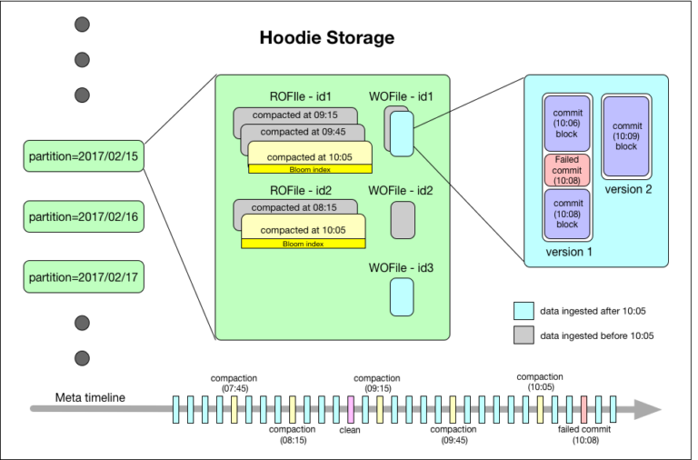

# Hudi

> Hudi 是一种针对分析型业务的、扫描优化的数据存储抽象，它能够使HDFS数据集在分钟级的时延内支持变更，也支持下游系统对这个数据集的增量处理。

## 架构设计

Hudi将数据集组织到一个basepath下的分区目录结构中，类似于传统的Hive表。数据集被分成多个分区，这些分区是包含该分区数据文件的目录。每个分区都由相对于基本路径的partitionpath唯一标识。在每个分区中，记录分布到多个数据文件中。每个数据文件都由唯一的fileId和生成该文件的commit来标识。在更新的情况下，多个数据文件可以共享在不同commit时写入的相同fileId。

每条记录都由记录键唯一标识，并映射到fileId。一旦记录的第一个版本被写入到文件中，记录键和fileId之间的映射是永久的。简而言之，fileId标识一组文件，其中包含一组记录的所有版本。

Hudi存储由三个不同的部分组成:

1. 元数据:Hudi将数据集上执行的所有活动的元数据作为时间轴维护，这支持数据集的瞬时视图。它存储在基路径的元数据目录下。下面我们概述了时间轴中的行动类型:
   - 提交:单个提交捕获关于将一批记录原子写入数据集的信息。提交由一个单调递增的时间戳标识，这表示写操作的开始。
   - 清除:清除数据集中不再在运行查询中使用的旧版本文件的后台活动。
   - 压缩:协调Hudi内不同数据结构的后台活动(例如，将更新从基于行的日志文件移动到柱状格式)。
2. Index: Hudi维护一个索引来快速将传入的记录键映射到fileId，如果记录键已经存在。索引实现是可插拔的，以下是当前可用的选项:
   - 存储在每个数据文件页脚中的Bloom过滤器:首选的默认选项，因为它不依赖于任何外部系统。数据和索引总是彼此一致的。
   - Apache HBase:对一小批keys的高效查找。这个选项可能会在索引标记期间节省几秒钟的时间。
3. 数据:Hudi以两种不同的存储格式存储所有输入的数据。实际使用的格式是可插拔的，但基本上需要以下特征:
   - 扫描优化的柱状存储格式(ROFormat)。默认为Apache Parquet。
   - 写优化的基于行的存储格式(WOFormat)。默认是Apache Avro。

## 表类型

Hudi支持以下表类型：

1. Copy on write(**COW**): 仅使用列式文件格式(如parquet)存储数据。 通过在写入期间执行同步合并，简单地更新版本和重写文件。
2. Merge on read(**MOR**)：使用基于列(如parquet)+基于行(如avro)的文件格式的组合存储数据。 更新被记录到增量文件中（基于行），然后被压缩以同步或异步地生成新版本的列式文件。

## 查询类型

Hudi支持如下查询类型：

1. 快照查询：查询查看给定提交或压缩操作时表的最新快照。 对于读表上的merge，它通过动态合并最新文件片的基文件和增量文件来获取接近实时的数据(几分钟)。 对于写表上的复制，它提供了现有parquet表的临时替代，同时提供了插入/删除和其他写侧功能。
2. 增量查询：根据给定的提交/压缩，查询只要查询写入表的新数据。 这有效地提供了更改流来支持增量数据管道。
3. 读优化查询：查询给定提交/压缩操作时的表的最新快照。 仅公开最新文件片中的基/列文件，并保证与非hudi列表相比具有相同的列查询性能。

## 写操作

在hudi中的写操作分为三种，分别是upsert、insert以及bulk-insert。

- upsert：是 *默认的写操作*，通过查找索引，输入记录首先被标记为插入或者更新，并最终在运行启发式操作后写入记录，以确定如何最好地将他们打包到存储上，以优化诸如文件大小之类的事情。这个操作推荐用于数据库更改捕获这样的用例，因为输入几乎肯定包含更新。
- insert：这个操作在启发式/文件大小方面与upsert非常相似，但完全跳过了索引查找步骤。 因此，对于日志重复删除之类的用例，它可能比upserts快得多(结合下面提到的过滤重复项的选项)。 这也适用于数据集可以容忍重复，但只需要Hudi的事务性写/增量拉取/存储管理功能的用例。
- bulk insert：upsert和insert操作都将输入记录保存在内存中，以加快存储启发式计算的速度(以及其他一些事情)，因此对于最初加载/引导一个Hudi数据集可能会很麻烦。 bulk insert提供了与insert相同的语义，同时实现了基于排序的数据写入算法，该算法可以很好地扩展到几百tb的初始负载。 然而，与像insert /upserts那样保证文件大小相比，这只是在调整文件大小方面做了最大的努力。

## 压缩

压缩（compaction）是hudi本身的一个操作，用于合并日志文件片，生成一个新的压缩文件。压缩只适用于MOR类型的表，且什么样的文件片被压缩是在写操作之后由压缩算法决定的（默认是选择具有最大未压缩日志文件大小的文件片）

从高层次来说，有两种类型的压缩方法，一种是同步的，另一种则是异步的。

- Synchronous compaction：在这里，压缩是由写入进程本身在每次写入之后同步执行的，也就是说，只有压缩完成，下一个写入操作才能开始。 就操作而言，这是最简单的，因为不需要调度单独的压缩过程，但数据新鲜度保证较低。 然而，这种风格在某些情况下仍然非常有用，比如可以在每次写操作时压缩最新的表分区，同时延迟对晚到/老的分区的压缩。
- Asynchronous compaction：在这种风格中，压缩过程可以通过写操作并发和异步运行。 这样做的明显好处是压缩不会阻塞下一批写操作，从而产生接近实时的数据新鲜度。 像Hudi DeltaStreamer这样的工具支持一种方便的连续模式，在这种模式下，压缩和写入操作以这种方式在单个spark运行时集群中进行。

## 清理

清理（cleaning）是hudi本身的一个操作，用于删除旧的文件片，以及限制表空间的增长，清理操作在每次写操作之后自动被执行。同时利用缓存在timelineserver上的timeline metadata来防止扫描整个表。

清理操作支持如下两种方式：

- Clean by commits/deltacommits：这是增量查询中最常见和必须使用的模式。 在这种风格中，cleaner保留了在最近N次commits/delta commits中写入的所有文件片，从而有效地提供了跨这些操作增量查询任何范围的能力。 虽然这对于增量查询很有用，但在一些高写工作负载上可能需要更大的存储空间，因为它为配置范围保留了所有版本的文件片。
- Clean by file-slices retained：这是一种更简单的清理风格，我们只保留每个文件组中的最后N个文件片。 像Apache hive这样的查询引擎处理非常大的查询，可能需要几个小时才能完成,在这种情况下,需要将N设置足够大,这样才能够防止需要查询的文件片被删除。