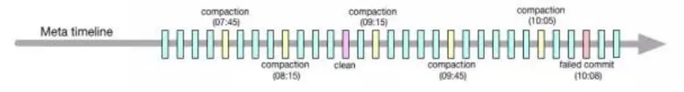
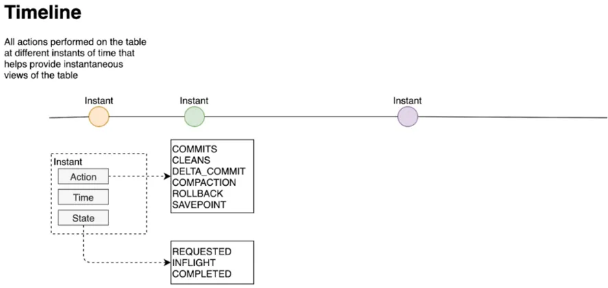
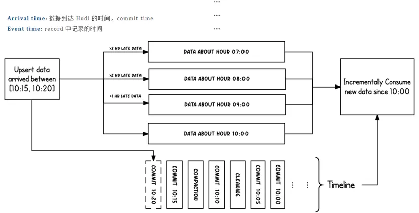

# 元数据

以时间轴（Timeline）的形式将数据集上的各项操作元数据维护起来，以支持数据集的瞬态视图，这部分元数据存储于根目录下的元数据目录。一共有三种类型的元数据：

- **Commits**：一个单独的 commit 包含对数据集之上一批数据的一次原子写入操作的相关信息。用单调递增的时间戳来标识 commits，标定的是一次写入操作的开始；
- **Cleans**：用于清除数据集中不再被查询所用到的旧版本文件的后台活动；
- **Compactions**：用于协调 Hudi 内部的数据结构差异的后台活动。例如，将更新操作由基于行存的日志文件归集到列存数据上

## Timeline

- Timeline 是 Hudi 用来管理提交（commit）的抽象，每个 commit 都绑定一个固定时间戳，分散到时间线上。
- 在 Timeline 上，每个 commit 被抽象为一个 HoodieInstant，一个 instant 记录了一次提交 (commit) 的行为、时间戳、和状态。

图中采用时间（小时）作为分区字段，从 10:00 开始陆续产生各种 commits，10:20 来了一条 9:00 的数据，该数据仍然可以落到 9:00 对应的分区，通过 timeline 直接消费 10:00 之后的增量更新（只消费有新 commits 的 group），那么这条延迟的数据仍然可以被消费到。