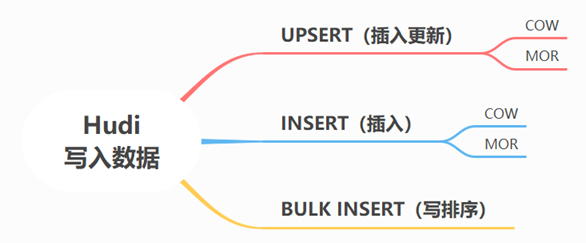

# 数据写操作类型

在 Hudi 数据湖框架中支持三种方式写入数据：UPSERT（插入更新）、INSERT（插入）和 BULK_INSERT（写排序）。

- UPSERT：默认行为，数据先通过 index 打标(INSERT/UPDATE)，有一些启发式算法决定消息的组织以优化文件的大小
- INSERT：跳过 index，写入效率更高
- BULK_INSERT：写排序，对大数据量的 Hudi 表初始化友好，对文件大小的限制 best effort（写 HFile）

## UPSERT 写流程

### COW 表类型

1. 先对 records 按照 record key 去重；
2. 首先对这批数据创建索引 (HoodieKey => HoodieRecordLocation)；通过索引区分哪些 records 是 update，哪些 records 是 insert（key 第一次写入）；
3. 对于 update 消息，会直接找到对应 key 所在的最新 FileSlice 的 base 文件，并做 merge 后写新的 base file (新的 FileSlice)；
4. 对于 insert 消息，会扫描当前 partition 的所有 SmallFile（小于一定大小的 base file），然后 merge 写新的 FileSlice；如果没有 SmallFile，直接写新的 FileGroup + FileSlice；

### MOR 表类型

1. 先对 records 按照 record key 去重（可选）
2. 首先对这批数据创建索引 (HoodieKey => HoodieRecordLocation)；通过索引区分哪些 records 是 update，哪些 records 是 insert（key 第一次写入）
3. 如果是 insert 消息，如果 log file 不可建索引（默认），会尝试 merge 分区内最小的 base file （不包含 log file 的 FileSlice），生成新的 FileSlice；如果没有 base file 就新写一个 FileGroup + FileSlice + base file；如果 log file 可建索引，尝试 append 小的 log file，如果没有就新写一个 FileGroup + FileSlice + base file
4. 如果是 update 消息，写对应的 file group + file slice，直接 append 最新的 log file（如果碰巧是当前最小的小文件，会 merge base file，生成新的 file slice）log file 大小达到阈值会 roll over 一个新的

## INSERT 写流程

### COW 表类型

1. 先对 records 按照 record key 去重（可选）；
2. 不会创建 Index；
3. 如果有小的 base file 文件，merge base file，生成新的 FileSlice + base file，否则直接写新的 FileSlice + base file；

### MOR 表类型

1. 先对 records 按照 record key 去重（可选）；
2. 不会创建 Index；
3. 如果 log file 可索引，并且有小的 FileSlice，尝试追加或写最新的 log file；如果 log file 不可索引，写一个新的 FileSlice + base file。

## BULK_INSERT 写流程

<!-- TODO -->